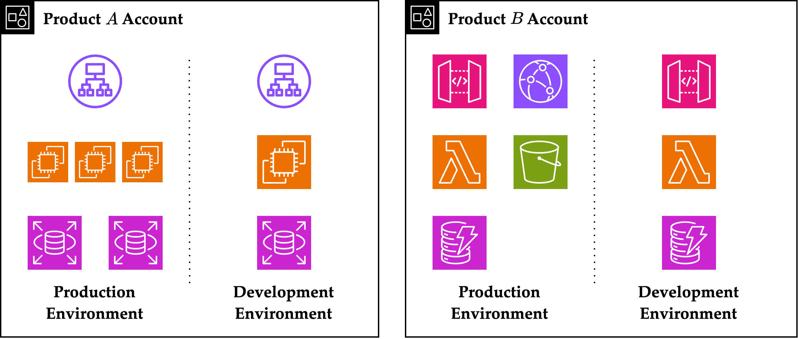

2024\. 2. B.S. Graduation Paper, Received Best Paper Award!

- [Secure IAM on AWS with Multi-Account Strategy (pdf)](https://zxcvber.com/files/secure-iam.pdf)
- [Presentation Poster (pdf)](https://zxcvber.com/files/secure-iam-poster.pdf)

## Abstract

Many recent IT companies use cloud services for deploying their products, mainly because of their convenience. As such, cloud assets have become a new attack surface, and the concept of cloud security has emerged. However, cloud security is not emphasized enough compared to on-premise security, resulting in many insecure cloud architectures. In particular, small organizations often don't have enough human resources to design a secure architecture, leaving them vulnerable to cloud security breaches.

We suggest the multi-account strategy for securing the cloud architecture. This strategy cost-effectively improves security by separating assets and reducing management overheads on the cloud infrastructure. When implemented, it automatically provides access restriction within the boundary of an account and eliminates redundancies in policy management. Since access control is a critical objective for constructing secure architectures, this practical method successfully enhances security even in small companies.

In this paper, we analyze the benefits of multi-accounts compared to single accounts and explain how to deploy multiple accounts effortlessly using the services provided by AWS. Then, we present possible design choices for multi-account structures with a concrete example. Finally, we illustrate two techniques for operational excellence on multi-account structures. We take an incremental approach to secure policy management with the principle of least privilege and introduce methods for auditing multiple accounts.

**Keywords**: multi-account strategy, identity and access management, cloud security

## 국문초록

**제목**: 다중 계정을 이용한 안전한 AWS 권한 관리

최근 많은 IT 기업이 편리하게 자사 제품을 배포하기 위해 클라우드 서비스를 사용한다. 이에 따라 기업의 클라우드 자원은 새로운 공격 표면이 되었고, 클라우드 보안이라는 분야가 새롭게 대두되었다. 그러나 클라우드 보안은 기존의 온프레미스 보안에 비해 충분히 강조되지 못해 보안에 취약한 클라우드 아키텍처를 사용하는 경우가 많다. 특히 작은 조직의 경우 안전한 클라우드 아키텍처를 고안할 인력이 부족한 경우가 많아 클라우드에서 발생하는 보안 사고에 취약한 편이다.

이 상황에서 보안을 손쉽게 강화하려면 다중 계정 환경을 적용하면 된다. 다중 계정 환경은 클라우드의 자원을 분리하고 관리 부하를 줄여 보안을 강화하는 전략으로, 노력 대비 큰 보안 향상을 준다. 이 전략을 적용하면 자동으로 접근 권한이 계정 범위 내로 제한되며, 정책 관리 시 발생하는 불필요한 중복이 제거된다. 안전한 아키텍처를 위해 권한 관리가 필수임을 고려한다면, 다중 계정 환경은 인력이 부족한 작은 조직에서도 적용할 수 있는 효과적인 보안 강화 방법이다.

이 논문에서는 다중 계정 환경의 장점을 단일 계정 환경과 비교하여 분석하고, AWS가 제공하는 서비스를 이용해 다중 계정 환경을 손쉽게 구성하는 방법을 설명한다. 또한 다중 계정 구조의 구체적인 예시를 통해 계정 구조 설계 시 유의할 점들을 언급한다. 마지막으로 최소 권한 원칙의 점진적 도입을 통한 안전한 정책 관리 방법과 다중 계정의 감사 방법을 소개하여 다중 계정 구조에서 운영 효율성을 달성하는 방법을 설명한다.

**주요어**: 다중 계정 환경, 권한 및 접근 제어, 클라우드 보안

## Acknowledgements

Special thanks to Professor Chung-Kil Hur for advising my paper, and to Professor Yongsoo Song for his recommendation for the best paper award.
