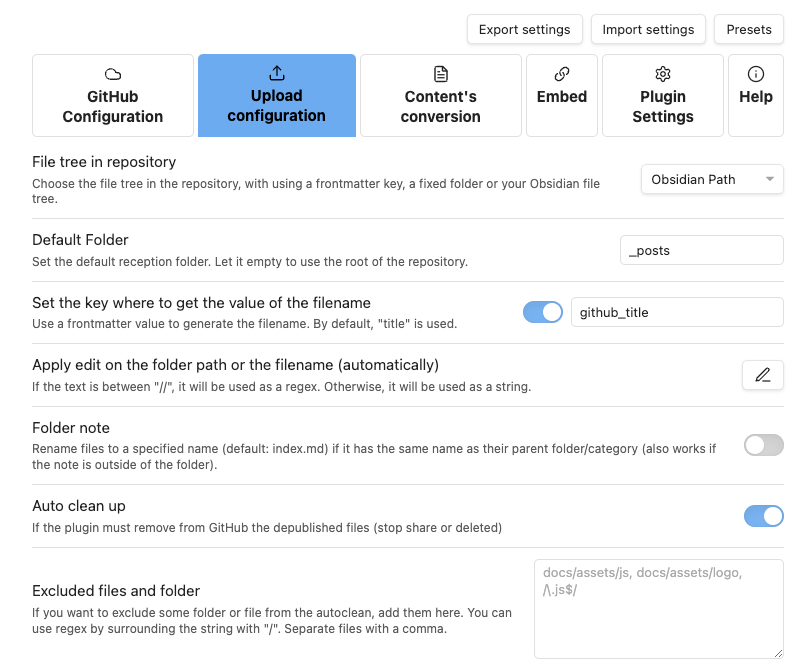

---  
share: true  
toc: true  
categories: [Development, Web]  
tags: [development, web]  
title: "블로그 이주 이야기"  
date: "2023-06-25"  
github_title: "2023-06-25-blog-moving"  
---  
  
 _New blog logo_  
  
오래 전, Github Pages가 불편하다는 이유로 티스토리로 옮겼었다.  
근데 어쩌다 보니 결국 다시 돌아오게 되었다.  
  
## History  
  
2019년 12월에 `calofmijuck.github.io` 사이트를 세팅했었다. 하지만 여러 불편한 점들을 발견했고, Jekyll 문서를 열심히 읽어보고 커스터마이즈를 시도한 끝에 실패하여 결국에는 모든게 세팅되어 있고 간편하게 제공되는 티스토리로 이주했던 기억이 있다.  
  
- [github.io 사이트 설정](https://calofmijuck.tistory.com/2)  
- [github.io 사이트 설정 - 2](https://calofmijuck.tistory.com/7)  
- [Tistory 이주](https://calofmijuck.tistory.com/12)  
  
과거의 나에 따르면, 티스토리로 옮긴 가장 큰 이유는 카테고리 별로 잘 정리된 사이드바를 쓰고 싶었기 때문이라고 한다. Jekyll minimal mistakes 테마에서 어떻게든 해보려고 꽤나 삽질을 했던 좋지 않은 기억이 아직도 남아있다.  
  
이번에는 지인의 소개로 [Chirpy](https://chirpy.cotes.page/)라는 깔끔한 테마를 하나 알게 되었고, [Obsidian](https://obsidian.md/)이라는 강력한 도구를 얻게 되어 다시 한 번 github.io 블로그에 도전해 보려고 한다.  
  
## Why Move Again?  
  
티스토리는 그 자체로도 충분히 좋은 플랫폼인 것이 분명하다. 특별히 아쉬운 점을 꼽아보자면,  
  
- 스킨 선택지가 (Jekyll에 비해) 다양하지 않다. 물론 내 입맛에 맞게 수정할 수는 있지만 조금 불편하다.  
- 개인적으로 기본 편집기가 매우 불편하기 때문에 마크타운이나 HTML을 사용하게 된다.  
  
이 정도인 것 같다. Jekyll을 사용하게 되면 스킨이나 테마의 선택지 폭은 매우 넓어지게 되고, 편집은 기본적으로 마크다운(kramdown)이기 때문에 크게 불편하지 않다. 추가로 Obsidian을 붙여서 사용할 계획이므로, 글 작성을 편리하게 할 수 있을 것이라 생각했다. 그리고 수식을 기본적으로 지원하기 때문에 수학을 좋아하는 나에게는 대환영이다.  
  
그리고 이건 개인적인 욕심인데, 작성한 글이 git과 연동이 되었으면 좋겠다고 생각한 적이 있었다. 그런데 Obsidian은 이와 같은 나의 욕심을 채워주었다.  
  
쓰다 보면 또 불편한 점을 발견해서 다시 티스토리로 돌아갈지도 모르겠지만, 종강도 했는데 일단은 미끼를 물어보고 세팅해서 일단 사용해 보기로 했다.  
  
## Moving from Notion to Obsidian  
  
그 전에 Notion을 버리고 Obsidian으로 갈아탄 이유를 조금 적고 가야겠다. 원래 노트 앱으로 Notion을 쓰고 있었다. 학생이기 때문에 인증을 하고, 무료로 Education Plus Plan을 이용하고 있었다. Notion의 아쉬운 점도 좀 있었는데,  
  
- 검색이 잘 안된다. 검색이 안되면 문서를 왜 작성하나? 위키처럼 링크를 모아둬서 찾기 편리하게 할 수도 있겠지만, 링크의 개수가 많아지면 별로 좋은 방법은 아닌 것 같다.  
- 특유의 블록 구조가 불편하다. 모든게 블럭이다. 그리고 간혹 복사 붙여넣기, 선택이 올바르게 동작하지 않는 경우가 있다.  
- 수식 입력이 불편하다. 인라인/블록 수식 모두 결국엔 블록이다. 개인적으로 수식 입력은 차라리 마크다운이 더 편한 것 같다.  
- 좀 느린 것 같다. (이건 좀 억지인가?)  
  
조금 다른 이야기이긴 하지만, 졸업 이후에 Notion션이 언제 Education Plus Plan을 끊어버릴지 모른다. 이와 같은 통수를 맞게 되면 무조건 마이그레이션을 해야하기 마련이다.  
  
반면 Obsidian은 기본적으로 무료로 대부분의 기능을 사용할 수 있다. 유료로 제공받는 유의미한 기능은 Sync 정도인 것 같다. 이는 Obsidian 자체 클라우드에 노트를 저장하고 다른 기기와 동기화하는데 사용하는 기능인데, 굳이 Obsidian 자체 클라우드가 아니라 iCloud 등 다른 저장소를 사용할 수도 있기 때문에 Sync 기능이 큰 유입 장벽을 만드는 것 같지는 않다.  
  
그리고 Obsidian은 기본적으로 마크다운 편집기이긴 하지만, 커스터마이즈 할 수 있는 부분이 굉장히 많고, 커뮤니티에 수많은 플러그인이 올라와 있다. 이러한 기능을 잘 사용하면 Notion 이상의 효율을 낼 수 있을 것이라고 믿었다.  
  
마지막으로 Graph View가 좀 사기인 것 같다. Reddit에서 Obsidian에 수업 필기하는 사람들의 Graph View 결과를 몇 개 봤는데, 문서 간의 수많은 연결고리가 마치 지식이 서로 연결되어 있는 느낌을 줬다. 사실 처음으로 Obsidian을 접했을 때 해보고 싶었던 것이 있었다. 배우고 있는 과목의 내용을 잘 정리해서 서로 링크로 연결하여 그 과목에서 배운 내용에 대한 지도를 만드는 것이다. 기회가 된다면 꼭 한 번 해보고 그 결과물을 Graph View로 보고 싶다.  
  
아무튼, 종합하면 Notion보다는 Obsidian이 맞겠다는 판단을 하고 과감하게 Obsidian으로 옮겼다.   
  
물론 이 결정을 한 시점은 시험기간이었음을 밝힌다.[^1]   
  
## Obsidian with Github Publisher Plugin  
  
Obsidian을 Github과 연동하기 위해 [Obsidian Github Publisher](https://github.com/ObsidianPublisher/obsidian-github-publisher) 플러그인을 사용할 수 있다.  
  
{: .shadow } _플러그인 설정 화면: 어느 폴더에 어떤 이름으로 파일을 업로드할지 설정할 수 있다._  
  
이 플러그인을 사용하면 Obsidian의 문서 중에서 `share: true` 로 마킹된 문서들을 레포에 저장할 수 있게 된다. 그렇다면 블로그 글을 Obsidian에서 작성하고, 플러그인을 이용해 레포에 push하게 되면, 자동으로 빌드/배포가 이뤄져서 블로그에 반영되는 것을 확인할 수 있을 것이다.  
  
Obsidian으로 편하게 글도 쓰고, 쓴 글이 git과 연동까지 되는 일석이조의 효과를 누릴 수 있게 된다!  
  
## Github Pages vs Self-Hosted  
  
이처럼 나의 욕심을 Obsidian으로 채우는 것 까지는 좋았으나, 실제로 실행에 옮기기까지 많은 고민이 있었다. 블로그가 과연 얼마나 커질지는 모르는 일이지만, 확장성을 고려했을 때 이것이 장기적으로 좋은 선택인지 생각해볼 필요가 있었기 때문이다.  
  
Obsidian 자체는 로컬 저장소를 사용하고 있기 때문에 크게 문제가 되지는 않을 것이라 생각했다. 하지만 블로그 글을 git과 연동하게 되면서 새롭게 생각해낸(?) 문제가 하나 있었다.  
  
글을 쓰다 보면 사진을 첨부하기 마련인데, 글의 개수가 많은 상황에서도 이를 과연 git에 저장하는 것이 맞을지 고민하게 되었다! Git은 설계상 텍스트 데이터를 잘 다룬다. 하지만 이미지는 바이너리 파일이다. 용량도 보통 텍스트보다 배로 크다. 이미지를 git에 많이 저장해도 될까?  
  
Git은 version control system이기 때문에, 이미지가 버전에 따라 영향을 받는다면, git에 포함되어야 함은 당연하다고 느낄 것 같다. 하지만 블로그 글에 들어가는 이미지는 자주 수정되지 않을 확률이 높기 때문에 version control의 목적으로 git을 쓴다기 보다는 단순히 저장소로 사용한다는 느낌이 좀 들었다. 그런데 자주 수정되지 않는다면 diff에서 많은 용량을 차지하지 않기 때문에 오히려 문제가 될 것도 없겠다는 생각이 들기도 했다.  
  
이 뿐만 아니라 Github Pages 자체적으로 사용량 제한이 걸려있다. [공식 문서](https://github.com/ObsidianPublisher/obsidian-github-publisher)의 Usage Limits 섹션에 따르면, 아래와 같은 제한이 있다. (일부 후략)  
  
- GitHub Pages source repositories have a recommended limit of 1 GB.  
- Published GitHub Pages sites may be no larger than 1 GB.  
- GitHub Pages deployments will timeout if they take longer than 10 minutes.  
- GitHub Pages sites have a soft bandwidth limit of 100 GB per month.  
- GitHub Pages sites have a soft limit of 10 builds per hour. This limit does not apply if you build and publish your site with a custom GitHub Actions workflow  
- In order to provide consistent quality of service for all GitHub Pages sites, rate limits may apply.  
  
이것 때문에 개인 서버 머신에 블로그를 배포할지 고민하기도 했고, 사진만 따로 AWS S3 + CloudFront 조합을 이용해볼까 고민하기도 했다. 요금제까지 알아봤다![^2]  
  
그러나 내 머신에 배포하게 되면 자동 배포를 하기 위해 세팅할 것이 너무 많다고 판단했고, 클라우드를 사용하는 것 또한 블로그의 파일을 분산시키는 것 같아서, 결국에는 [귀여운 판다](https://tinypng.com/)의 도움을 받아 사진 파일을 압축해서 올리고 Github Pages를 이용하기로 했다.  
  
조사했던 내용은 나중에 블로그를 확장 하게 되면 유용하게 사용할 것이다.  
  
## New Blog  
  
이렇게 하여 Obsidian + Github Publisher + Github Pages로 새로운 블로그를 세팅해 봤다. `calofmijuck.github.io` 는 이미 교양수학 기출문제로 활용되고 있기 때문에 이 블로그는 `calofmijuck.github.io/blog` 주소가 할당되어야 했으나, custom domain을 적용하여 `blog.zxcvber.com` 이 되었다. 괜찮은 것 같다.  
  
시간될 때 댓글 기능도 붙이고, 과거 글도 몇 개 복원하고, 테마도 더 수정할 계획이다.  
  
[^1]: 공부 빼고 다 재미있을 시기 아니겠는가?  
[^2]: S3는 $0.025/GB라서 부담되는 가격이 아니고, CloudFront는 매달 데이터 전송 1TB까지 무료였다.