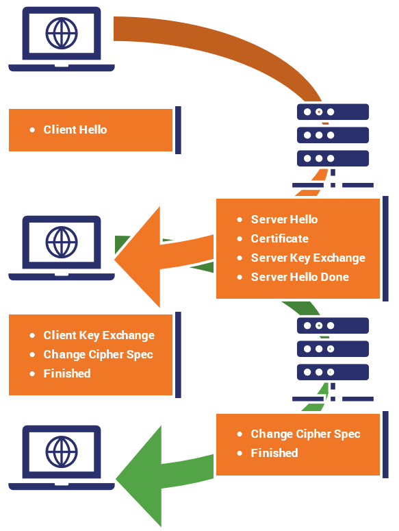

This is a brief comparison of HTTP and HTTPS

- HTTP: HyperText Transfer Protocol
- HTTPS: HyperText Transfer Protocol **Secure**
	- Uses certificates, encryption, TLS.
	- Used for privacy.

## TLS Overview

**Transport Layer Security** (TLS) **protocol** provides privacy (confidentiality) and data integrity between two communicating parties.

- TLS is built on top of TCP/IP.
- TLS is based on **secure socket layer** (SSL), but now SSL is deprecated.

You can check if TLS is used on your browser. The address should begin with `https` and there should be a green lock icon.

### TLS History

- 1994: SSL 1.0
	- Netscape (browser company) used it internally for their browser.
	- Not publicly released.
- 1995: SSL 2.0
	- Published by Netscape.
	- There were several weaknesses.
- 1996: SSL 3.0
	- Designed by Netscape and Paul Kocher.
- 1999: TLS 1.0
	- IETF makes RFC 2246 based on SSL 3.0.
	- Not inter-operable with SSL 3.0
		- TLS uses HMAC instead of MAC.
		- TLS can run on any port.
- 2006: TLS 1.1
	- RFC 4346
	- Protection against CBC padding attacks.
- 2008: TLS 1.2
	- RFC 5246
	- More options in cipher suites like SHA256, AES.
- 2018: TLS 1.3
	- RFC 8446
	- Insecure ciphers such as RC4, DES were removed.
	- Streamline RTT handshakes. (0-RTT mode)

## CBC Padding Oracle Attack

Recall [CBC Mode (Internet Security)](./2023-09-18-symmetric-key-cryptography-2.md#cipher-block-chaining-mode-(cbc)) .

Suppose that each block has $8$ bytes. If the message size is not a multiple of the block size, we pad the message. If we need to pad $b$ bytes, we pad $b$ bytes with $b$, encoded in binary.

If the padding is not valid, the decryption algorithm outputs a *padding error* during the decryption process. The attacker can observe if a padding error has occurred, and use this information to recover the plaintext.

To defend this attack, we can use [encrypt-then-MAC (Modern Cryptography)](../modern-cryptography/2023-09-26-cca-security-authenticated-encryption.md#encrypt-then-mac-(etm)), or hide the padding error.

### Attack in Detail

We will perform a **chosen ciphertext attack** to fully recover the plaintext.

Suppose that we obtain a ciphertext $(\mathrm{IV}, c_1, c_2)$, which is an encryption of two blocks $m = m_0 \parallel m_1$, including the padding. By the CBC encryption algorithm we know that

$$
c_1 = E_k(m_0 \oplus \mathrm{IV}), \qquad c_2 = E_k(m_1 \oplus c_1).
$$

We don't know exactly how many padding bits there were, but it doesn't matter. We brute force by **changing the last byte of $c_1$** and requesting the decryption of the modified ciphertext $(\mathrm{IV}, c_1', c_2)$.

The decryption process of the last block is $c_1 \oplus D_k(c_2)$, so by changing the last byte of $c_1$, we hope to get a decryption result that ends with $\texttt{0x01}$. Then the last byte $\texttt{0x01}$ will be treated as a padding and padding errors will not occur. So we keep trying until we don't get a padding error.[^1]

Now, suppose that we successfully changed the last byte of $c_1$ to $b$, so that the last byte of $(c_1[0\dots6] \parallel b) \oplus D_k(c_2)$ is $\texttt{0x01}$. Next, we change the second-last bit $c_1[6]$ and request the decryption and hope to get an output that ends with $\texttt{0x0202}$. The last two bytes will also be treated as a padding and we won't get a padding error.

We repeat the above process until we get a modified ciphertext $c_1' \parallel c_2$, where the decryption result ends with $8$ bytes of $\texttt{0x08}$. Then now we know that

$$
c_1' \oplus D_k(c_2) = \texttt{0x08}^8.
$$

Then we can recover $D_k(c_2) = c_1' \oplus \texttt{0x08}^8$, and then since $m_1 = c_1 \oplus D_k(c_2)$,

$$
m_1 = c_1 \oplus D_k(c_2) = c_1 \oplus c_1' \oplus \texttt{0x08}^8,
$$

allowing us to recover the whole message $m_1$.

Now to recover $m_0$, we modify the $\mathrm{IV}$ using the same method as above. This time, we do not use $c_2$ and request a decryption of $(\mathrm{IV}', c_1)$ only. If some $\mathrm{IV}'$ gives a decryption result that ends with $8$ bytes of $\texttt{0x08}$, we have that

$$
\mathrm{IV}' \oplus D_k(c_1) = \texttt{0x08}^8.
$$

Similarly, we recover $m_0$ by

$$
m_0 = \mathrm{IV} \oplus D_k(c_1) = \mathrm{IV} \oplus \mathrm{IV}' \oplus \texttt{0x08}^8.
$$

## Hashed MAC (HMAC)

Let $H$ be a has function. We defined MAC as $H(k \parallel m)$ where $k$ is a key and $m$ is a message. This MAC is insecure if $H$ has [Merkle-Damgård construction](../modern-cryptography/2023-09-28-hash-functions.md#merkle-damgård-transform), since it is vulnerable to length extension attacks. See [prepending the key in MAC is insecure (Modern Cryptography)](../modern-cryptography/2023-09-28-hash-functions.md#prepending-the-key).

Choose a key $k \leftarrow \mathcal{K}$, and set

$$
k_1 = k \oplus \texttt{ipad}, \quad k_2 = k\oplus \texttt{opad}
$$

where $\texttt{ipad} = \texttt{0x363636}...$ and $\texttt{opad} = \texttt{0x5C5C5C}...$. Then

$$
\mathrm{HMAC}(k, m) = H(k_2 \parallel H(k_1 \parallel m)).
$$

## TLS Details

- TLS consists of two main protocols (4 in total)
- **Handshake protocol** is the most important.
	- Uses public key cryptography to share a secret key between the client and the server.
- Record protocol
	- Use the shared key from the handshake to protect communication.

### TLS Handshake Protocol

Here's how the client and the server establishes a connection using the TLS handshake protocol. (TLS 1.2, RFC 5246)

> 1. Two parties agree on the following.
> 	- The version of the protocol.
> 	- The set of cipher suites (cryptographic algorithms) to be used.
> 2. The client uses digital certificates to authenticate the server.
> 3. Use the server's public key to share a secret.
> 4. Both parties generate a symmetric key from the shared secret.

[^2]

- `ServerKeyExchange`, `ClientKeyExchange` is optional. Used sometimes if Diffie-Hellman is used.
- The actual messages and process differ for each protocol and ciphers used.
- **All messages after `ChangeCipherSpec` are encrypted.**

#### ClientHello

- Client sends the TLS protocol version and cipher suites that it supports.
	- The version is the highest version supported by the client.
- A random number $N_c$ for generating the secret is sent.
- A session ID may be sent if the client wants to resume an old session.

#### ServerHello

- Server sends the TLS version and cipher suite to use.
	- The TLS version will be the highest version supported by both parties.
	- The server will pick the strongest cryptographic algorithm offered by the client.
- The server also sends a random number $N_s$.

#### Certificate/ServerKeyExchange

- The server sends its public key certificate.
	- The actual data depends on the cipher suite used.
	- For example, it can contain RSA public key, or Diffie-Hellman public key.
- The server will send `ServerHelloDone`.
- The client will verify the server's certificate.

#### ClientKeyExchange

- Client sends *premaster secret* (PMS) $secret_c$.
	- This is encrypted with server's public key.
	- This secret key material will be used to generate the secret key.
- Both parties derive a shared **session key** from $N_c$, $N_s$, $secret_c$.
	- If the protocol is correct, the same key should be generated.

#### Finished

Both parties now switch to encrypted communication. Both parties exchange a `Finished` message.

- This message is the first message protected by the previously agreed cipher.
- The message contains the **hash** of all sent and received messages during the handshake.
- This is to ensure that the key exchange and authentication process were successful and the messages were not tampered with.
- The hash must be verified by the other side.

More information in [Section 7.4.9 (RFC 5246)](https://www.rfc-editor.org/rfc/rfc5246#section-7.4.9).

### Generating Master and Secret Keys

This is from the RFC 5246 document. PRF is a pseudorandom function.

```
master_secret = PRF(pre_master_secret, "master secret",
					ClientHello.random + ServerHello.random)
					[0..47];

key_block = PRF(SecurityParameters.master_secret,
				"key expansion",
				SecurityParameters.server_random +
				SecurityParameters.client_random);
```

- Why do we use `pre_master_secret` and `master_secret`?
	- To provide greater consistency between TLS cipher suites.[^3]

## Version Rollback Attack (SSL)

- Client sends TLS version 3.0, but the attacker in the middle modifies it and sends version 2.0.
- Server thinks that the client only supports SSL 2.0.
- Then the client and the server communicates using SSL 2.0, which may be insecure.

### Chosen Protocol Attacks

 - Also known as **Downgrade Attacks**.
	 - Dangerous since old versions have security vulnerabilities.
 - Attackers can perform attacks using the old, broken version.
	 - Weak protocols, weak cryptographic algorithms, etc.
 - Newer versions (patched) must be *backward-compatible*, since not all people upgrade right away.
 - Methods to prevent this attack.
	 - Drop backward compatibility.
	 - Authenticate the version number.

#### Version Checking in SSL 3.0

- When sending the premaster secret, also send the protocol version.
	- This data is encrypted with the server's public key, so it cannot be tampered.
- The server will decrypt and check if the protocol version matches the version in the `ClientHello` message.

## Other TLS/SSL Protocols

These two protocols run over the record protocol.

- **Alert protocol**
	- Handling of sessions, warnings and errors.
- **Change cipher spec protocol**
	- Not a part of handshake protocol.
	- Indicates that the parties are changing to the agreed cipher suite.

## Issues in TLS 1.2

- **Forward secrecy** is not supported.
- It used weak cryptographic algorithms.
- Compression is not as efficient.

### Forward Secrecy

> **Forward secrecy** is a feature of key agreement protocols that session keys will not be compromised even if long-term secrets used in the session key exchange are compromised.[^4]

> An encryption system has the property of **forward secrecy** if plaintext (decrypted) inspection of the data exchange that occurs during key agreement phase of session initiation does not reveal the key that was used to encrypt the remainder of the session.[^4]

- Forward secrecy prevents an **NSA-style attack**.
	- Save all TLS traffic starting from TLS handshake.
	- Obtain the server's private key later with a court order or hacking in.
	- Decrypt all the stored traffic.
- If an ephemeral session key is used for each new message, forward secrecy is provided.
	- Other messages cannot be decrypted even if a session key is compromised.
- From TLS 1.3, fixed by only using Diffie-Hellman ephemeral (`DHE-*`) ciphers.

### DH-RSA and DHE-RSA

Actual secret sharing is done using Diffie-Hellman key exchange, and RSA is used for digital signatures.

#### DH-RSA

- Server's **permanent** key pair is a Diffie-Hellman key pair.
	- Certificate has the server's public key $g^s \bmod p$.
	- Certificate is signed by the CA using RSA.
- The client sends $g^c \bmod p$.

#### DHE-RSA

- **For each TLS session**, the server generates a random number $s$.
- The server's public key is $g^s \bmod p$.
	- Certificate is signed using RSA.
- The client sends $g^c \bmod p$.
- The server and client agree on a secret $g^{sc} \bmod p$.
- The ephemeral keys $s$ and $g^{sc} \bmod p$ are discarded after the session.

## TLS 1.3

- TLS 1.3 does not support RSA, nor other vulnerable cipher suites.
- Shortened TLS handshake, thus faster and more secure.
	- Reduced RTTs (round trip time).
	- Achieves forward secrecy.

### TLS 1.3 Handshake

We previously had 2 round trips, but now we have one. The main difference is the client hello part.

- **Client hello**
	- Protocol version, client random, cipher suites are sent.
	- **Parameters for calculating the premaster secret are also sent.**[^5]
- **Server generates master secret**
	- Server has client random, parameters and cipher suites.
	- Using the server random, generate the master secret.
- **Server hello** and **Finished**
	- Server's certificate, digital signature, server random, chosen cipher suite is sent.
	- This message is encrypted, so server random is not leaked.
	- Master secret has been generated, so `Finished` is sent.
- **Client Finished**
	- Client verifies the certificate, generates master secret, sends `Finished`.

### 0-RTT for Session Resumption

TLS 1.3 also supports an event faster handshake that doesn't require and round trips.

- Works only if the user has visited the website before.
- Both parties can derive another shared secret from the first session.
	- **Resumption main secret**, **pre-shared key** (PSK)
- The server sends a **session ticket** during the first session.
	- The client sends this ticket along with the first encrypted message of the new session.

#### Replay Attacks in 0-RTT

0-RTT is susceptible to **replay attacks**.

- Different servers (of the same domain) cannot catch replay attacks.
- Initial data in TLS resumption should be handled carefully.
	- For example, only allow methods that do not change state (like HTTP GET) without any parameters.

Read more in [Introducing 0-RTT (Cloudflare Blog)](https://blog.cloudflare.com/introducing-0-rtt/).

[^1]: We have to brute force this, since if a padding error occurs, we don't get to see the decrypted data. If we don't get a padding error, we will likely get a MAC error, so we still don't get to see the decrypted data. All we do is exploit the fact that a padding error didn't occur.
[^2]: Source: [The SSL Store](https://www.thesslstore.com/blog/explaining-ssl-handshake/).
[^3]: Source: [Cryptography SE](https://crypto.stackexchange.com/questions/24780/what-is-the-purpose-of-pre-master-secret-in-ssl-tls).
[^4]: Source: [Forward secrecy (Wikipedia)](https://en.wikipedia.org/wiki/Forward_secrecy).
[^5]: The client is assuming that it knows the server's preferred key exchange method, since many insecure cipher suites have been removed. Now, the number of possible cipher suites has been reduced.
