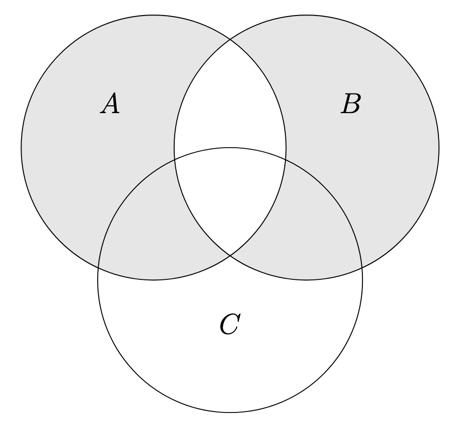

르벡 적분을 공부하기 위해서는 먼저 집합의 ‘길이’ 개념을 공부해야 합니다. 그리고 집합의 ‘길이’ 개념을 확립하기 위해서는 집합 간의 연산과 이에 대한 구조가 필요합니다.

## Algebra of Sets

$\mathcal{R}$이 집합의 모임이라고 하겠습니다. $\mathcal{R} \neq \varnothing$ 임을 가정합니다.

**정의.** (Ring) $\mathcal{R}$가 다음을 만족하면 $\mathcal{R}$를 **ring**이라고 한다.

> 모든 $A, B \in \mathcal{R}$ 에 대하여 $A \cup B \in \mathcal{R}$ 이고 $A \setminus B \in \mathcal{R}$ 이다.

합집합과 차집합에 닫혀 있으면 ring이 된다고 합니다. 다음을 관찰할 수 있습니다.

**명제.** $\mathcal{R}$가 ring이라고 하자.

- $\mathcal{R}\neq \varnothing$ 이므로, $A \in \mathcal{R}$ 를 잡을 수 있다. 따라서 $A \setminus A = \varnothing \in \mathcal{R}$ 이다.
- $A, B \in \mathcal{R}$ 에 대하여 $A \cap B = A \setminus(A \setminus B) \in \mathcal{R}$ 이므로 ring은 교집합에 대해서도 닫혀 있다.

합집합, 교집합, 차집합 등의 연산을 하다보면 자연스럽게 그 결과는 전체집합의 부분집합이 됩니다. 이를 모아 power set으로 정의하게 됩니다.

**정의.** (Power Set) 집합 $X$에 대하여 power set $\mathcal{P}(X)$는 다음과 같이 정의한다.

$$\mathcal{P}(X) = \{A : A \subseteq X\}.$$

Ring과 유사하지만 살짝 더 좋은 성질을 가진 구조를 가지고 논의를 전개합니다.

**정의.** (Algebra) 다음 조건을 만족하는 $\mathcal{F} \subseteq\mathcal{P}(X)$ 를 **algebra** on $X$ 라고 한다.

1. $X \in \mathcal{F}$ 이다.
2. $A \in \mathcal{F}$ 이면 $X \setminus A \in \mathcal{F}$ 이다.
3. $A, B \in \mathcal{F}$ 이면 $A\cup B \in \mathcal{F}$ 이다.

**참고.** 여집합의 경우 $A^C = X \setminus A$ 와 같이 표기합니다. 다음이 성립함을 이미 알고 있습니다.

> $A \cap B = (A^C \cup B^C)^C$, $A\setminus B = A \cap B^C$.

그러므로 $A, B \in \mathcal{F}$ 이면 $A \cap B, A \setminus B \in \mathcal{F}$ 입니다. 따라서 algebra의 경우 합집합, 교집합, 차집합, 여집합에 대해 모두 닫혀 있음을 알 수 있습니다. Ring 보다는 조금 더 다루기 편합니다.

자세히 살펴보니 ring의 정의와 유사한데, 1번 조건이 추가되었고 차집합이 $X$에 대한 차집합으로 바뀐 것을 확인할 수 있습니다. 실제로 다음이 성립하는 것을 확인할 수 있습니다.

**명제.** 다음이 성립한다.

1. $\mathcal{R}$이 algebra on $X$이면 $\mathcal{R}$은 ring이다.
2. $\mathcal{R} \subseteq\mathcal{P}(X)$이 ring이고 $X \in \mathcal{R}$ 이면 $\mathcal{R}$은 algebra on $X$ 이다.

조금만 더 확장해서 countable한 연산에 대해서도 허용하고 싶습니다.

**정의.** ($\sigma$-ring) $\mathcal{R}$이 ring일 때, $A_n \in \mathcal{R}$ ($n = 1, 2, \dots$) 에 대하여 $\displaystyle\bigcup_{n=1}^\infty A_n \in \mathcal{R}$ 이 성립하면 $\mathcal{R}$을 **$\sigma$-ring**이라 한다.

Countable한 합집합을 해도 닫혀 있다는 뜻입니다. 조금 생각해보면 마찬가지로 교집합에 대해서도 성립함을 알 수 있습니다.

**참고.** 다음 성질

$$\bigcap_{n=1}^\infty A_n = A_1 \setminus\bigcup_{n=1}^\infty (A_1 \setminus A_n)$$

을 이용하면 $\mathcal{R}$이 $\sigma$-ring이고 $A_n \in \mathcal{R}$ 일 때 $\displaystyle\bigcap_{n=1}^\infty A_n \in \mathcal{R}$ 임을 알 수 있다.

마찬가지로 algebra도 정의할 수 있습니다.

**정의.** ($\sigma$-algebra) $\mathcal{F}$가 algebra on $X$일 때, $A_n \in \mathcal{F}$ ($n = 1, 2, \dots$) 에 대하여 $\displaystyle\bigcup_{n=1}^\infty A_n \in \mathcal{F}$ 가 성립하면 $\mathcal{F}$를 **$\sigma$-algebra**라 한다.

$\sigma$-algebra는 당연히 $\sigma$-ring이기 때문에 countable한 교집합을 해도 닫혀 있습니다.

## Set Functions

집합 간의 연산을 정의했으니, 이제 집합의 ‘길이’를 정의할 준비가 되었습니다. 집합에 ‘길이’를 대응시키는 것은 곧 집합 위에서 함수를 정의하는 것과 같습니다. 이와 같은 맥락에서 set function 개념이 등장합니다.

**정의.** (Set Function) $\mathcal{R}$이 ring on $X$라고 하자. 함수 $\phi : \mathcal{R} \rightarrow\overline{\mathbb{R}}$ 를 $\mathcal{R}$ 위의 **set function**이라 한다.

정의역이 $\mathcal{R}$으로, 집합의 모임입니다. 즉 $\phi$는 집합을 받아 $\overline{\mathbb{R}}$과 대응시키는 함수임을 알 수 있습니다.

우리는 ‘길이’ 함수를 정의하고자 합니다. ‘길이’는 보통 양수이기 때문에, $\phi$의 치역에 $-\infty$와 $\infty$가 동시에 포함되어 있는 경우는 제외합니다. 또한 $\phi$의 치역이 $\{\infty\}$이거나 $\{-\infty\}$인 경우도 생각하지 않습니다.

따라서, $\phi(A) \in \mathbb{R}$ 인 $A \in \mathcal{R}$이 존재한다고 가정할 수 있습니다. 이 사실은 양변에서 $\phi(A)$를 cancel 할 때 사용됩니다.

**정의.** $\phi$는 $\mathcal{R}$ 위의 set function이다.

1. 서로소인 두 집합 $A, B \in \mathcal{R}$ 에 대하여

$$\phi(A\cup B) = \phi(A) + \phi(B)$$

이면 $\phi$는 **additive**하다.
2. 쌍마다 서로소인 집합 $A_i \in \mathcal{R}$ 에 대하여

$$\phi\left( \bigcup_{i=1}^\infty A_i \right) = \sum_{i=1}^\infty \phi(A_i)$$

이고 $\displaystyle\bigcup_{i=1}^\infty A_i \in \mathcal{R}$ 이면[^1] $\phi$는 **countably additive** ($\sigma$-additive) 하다.

이제 ‘길이’의 개념을 나타내는 함수를 정의합니다. 이 함수는 측도(measure)라고 합니다.

**정의.** (Measure) $\sigma$-ring $\mathcal{R}$에 대하여, $\mathcal{R}$ 위의 set function $\mu$가 countably additive이고 치역이 $[0, \infty]$이면 $\mu$를 measure on $\mathcal{R}$이라 한다.

치역이 음이 아닌 실수와 무한대인 것은 ‘길이’의 개념을 나타내기 위해서입니다. 또한 countable 성질을 가져가고 싶은 이유를 이제 설명할 수 있습니다. 열린집합 $U \subseteq\mathbb{R}$ 은 서로소인 열린 구간의 countable한 합집합으로 표현할 수 있습니다.[^2] 실수의 열린 부분집합에 대해 먼저 ‘길이’를 정의하고 이를 다른 부분집합으로 확장하는 논리 전개 방식을 택할 예정이기 때문에, countable 조건이 필요한 것입니다.

**참고.**

1. $\phi$가 additive이면 쌍마다 서로소인 $A_i \in \mathcal{R}$ 에 대하여 다음이 성립한다.

$$\phi\left( \bigcup_{i=1}^n A_i \right) = \sum_{i=1}^n \phi(A_i).$$

이 성질을 *finite additivity*라 부르고, $\phi$는 *finitely additive*하다고 한다.
2. $\phi(\varnothing) = 0$ 이다. $\phi(A) = \phi(A \cup \varnothing)$ 라고 적고, 양변에서 $\phi(A) \in \mathbb{R}$ 를 지울 수 있다.

$\phi(A) \in \mathbb{R}$ 인 $A \in \mathcal{R}$이 존재한다는 가정을 사용했습니다. 앞서 언급한 것처럼, extended real number가 나오기 때문에 뺄셈에 조심해야 합니다.

**정의.** $\mu$가 measure on $\sigma$-algebra $\mathcal{F} \subseteq\mathcal{P}(X)$ 라 하자.

1. $\mu$가 **finite** 하다. $\iff$모든 $X \in \mathcal{F}$ 에 대하여 $\mu(X) < \infty$ 이다.
2. $\mu$가 **$\sigma$-finite** 하다. $\iff$집합열 $F_1 \subseteq F_2 \subseteq\cdots$ 가 존재하여 $\mu(F_i) < \infty$ 이고 $\displaystyle\bigcup_{i=1}^\infty F_i = X$ 이다.

## Basic Properties of Set Functions

$\phi$가 set function이라 하자.

- $\phi$가 ring $\mathcal{R}$ 위에서 countably additive이면 $\phi$는 additive이다.
- $\phi$가 ring $\mathcal{R}$ 위에서 additive이면, $A, B \in \mathcal{R}$ 에 대하여

$$\phi(A\cup B) + \phi(A\cap B) = \phi(A) + \phi(B)$$

가 성립한다.[^3]

- $\phi$가 ring $\mathcal{R}$ 위에서 additive이면, $A_1 \subseteq A_2$ 인 $A_1, A_2 \in \mathcal{R}$ 에 대하여

$$\phi(A_2) = \phi(A_2 \setminus A_1) + \phi(A_1)$$

가 성립한다. 따라서,

  1. $\phi \geq 0$ 이면 $\phi(A_1) \leq \phi(A_2)$ 이다. (단조성)
  2. $\lvert \phi(A_1) \rvert < \infty$ 이면 $\phi(A_2 \setminus A_1) = \phi(A_2) - \phi(A_1)$ 이다.[^4]

- $\phi$가 additive이고 $\phi \geq 0$ 이면 $A, B \in \mathcal{R}$ 에 대하여

$$\phi(A\cup B) \leq \phi(A) + \phi(B)$$

가 성립한다. 귀납법을 적용하면, 모든 $A_i \in \mathcal{R}$에 대하여

$$\phi\left( \bigcup_{n=1}^m A_n \right) \leq \sum_{n=1}^m \phi(A_n)$$

가 성립한다. 이 때 $A_i$가 반드시 쌍마다 서로소일 필요는 없다. 이 성질을 *finite subadditivity*라 한다.

마지막으로 measure와 관련된 정리를 소개합니다.

**정리.** $\mu$가 $\sigma$-algebra $\mathcal{F}$의 measure라 하자. $A_n \in \mathcal{F}$ 에 대하여 $A_1 \subseteq A_2 \subseteq\cdots$ 이면

$$\lim_{n\rightarrow\infty} \mu(A_n) = \mu\left( \bigcup_{n=1}^\infty A_n \right)$$

이 성립한다.

**증명.** $B_1 = A_1$, $n \geq 2$ 에 대해 $B_n = A_n \setminus A_{n-1}$ 로 두자. $B_n$은 쌍마다 서로소임이 자명하다. 따라서,

$$\mu(A_n) = \mu\left( \bigcup_{k=1}^n B_k \right) = \sum_{k=1}^n \mu(B_k)$$

이고, measure의 countable additivity를 이용하여

$$\lim_{n\rightarrow\infty} \mu(A_n) = \lim_{n\rightarrow\infty} \sum_{k=1}^n \mu(B_k) = \sum_{n=1}^\infty \mu(B_n) = \mu\left( \bigcup_{n=1}^{\infty} B_n \right) = \mu\left( \bigcup_{n=1}^\infty A_n \right)$$

임을 알 수 있다. 마지막 등호에서는 $\displaystyle\bigcup_{n=1}^\infty A_n = \bigcup_{n=1}^\infty B_n$ 임을 이용한다.

왠지 위 조건을 뒤집어서 $A_1 \supseteq A_2 \supseteq \cdots$ 인 경우 교집합에 대해서도 성립하면 좋을 것 같습니다.

$$\lim_{n\rightarrow\infty} \mu(A_n) = \mu\left( \bigcap_{n=1}^\infty A_n \right).$$

하지만 안타깝게도 조건이 부족합니다. $\mu(A_1) < \infty$ 라는 추가 조건이 필요합니다. 반례는 $A_n = [n, \infty)$를 생각해보면 됩니다. 정리의 정확한 서술은 다음과 같습니다. 증명은 연습문제로 남깁니다.

**정리.** $\mu$가 $\sigma$-algebra $\mathcal{F}$의 measure라 하자. $A_n \in \mathcal{F}$ 에 대하여 $A_1 \supseteq A_2 \supseteq \cdots$ 이고 $\mu(A_1) < \infty$ 이면

$$\lim_{n\rightarrow\infty} \mu(A_n) = \mu\left( \bigcap_{n=1}^\infty A_n \right)$$

이 성립한다.

이 두 정리를 **continuity of measure**라고 합니다. 함수가 연속이면 극한이 함수 안으로 들어갈 수 있는 성질과 유사하여 이와 같은 이름이 붙었습니다. 어떤 책에서는 $A_1 \subseteq A_2 \subseteq\cdots$ 조건을 $A_n \nearrow \bigcup_n A_n$ 라 표현하기도 합니다. 그래서 이 조건에 대한 정리를 *continuity from below*라 하기도 합니다. 마찬가지로 $A_1 \supseteq A_2 \supseteq \cdots$ 조건을 $A_n \searrow \bigcap_n A_n$ 로 적고 이에 대한 정리를 *continuity from above*라 합니다.

---

이제 measure의 개념을 정리했으니 다음 글에서는 본격적으로 집합을 재보려고 합니다. 우리의 목표는 $\mathbb{R}^p$에서 measure를 정의하는 것입니다. 우선 쉽게 잴 수 있는 집합들부터 고려할 것입니다.

[^1]: $\sigma$-ring 이면 불필요한 조건이지만, 일반적인 ring에 대해서는 필요한 조건입니다.

[^2]: 증명은 해석개론, 김김계 책을 참고해주세요. 각 구간마다 유리수를 택할 수 있고, 유리수는 countable이기 때문에...

[^3]: 확률의 덧셈정리와 유사합니다. 확률론 또한 measure theory와 관련이 깊습니다.

[^4]: 무한하지 않다는 조건이 있어야 이항이 가능합니다.