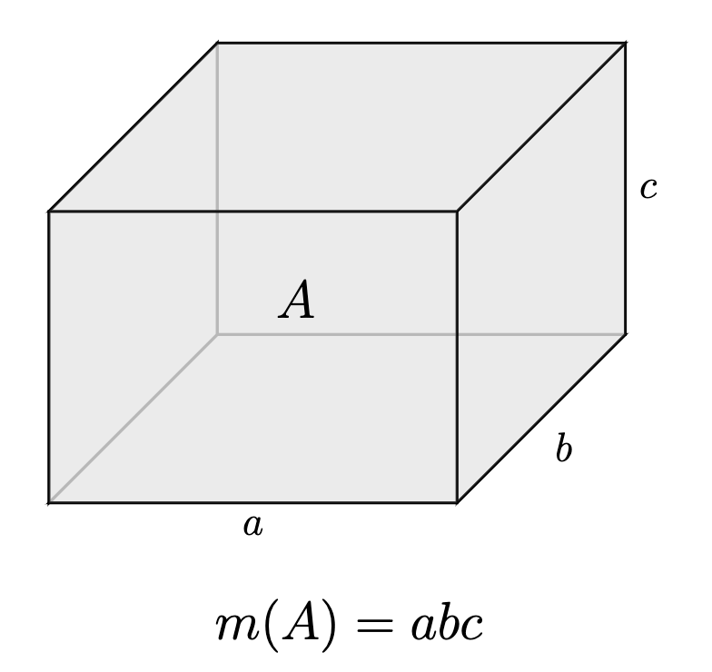

이제 본격적으로 집합을 재보도록 하겠습니다. 우리가 잴 수 있는 집합들부터 시작합니다. $\mathbb{R}^p$에서 논의할 건데, 이제 여기서부터는 $\mathbb{R}$의 구간의 열림/닫힘을 모두 포괄하여 정의합니다. 즉, $\mathbb{R}$의 구간이라고 하면 $[a, b], (a, b), [a, b), (a, b]$ 네 가지 경우를 모두 포함합니다.

## Elementary Sets

**정의.** ($\mathbb{R}^p$의 구간) $a_i, b_i \in \mathbb{R}$, $a_i \leq b_i$ 라 하자. $I_i$가 $\mathbb{R}$의 구간이라고 할 때, $\mathbb{R}^p$의 구간은

$$\prod_ {i=1}^p I_i = I_1 \times \cdots \times I_p$$

와 같이 정의한다.

예를 들어 $\mathbb{R}^2$의 구간이라 하면 직사각형 영역, $\mathbb{R}^3$의 구간이라 하면 직육면체 영역을 떠올릴 수 있습니다. 단, 경계는 포함되지 않을 수도 있습니다.

이러한 구간들을 유한개 모아 합집합하여 얻은 집합을 모아 elementary set이라 합니다.

**정의.** (Elementary Set) 어떤 집합이 유한개 구간의 합집합으로 표현되면 그 집합을 **elementary set**이라고 한다. 그리고 $\mathbb{R}^p$의 elementary set의 모임을 $\Sigma$로 표기한다.

임의의 구간은 유계입니다. 따라서 구간의 유한한 합집합도 유계일 것입니다.

**참고.** 임의의 elementary set은 유계이다.

Elementary set의 모임에서 집합의 연산을 정의할 수 있을 것입니다. 이 때, $\Sigma$가 ring이 된다는 것을 간단하게 확인할 수 있습니다.

**명제.** $\Sigma$는 ring이다. 하지만 전체 공간인 $\mathbb{R}^p$를 포함하고 있지 않기 때문에 $\sigma$-ring은 아니다.

구간의 길이를 재는 방법은 아주 잘 알고 있습니다. 유한개 구간의 합집합인 elementary set에서도 쉽게 잴 수 있습니다. 이제 길이 함수 $m: \Sigma \rightarrow[0, \infty)$ 을 정의하겠습니다. 아직 measure는 아닙니다.

**정의.** $a_i, b_i \in \mathbb{R}$ 가 구간 $I_i$의 양 끝점이라 하자. $\mathbb{R}^p$의 구간 $I = \displaystyle\prod_ {i=1}^p I_i$ 에 대하여,

$$m(I) = \prod_ {i=1}^p (b_i - a_i)$$

로 정의한다.

**정의.** $I_i$가 쌍마다 서로소인 $\mathbb{R}^p$의 구간이라 하자. $A = \displaystyle\bigcup_ {i=1}^n I_i$ 에 대하여

$$m(A) = \sum_ {i=1}^n m(I_i)$$

로 정의한다.

$\mathbb{R}, \mathbb{R}^2, \mathbb{R}^3$에서 생각해보면 $m$은 곧 길이, 넓이, 부피와 대응되는 함수임을 알 수 있습니다. 또한 쌍마다 서로소인 구간의 합집합에 대해서는 각 구간의 함숫값을 더한 것으로 정의합니다. 어떤 집합을 겹치지 않게 구간으로 나눌 수 있다면, 집합의 ‘길이’가 각 구간의 ‘길이’ 합이 되는 것은 자연스럽습니다.

그리고 이 정의는 well-defined 입니다. $A \in \Sigma$ 에 대해서 서로소인 유한개 구간의 합집합으로 나타내는 방법이 유일하지 않아도, $m$ 값은 같습니다.

**참고.** $m$은 $\Sigma$ 위에서 additive이다. 따라서 $m : \Sigma \rightarrow[0, \infty)$ 은 additive set function이다.

여기서 추가로 regularity 조건을 만족했으면 좋겠습니다.

**정의.** (Regularity) Set function $\mu: \Sigma \rightarrow[0, \infty]$ 가 additive라 하자. 모든 $A \in \Sigma$ 와 $\epsilon > 0$ 에 대하여

> 닫힌집합 $F \in \Sigma$, 열린집합 $G \in \Sigma$ 가 존재하여 $F \subseteq A \subseteq G$ 이고 $\mu(G) - \epsilon \leq \mu(A) \leq \mu(F) + \epsilon$

이면 $\mu$가 $\Sigma$ 위에서 **regular**하다고 정의한다.

위에서 정의한 $m$이 regular한 것은 쉽게 확인할 수 있습니다.

이제 set function $\mu: \Sigma \rightarrow[0, \infty)$ 가 finite, regular, additive 하다고 가정합니다.

**정의.** (Outer Measure) $E \in \mathcal{P}(\mathbb{R}^p)$ 의 **outer measure** $\mu^\ast: \mathcal{P}(\mathbb{R}^p) \rightarrow[0, \infty]$ 는

$$\mu^\ast(E) = \inf \left\lbrace \sum_ {n=1}^\infty \mu(A_n) : \text{열린집합 } A_n \in \Sigma \text{ 에 대하여 } E \subseteq\bigcup_ {n=1}^\infty A_n\right\rbrace.$$

로 정의한다.

Outer measure라 부르는 이유는 $E$의 바깥에서 길이를 재서 근사하기 때문입니다. Outer measure는 모든 power set에 대해서 정의할 수 있으니, 이를 이용해서 모든 집합을 잴 수 있으면 좋겠습니다. 하지만 measure가 되려면 countably additive 해야하는데, 이 조건이 가장 만족하기 까다로운 조건입니다. 실제로 countably additive 조건이 성립하지 않습니다.

**참고.**

- $\mu^\ast \geq 0$ 이다.

- $E_1 \subseteq E_2$ 이면 $\mu^\ast(E_1) \leq \mu^\ast(E_2)$ 이다. (단조성)

**정리.**

1. $A \in \Sigma$ 이면 $\mu^\ast(A) = \mu(A)$.[^1]

2. Countable subadditivity가 성립한다.

	$$\mu^\ast\left( \bigcup_ {n=1}^\infty E_n \right) \leq \sum_ {n=1}^\infty \mu^\ast(E_n), \quad (\forall E_n \in \mathcal{P}(\mathbb{R}^p))$$

**증명.**

(1) $A \in \Sigma$, $\epsilon > 0$ 라 두자. $\mu$의 regularity를 이용하면, 열린집합 $G \in \Sigma$ 가 존재하여 $A \subseteq G$ 이고

$$\mu^\ast(A) \leq \mu(G) \leq \mu(A) + \epsilon$$

이다. $\mu^\ast$의 정의에 의해 열린집합 $A_n \in \Sigma$ 가 존재하여 $A \subseteq\displaystyle\bigcup_ {n=1}^\infty A_n$ 이고

$$\sum_ {n=1}^\infty \mu(A_n) \leq \mu^\ast(A) + \epsilon$$

이다. 마찬가지로 regularity에 의해 닫힌집합 $F \in \Sigma$ 가 존재하여 $F\subseteq A$ 이고 $\mu(A) \leq \mu(F) + \epsilon$ 이다. $F \subseteq\mathbb{R}^p$ 는 유계이고 닫힌집합이므로 compact set이고, finite open cover를 택할 수 있다. 즉, 적당한 $N \in \mathbb{N}$ 에 대하여 $F \subseteq\displaystyle\bigcup_ {i=1}^N A_ {i}$ 가 성립한다.

따라서

$$\mu(A) \leq \mu(F) + \epsilon \leq \sum_ {i=1}^N \mu(A_i) \leq \sum_ {i=1}^n \mu(A_i) + \epsilon \leq \mu^\ast(A) + 2\epsilon$$

이제 $\epsilon \rightarrow 0$ 로 두면 $\mu(A) = \mu^\ast(A)$ 를 얻는다.

\(2\) 부등식의 양변이 모두 $\infty$ 이면 증명할 것이 없으므로, 양변이 모두 유한하다고 가정하여 모든 $n\in \mathbb{N}$ 에 대해 $\mu^\ast(E_n) < \infty$ 라 하자. $\epsilon > 0$ 로 두고, 각 $n \in \mathbb{N}$ 에 대하여 열린집합 $A_ {n, k} \in \Sigma$ 가 존재하여 $E_n \subseteq\displaystyle\bigcup_ {k=1}^\infty A_ {n, k}$ 이고 $\displaystyle\sum_ {k=1}^\infty \mu(A_ {n,k}) \leq \mu^\ast(E_n) + 2^{-n}\epsilon$ 이다.

$\mu^\ast$는 하한(infimum)으로 정의되었기 때문에,

$$\mu^\ast\left( \bigcup_ {n=1}^\infty E_n \right) \leq \sum_ {n=1}^\infty \sum_ {k=1}^\infty \mu(A_ {n,k}) \leq \sum_ {n=1}^\infty \mu^\ast(E_n) + \epsilon$$

가 성립하고, $\epsilon \rightarrow 0$ 로 두면 부등식이 성립함을 알 수 있다.

## $\mu$-measurable Sets

Countably additive 조건이 성립하는 집합들만 모아서 measure를 construct 하려고 합니다. 아래 내용은 이를 위한 사전 준비 작업입니다.

**표기법.** (대칭차집합) $A \mathop{\mathrm{\triangle}}B = (A\setminus B) \cup (B \setminus A)$.

**정의.**

- $d(A, B) = \mu^\ast(A \mathop{\mathrm{\triangle}}B)$ 로 정의한다.

- 집합열 $A_n$에 대하여 $d(A_n, A) \rightarrow 0$ 이면 $A_n \rightarrow A$ 로 정의한다.

**참고.**

- $A, B, C \in \mathbb{R}^p$ 에 대하여 $d(A, B) \leq d(A, C) + d(C, B)$ 이다.

- $A_1, B_2, B_1, B_2 \in \mathbb{R}^p$ 일 때, 다음이 성립한다.

	$$\left.\begin{array}{c}d(A_1 \cup A_2, B_1 \cup B_2) \\d(A_1 \cap A_2, B_1 \cap B_2) \\d(A_1 \setminus A_2, B_1 \setminus B_2)\end{array}\right\rbrace\leq d(A_1, B_1) + d(A_2, B_2).$$

**정의.** (Finitely $\mu$-measurable) 집합 $A_n \in \Sigma$ 이 존재하여 $A_n \rightarrow A$ 이면 $A$가 **finitely $\mu$-measurable**이라 한다. 그리고 finitely $\mu$-measurable한 집합의 모임을 $\mathfrak{M} _ F(\mu)$로 표기한다.

위 정의는 $\mu$라는 set function에 의해 $\mu^\ast (A_n \mathop{\mathrm{\triangle}}A) \rightarrow 0$ 이 되는 elementary set $A_n$이 존재한다는 의미입니다.

**정의.** ($\mu$-measurable) $A_n \in \mathfrak{M} _ F(\mu)$ 에 대하여 $A = \displaystyle\bigcup_ {n=1}^\infty A_n$ 이면 $A$가 **$\mu$-measurable**이라 한다. 그리고 $\mu$-measurable한 집합의 모임을 $\mathfrak{M}(\mu)$로 표기한다.

**참고.** $\mu^\ast(A) = d(A, \varnothing) \leq d(A, B) + \mu^\ast(B)$.

**명제.** $\mu^\ast(A)$ 또는 $\mu^\ast(B)$가 유한하면, 다음이 성립한다.

$$\lvert \mu^\ast(A) - \mu^\ast(B) \rvert \leq d(A, B).$$

**따름정리.** $A \in \mathfrak{M} _ F(\mu)$ 이면 $\mu^\ast(A) < \infty$ 이다.

**증명.** $A_n \in \Sigma$ 가 존재하여 $A_n \rightarrow A$ 이고, $N \in \mathbb{N}$ 이 존재하여

$$\mu^\ast(A) \leq d(A_N, A) + \mu^\ast(A_N) \leq 1 + \mu^\ast(A_N) < \infty$$

이다.

**따름정리.** $A_n \rightarrow A$ 이고 $A_n, A \in \mathfrak{M} _ F(\mu)$ 이면 $\mu^\ast(A_n)\rightarrow\mu^\ast(A) < \infty$ 이다.

**증명.** $\mu^\ast(A)$, $\mu^\ast(A_n)$가 유한하므로, $n \rightarrow\infty$ 일 때 $\lvert \mu^\ast(A_n) - \mu^\ast(A) \rvert \leq d(A_n, A) \rightarrow 0$ 이다.

## Construction of Measure

준비가 끝났으니 measure를 construct 해보겠습니다! $\mathcal{P}(\mathbb{R}^p)$에서는 할 수 없지만 정의역을 $\mathfrak{M}(\mu)$로 조금 좁히면 measure가 된다는 뜻입니다.

**정리.** $\mathfrak{M}(\mu)$는 $\sigma$-algebra 이고 $\mu^\ast$는 $\mathfrak{M}(\mu)$의 measure가 된다.

**증명.** $\mathfrak{M}(\mu)$가 $\sigma$-algebra이고 $\mu^\ast$가 $\mathfrak{M}(\mu)$에서 countably additive임을 보이면 충분하다.

(Step 0) *$\mathfrak{M} _ F(\mu)$는 ring이다.*

$A, B \in \mathfrak{M} _ F(\mu)$ 라 하자. 그러면 $A_n, B_n \in \Sigma$ 이 존재하여 $A_n \rightarrow A$, $B_n \rightarrow B$ 이 된다. 그러면

$$\left.\begin{array}{c}d(A_n \cup B_n, A \cup B) \\ d(A_n \cap B_n, A \cap B) \\ d(A_n \setminus B_n, A \setminus B)\end{array}\right\rbrace\leq d(A_n, A) + d(B_n, B) \rightarrow 0$$

이므로 $A_n \cup B_n \rightarrow A \cup B, A_n \setminus B_n \rightarrow A\setminus B$ 이기 때문에 $\mathfrak{M} _ F(\mu)$는 ring이다.

**(Step 1)** *$\mu^\ast$는 $\mathfrak{M} _ F(\mu)$ 위에서 additive이다*.

$\Sigma$ 위에서는 $\mu = \mu^\ast$ 이므로, 위 따름정리에 의해

$$\begin{matrix} \mu(A_n) \rightarrow\mu^\ast(A), & \mu(A_n\cup B_n) \rightarrow\mu^\ast(A\cup B), \\ \mu(B_n) \rightarrow\mu^\ast(B), & \mu(A_n\cap B_n) \rightarrow\mu^\ast(A\cap B) \end{matrix}$$

가 성립함을 알 수 있다. 일반적으로 $\mu(A_n) + \mu(B_n) = \mu(A_n \cup B_n) + \mu(A_n \cap B_n)$ 이므로 여기서 $n \rightarrow\infty$ 로 두면

$$\mu^\ast(A) + \mu^\ast(B) = \mu^\ast(A\cup B) + \mu^\ast(A \cap B)$$

를 얻는다. $A \cap B = \varnothing$ 라는 조건이 추가되면 $\mu^\ast$가 additive임을 알 수 있다.

**(Step 2)** *$\mathfrak{M} _ F(\mu) = \lbrace A \in \mathfrak{M}(\mu) : \mu^\ast(A) < \infty\rbrace$.*[^2]

**Claim**. 쌍마다 서로소인 $\mathfrak{M} _ F(\mu)$의 원소들을 잡아 이들의 합집합으로 $A \in \mathfrak{M}(\mu)$ 를 표현할 수 있다.

**증명.** $A_n' \in \mathfrak{M} _ F(\mu)$ 에 대하여 $A = \bigcup A_n'$ 로 두자.

> $A_1 = A_1'$, $n \geq 2$ 이면 $A_n = A_n' \setminus(A_1'\cup \cdots \cup A_ {n-1}')$

와 같이 정의하면 $A_n$이 쌍마다 서로소이고 $A_n \in \mathfrak{M} _ F(\mu)$ 임을 알 수 있다.

위 사실을 이용하여 $A_n \in \mathfrak{M} _  F(\mu)$ 에 대하여 $A = \displaystyle\bigcup_ {n=1}^\infty A_n$ 으로 두자.

1. Countable subadditivity에 의해 $\displaystyle\mu^\ast(A) \leq \sum_ {n=1}^{\infty} \mu^\ast (A_n)$ 가 성립한다.

2. Step 1에 의해 $\displaystyle\bigcup_ {n=1}^k A_n \subseteq A$, $\displaystyle\sum_ {n=1}^{k} \mu^\ast(A_n) \leq \mu^\ast(A)$ 이다. $k \rightarrow\infty$ 로 두면 $\displaystyle\mu^\ast(A) \geq \sum_ {n=1}^\infty \mu^\ast(A_n)$ 임을 알 수 있다.

따라서 $\displaystyle\mu^\ast(A) = \sum_ {n=1}^\infty \mu^\ast(A_n)$ 이다.[^3] [^4]

이제 $B_n =\displaystyle\bigcup_ {k=1}^n A_k$ 로 두자. $\mu^\ast(A) < \infty$ 를 가정하면 $\displaystyle\sum_ {n=1}^\infty \mu^\ast(A_n)$의 수렴성에 의해

$$\displaystyle d(A, B_n) = \mu^\ast\left( \bigcup_ {k=n+1}^\infty A_k \right) = \sum_ {k=n+1}^{\infty} \mu^\ast(A_i) \rightarrow 0 \text{ as } n \rightarrow\infty$$

임을 알 수 있다.

$B_n \in \mathfrak{M} _ F(\mu)$ 이므로 $C_n \in \Sigma$ 를 잡아 각 $n \in \mathbb{N}$ 에 대하여 $d(B_n, C_n)$를 임의로 작게 만들 수 있다. 그러면 $d(A, C_n) \leq d(A, B_n) + d(B_n, C_n)$ 이므로 충분히 큰 $n$에 대하여 $d(A, C_n)$도 임의로 작게 만들 수 있다. 따라서 $C_n \rightarrow A$ 임을 알 수 있고 $A \in \mathfrak{M} _ F(\mu)$ 라는 결론을 내릴 수 있다.

**(Step 3)** *$\mu^\ast$는 $\mathfrak{M}(\mu)$ 위에서 countably additive이다.*

$A_n \in \mathfrak{M}(\mu)$ 가 $A \in \mathfrak{M}(\mu)$ 의 분할이라 하자. 적당한 $m \in \mathbb{N}$ 에 대하여 $\mu^\ast(A_m) = \infty$ 이면

$$\mu^\ast\left( \bigcup_ {n=1}^\infty A_n \right) \geq \mu^\ast(A_m) = \infty = \sum_ {n=1}^\infty \mu^\ast(A_n)$$

이므로 countable additivity가 성립한다.

이제 모든 $n\in \mathbb{N}$ 에 대하여 $\mu^\ast(A_n) < \infty$ 이면, Step 2에 의해 $A_n \in \mathfrak{M} _ F(\mu)$ 이고

$$\mu^\ast(A) = \mu^\ast\left( \bigcup_ {n=1}^\infty A_n \right) = \sum_ {n=1}^\infty \mu^\ast(A_n)$$

가 성립한다.

**(Step 4)** *$\mathfrak{M}(\mu)$는 $\sigma$-ring이다.*

$A_n \in \mathfrak{M}(\mu)$ 이면 $B_ {n, k} \in \mathfrak{M} _ F(\mu)$ 가 존재하여 $\displaystyle A_n = \bigcup_k B_ {n,k}$ 이다. 그러면

$$\bigcup_n A_n = \bigcup_ {n, k} B_ {n, k} \in \mathfrak{M}(\mu)$$

이다.

$A, B \in \mathfrak{M}(\mu)$ 라 하면 $A_n, B_n \in \mathfrak{M} _ F(\mu)$ 에 대해 $\displaystyle A = \bigcup A_n$, $\displaystyle B = \bigcup B_n$ 이므로,

$$A \setminus B = \bigcup_ {n=1}^\infty \left( A_n \setminus B \right) = \bigcup_ {n=1}^\infty (A_n\setminus(A_n\cap B))$$

임을 알 수 있다. 그러므로 $A_n \cap B \in \mathfrak{M} _ F(\mu)$ 인 것만 보이면 충분하다. 정의에 의해

$$A_n \cap B = \bigcup_ {k=1}^\infty (A_n \cap B_k) \in \mathfrak{M}(\mu)$$

이고 $\mu^\ast(A_n \cap B) \leq \mu^\ast(A_n) < \infty$ 이므로 $A_n\cap B \in \mathfrak{M} _ F(\mu)$ 이다. 따라서 $A \setminus B$ 가 $\mathfrak{M} _ F(\mu)$의 원소들의 countable 합집합으로 표현되므로 $A\setminus B \in \mathfrak{M}(\mu)$ 이다.

따라서 $\mathfrak{M}(\mu)$는 $\sigma$-ring이고 $\sigma$-algebra이다.

---

이제 $\Sigma$ 위의 $\mu$ 정의를 $\mathfrak{M}(\mu)$ ($\sigma$-algebra)로 확장하여 $\mathfrak{M}(\mu)$ 위에서는 $\mu = \mu^\ast$ 로 정의합니다. $\Sigma$ 위에서 $\mu = m$ 일 때, 이와 같이 확장한 $\mathfrak{M}(m)$ 위의 $m$을 **Lebesgue measure** on $\mathbb{R}^p$라 합니다. 그리고 $A \in \mathfrak{M}(m)$ 를 Lebesgue measurable set이라 합니다.

[^1]: $A$가 open이 아니면 자명하지 않은 명제입니다.

[^2]: $A$가 $\mu$-measurable인데 $\mu^\ast(A) < \infty$이면 $A$는 finitely $\mu$-measurable이다.

[^3]: $A$가 countable union of sets in $\mathfrak{M} _ F(\mu)$이므로 $\mu^\ast$도 각 set의 $\mu^\ast$의 합이 된다.

[^4]: 아직 증명이 끝나지 않았습니다. $A_n$은 $\mathfrak{M}(\mu)$의 원소가 아니라 $\mathfrak{M} _ F(\mu)$의 원소입니다.
