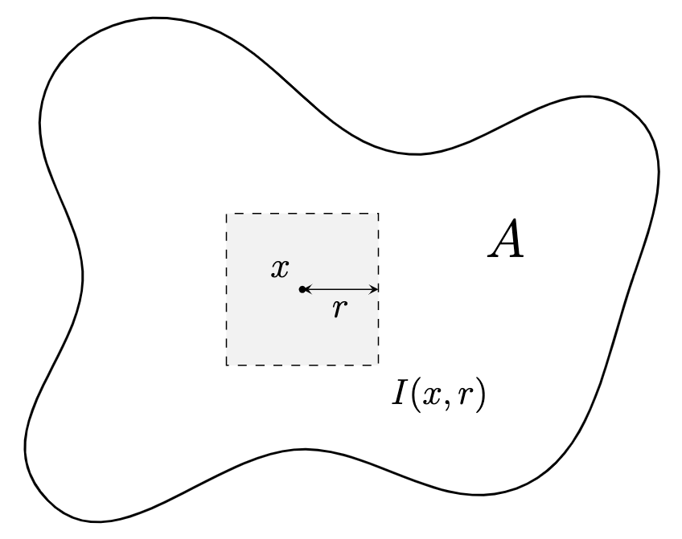

## Remarks on Construction of Measure

Construction of measure 증명에서 추가로 참고할 내용입니다.

**명제.** $A$가 열린집합이면 $A \in \mathfrak{M}(\mu)$ 이다. 또한 $A^C \in \mathfrak{M}(\mu)$ 이므로, $F$가 닫힌집합이면 $F \in \mathfrak{M}(\mu)$ 이다.

**증명.** 중심이 $x\in \mathbb{R}^p$ 이고 반지름이 $r$인 열린 box를 $I(x, r)$이라 두자. $I(x, r)$은 명백히 $\mathfrak{M}_F(\mu)$의 원소이다. 이제

$$A = \bigcup_{\substack{x \in \mathbb{Q}^p, \; r \in \mathbb{Q}\\ I(x, r)\subseteq A}} I(x, r)$$

로 적을 수 있으므로 $A$는 $\mathfrak{M}_F(\mu)$의 원소들의 countable union이 되어 $A \in \mathfrak{M}(\mu)$ 이다. 이제 $\mathfrak{M}(\mu)$가 $\sigma$-algebra이므로 $A^C\in \mathfrak{M}(\mu)$ 이고, 이로부터 임의의 닫힌집합 $F$도 $\mathfrak{M}(\mu)$의 원소임을 알 수 있다.

**명제.** $A \in \mathfrak{M}(\mu)$ 이면 임의의 $\epsilon > 0$ 에 대하여

$$F \subseteq A \subseteq G, \quad \mu\left( G \setminus A \right) < \epsilon, \quad \mu\left( A \setminus F \right) < \epsilon$$

를 만족하는 열린집합 $G$와 닫힌집합 $F$가 존재한다.

이는 곧 정의역을 $\mathfrak{M}(\mu)$로 줄였음에도 $\mu$가 여전히 $\mathfrak{M}(\mu)$ 위에서 regular라는 뜻입니다.

**증명.** $A = \bigcup_{n=1}^\infty A_n$ ($A_n \in \mathfrak{M}_F(\mu)$) 로 두고 $\epsilon > 0$ 을 고정하자. 각 $n \in \mathbb{N}$ 에 대하여 열린집합 $B_{n, k} \in \Sigma$ 를 잡아 $A_n \subseteq\bigcup_{k=1}^\infty B_{n, k}$ 와

$$\mu\left( \bigcup_{k=1}^{\infty} B_{n, k} \right) \leq \sum_{k=1}^{\infty} \mu\left( B_{n, k} \right) < \mu\left( A_n \right) + 2^{-n}\epsilon$$

을 만족하도록 할 수 있다.[^1]

이제 열린집합을 잡아보자. $G_n = \bigcup_{k=1}^{\infty} B_{n, k}$ 으로 두고 $G = \bigcup_{n=1}^{\infty} G_n$ 로 잡는다. $A_n \in \mathfrak{M}_F(\mu)$ 이므로 $\mu\left( A_n \right) < \infty$ 이고, 다음이 성립한다.

$$\begin{aligned}
        \mu\left( G \setminus A \right) & = \mu\left( \bigcup_{n=1}^{\infty} G_n \setminus\bigcup_{n=1}^{\infty} A_n \right) \leq \mu\left( \bigcup_{n=1}^{\infty} G_n \setminus A_n \right) \\ &\leq \sum_{n=1}^{\infty} \mu\left( G_n \setminus A_n \right) \leq \sum_{n=1}^{\infty} 2^{-n}\epsilon = \epsilon.
    \end{aligned}$$

닫힌집합의 존재성을 보이기 위해 위 과정을 $A^C$에 대해 반복하면 $A^C \subseteq F^C$, $\mu\left( F^C \setminus A^C \right) < \epsilon$ 가 되도록 열린집합 $F^C$를 잡을 수 있다. $F$가 닫힌집합이고 $F^C \setminus A^C = F^C \cap A = A\setminus F$ 이므로 $\mu\left( A \setminus F \right) < \epsilon$ 이고 $F\subseteq A$ 이다.

**정의.** (Borel $\sigma$-algebra) $\mathbb{R}^p$의 모든 열린집합과 닫힌집합을 포함하는 $\sigma$-algebra를 $\mathfrak{B} = \mathfrak{B}(\mathbb{R}^p)$ 라 적고 **Borel $\sigma$-algebra**라 한다. 또한 $\mathfrak{B}$의 원소 $E$를 **Borel set**이라 한다.

Borel $\sigma$-algebra는 $\mathbb{R}^p$의 열린집합을 포함하는 가장 작은 $\sigma$-algebra로 정의할 수도 있습니다. $O$가 $\mathbb{R}^p$의 열린집합의 모임이라 하면

$$\mathfrak{B} = \bigcap_{O \subseteq G,\;G:\, \sigma\text{-algebra}} G$$

로 정의합니다. 여기서 '가장 작은'의 의미는 집합의 관점에서 가장 작다는 의미로, 위 조건을 만족하는 임의의 집합 $X$를 가져오더라도 $X \subseteq\mathfrak{B}$ 라는 뜻입니다. 그래서 교집합을 택하게 됩니다. 위 정의에 의해 $\mathfrak{B} \subseteq\mathfrak{M}(\mu)$ 임도 알 수 있습니다.

## $\mu$-measure Zero Sets

**정의.** ($\mu$-measure zero set) $A \in \mathfrak{M}(\mu)$ 에 대하여 $\mu(A) = 0$ 인 $A$를 **$\mu$-measure zero set**이라 한다.

**명제.** $A \in \mathfrak{M}(\mu)$ 이면 $F \subseteq A \subseteq G$ 인 Borel set $F$, $G$가 존재한다. 추가로, $A$는 Borel set과 $\mu$-measure zero set의 합집합으로 표현할 수 있으며, $A$와 적당한 $\mu$-measure zero set을 합집합하여 Borel set이 되게 할 수 있다.

**증명.** $\mathfrak{M}(\mu)$의 regularity를 이용하여 다음을 만족하는 열린집합 $G_n \in \Sigma$, 닫힌집합 $F_n \in \Sigma$ 를 잡는다.

$$F_n \subseteq A \subseteq G_n, \quad \mu\left( G_n \setminus A \right) < \frac{1}{n}, \quad \mu\left( A \setminus F_n \right) < \frac{1}{n}.$$

이제 $F = \bigcup_{n=1}^{\infty} F_n$, $G = \bigcap_{n=1}^{\infty} G_n$ 로 정의하면 $F, G \in \mathfrak{B}$ 이고 $F \subseteq A \subseteq G$ 이다.

한편, $A = F \cup (A \setminus F)$, $G = A \cup (G \setminus A)$ 로 적을 수 있다. 그런데 $n \rightarrow\infty$ 일 때

$$\left.\begin{array}{r}\mu\left( G \setminus A \right)\leq \mu\left( G_n \setminus A \right) < \frac{1}{n} \\
        \mu\left( A \setminus F \right) \leq \mu\left( A \setminus F_n \right) < \frac{1}{n}\end{array}\right\}
    \rightarrow 0$$

이므로 $A \in \mathfrak{M}(\mu)$ 는 Borel set 과 $\mu$-measure zero set의 합집합이다. 그리고 $A \in \mathfrak{M}(\mu)$ 에 적당한 $\mu$-measure zero set을 합집합하여 Borel set이 되게 할 수 있다.

**명제.** 임의의 measure $\mu$에 대하여 $\mu$-measure zero set의 모임은 $\sigma$-ring이다.

**증명.** Countable subadditivity를 확인하면 나머지는 자명하다. 모든 $n\in \mathbb{N}$ 에 대하여 $\mu\left( A_n \right) = 0$ 이라 하면

$$\mu\left( \bigcup_{n=1}^{\infty} A_n \right) \leq \sum_{n=1}^{\infty} \mu\left( A_n \right) = 0$$

이다.

**명제.** $A$가 countable set이면 $m(A) = 0$ 이다. 그러나 $m(A) = 0$ 이지만 uncountable set인 $A$가 존재하기 때문에 역은 성립하지 않는다.

**증명.** $A$가 countable set이라 하자. 그러면 $A$는 점들의 countable union이고, 점은 measure가 0인 $\mathbb{R}^p$의 닫힌집합이므로 $A$는 measurable이면서 (닫힌집합의 합집합) $m(A) = 0$ 이 된다.

Uncountable인 경우에는 Cantor set $P$를 생각한다. $E_n$을 다음과 같이 정의한다.

- $E_0 = [0, 1]$.
- $E_1 = \left[0, \frac{1}{3}\right] \cup \left[\frac{2}{3}, 1\right]$, $E_0$의 구간을 3등분하여 가운데를 제외한 것이다.
- $E_2 = \left[0, \frac{1}{9}\right] \cup \left[\frac{2}{9}, \frac{3}{9}\right] \cup \left[\frac{6}{9}, \frac{7}{9}\right] \cup \left[\frac{8}{9}, 1\right]$, 마찬가지로 $E_1$의 구간을 3등분하여 가운데를 제외한 것이다.

위 과정을 반복하여 $E_n$을 얻고, Cantor set은 $P = \bigcap_{n=1}^{\infty} E_n$ 로 정의한다. 여기서 $m(E_n) = \left( \frac{2}{3} \right)^n$ 임을 알 수 있고, $P \subseteq E_n$ 이므로 $m(P)\leq m(E_n)$ 가 성립한다. 이제 $n \rightarrow\infty$ 로 두면 $m(P) = 0$ 이다.

**참고.** $\mathfrak{M}(m) \subsetneq \mathcal{P}(\mathbb{R}^p)$. $\mathbb{R}^p$의 부분집합 중 measurable하지 않은 집합이 존재한다.[^2]

## Measure Space

이제 본격적으로 measure와 Lebesgue integral을 다룰 공간을 정의하겠습니다.

**정의.** (Measure Space) 집합 $X$에 대하여 $\sigma$-algebra/$\sigma$-ring $\mathfrak{M}$ on $X$와 $\mathfrak{M}$ 위의 measure $\mu$가 존재하면 $X$를 **measure space**라 한다. 그리고 $X = (X, \mathfrak{M}, \mu)$ 로 표기한다.

**정의.** (Measurable Space) 집합 $X$에 대하여 $\mathfrak{M}$이 $\sigma$-algebra on $X$이면 $X$를 **measurable space**라 한다. 그리고 $X = (X, \mathfrak{M})$ 으로 표기한다.

두 정의를 비교하면 measure $\mu$가 주어진 $(X, \mathfrak{M}, \mu)$는 measure space이고, $\mu$가 주어지지 않은 $(X, \mathfrak{M})$은 잴 수 있다는 의미에서 measurable space입니다.

**예제.**

1. $(\mathbb{R}^p, \mathfrak{M}(m), m)$를 Lebesgue measure space라 한다.
2. 원소의 개수를 세는 counting measure $\mu(E) = \lvert E \rvert$ ($E \in \mathcal{P}(\mathbb{N})$) 에 대하여 $(\mathbb{N}, \mathcal{P}(\mathbb{N}), \mu)$는 measure space가 된다.

**정의.** (Complete Measure Space) Measure space $(X, \mathfrak{M}, \mu)$의 임의의 $\mu$-measure zero set $B$에 대하여 $B$의 임의의 부분집합 또한 $\mu$-measurable이면, $(X, \mathfrak{M}, \mu)$를 **complete measure space**라 한다. 즉,

> $A \subseteq B \subseteq X$ 일 때, $B \in \mathfrak{M}$ 이고 $\mu(B) = 0$ 이면 $A \in \mathfrak{M}$ 이다.

[^1]: 첫 번째 부등식은 countable subadditivity, 두 번째 부등식은 $\mu^\ast$의 정의에서 나온다.

[^2]: [Vitali set](https://en.wikipedia.org/wiki/Vitali_set) 참고.

