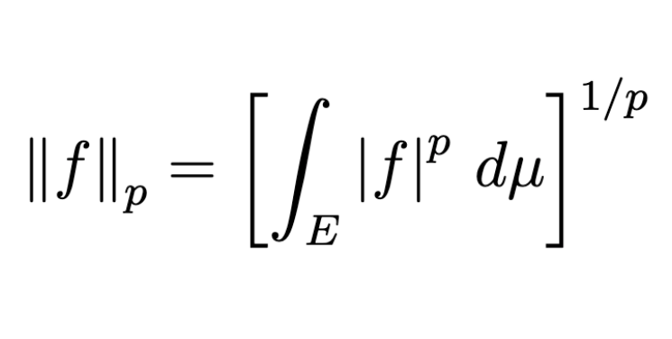

{: .w-50}

## Integration on Complex Valued Function

Let $(X, \mathscr{F}, \mu)$ be a measure space, and $E \in \mathscr{F}$.

**정의.**

1. A complex valued function $f = u + iv$, (where $u, v$ are real functions) is measurable if $u$ and $v$ are both measurable.

2. For a complex function $f$,

	$$f \in \mathcal{L}^{1}(E, \mu) \iff  \int _ E \left\lvert  f \right\rvert  \,d{\mu} < \infty \iff u, v \in \mathcal{L}^{1}(E, \mu).$$

3. If $f = u + iv \in \mathcal{L}^{1}(E, \mu)$, we define

	$$\int _ E f \,d{\mu} = \int _ E u \,d{\mu} + i\int _ E v \,d{\mu}.$$

**참고.**

1. Linearity also holds for complex valued functions. For $f _ 1, f _ 2 \in \mathcal{L}^{1}(\mu)$ and $\alpha \in \mathbb{C}$,

	$$\int _ E \left( f _ 1 + \alpha f _ 2 \right) \,d{\mu} = \int _ E f _ 1 \,d{\mu} +  \alpha \int _ E f _ 2 \,d{\mu}.$$

2. Choose $c \in \mathbb{C}$ and $\left\lvert  c \right\rvert  = 1$ such that $\displaystyle c \int _ E f \,d{\mu} \geq 0$. This is possible since multiplying by $c$ is equivalent to a rotation.

Now set $cf = u + vi$ where $u, v$ are real functions and the integral of $v$ over $E$ is $0$. Then,

$$\begin{aligned}                      \left\lvert  \int _ E f \,d{\mu} \right\rvert  & = c \int _ E f\,d{\mu} = \int _ E u \,d{\mu}              \\                                             & \leq \int _ E (u^2+v^2)^{1/2} \,d{\mu}                 \\                                             & = \int _ E \left\lvert  cf \right\rvert  \,d{\mu} = \int _ E \left\lvert  f \right\rvert  \,d{\mu}.                  \end{aligned}$$

## Functions of Class $\mathcal{L}^{p}$

### $\mathcal{L}^p$ Space

Assume that $(X, \mathscr{F}, \mu)$ is given and $X = E$.

**정의.** ($\mathcal{L}^{p}$) A complex function $f$ is in $\mathcal{L}^{p}(\mu)$ if $f$ is measurable and $\displaystyle\int _ E \left\lvert  f \right\rvert ^p \,d{\mu} < \infty$.

**정의.** ($\mathcal{L}^{p}$-norm) **$\mathcal{L}^{p}$-norm** of $f$ is defined as

$$\left\lVert f \right\rVert _ p = \left[\int _ E \left\lvert  f \right\rvert ^p \,d{\mu} \right]^{1/p}.$$

### Inequalities

**정리.** (Young Inequality) For $a, b \geq 0$, if $p > 1$ and $1/p + 1/q = 1$, then

$$ab \leq \frac{a^p}{p} + \frac{b^q}{q}.$$

**증명.** From $1/p + 1/q = 1$, $p - 1 = \frac{1}{q - 1}$. The graph $y = x^{p - 1}$ is equal to the graph of $x = y^{q - 1}$. Sketch the graph on the $xy$-plane and consider the area bounded by $x = 0$, $x = a$, $y = 0$, $y = b$. Then we directly see that

$$\int _ 0^a x^{p-1} \,d{x} + \int _ 0^b y^{q-1} \,d{y} \geq ab,$$

with equality when $a^p = b^q$. Evaluating the integral gives the desired inequality.

**참고.** For $\mathscr{F}$-measurable $f, g$ on $X$,

$$\left\lvert  fg \right\rvert  \leq \frac{\left\lvert  f \right\rvert ^p}{p} + \frac{\left\lvert  g \right\rvert ^q}{q} \implies \left\lVert fg \right\rVert _ 1 \leq \frac{\left\lVert f \right\rVert _ p^p}{p} + \frac{\left\lVert g \right\rVert _ q^q}{q}$$

by Young inequality. In particular, if $\left\lVert f \right\rVert _ p = \left\lVert g \right\rVert _ q = 1$, then $\left\lVert fg \right\rVert _ 1 \leq 1$.

**정리.** (Hölder Inequality) Let $1 < p < \infty$ and $\displaystyle\frac{1}{p} + \frac{1}{q} = 1$. If $f, g$ are measurable,

$$\left\lVert fg \right\rVert _ 1 \leq \left\lVert f \right\rVert _ p \left\lVert g \right\rVert _ q.$$

So if $f \in \mathcal{L}^{p}(\mu)$ and $g \in \mathcal{L}^{q}(\mu)$, then $fg \in \mathcal{L}^{1}(\mu)$.

**증명.** If $\left\lVert f \right\rVert _ p = 0$ or $\left\lVert g \right\rVert _ q = 0$ then $f = 0$ a.e. or $g = 0$ a.e. So $fg = 0$ a.e. and $\left\lVert fg \right\rVert _ 1 = 0$.

Now suppose that $\left\lVert f \right\rVert _ p > 0$ and $\left\lVert g \right\rVert _ q > 0$. By the remark above, the result directly follows from

$$\left\lVert \frac{f}{\left\lVert f \right\rVert _ p} \cdot \frac{g}{\left\lVert g \right\rVert _ q} \right\rVert _ 1 \leq 1.$$

**정리.** (Minkowski Inequality) For $1 \leq p < \infty$, if $f, g$ are measurable, then

$$\left\lVert f + g \right\rVert _ p \leq \left\lVert f \right\rVert _ p + \left\lVert g \right\rVert _ p.$$

**증명.** If $f, g \notin \mathcal{L}^{p}$, the right hand side is $\infty$ and we are done. For $p = 1$, the equality is equivalent to the triangle inequality. Also if $\left\lVert f + g \right\rVert _ p = 0$, the inequality holds trivially. We suppose that $p > 1$, $f, g \in \mathcal{L}^p$ and $\left\lVert f+g \right\rVert _ p > 0$.

Let $q = \frac{p}{p-1}$. Since

$$\begin{aligned}        \left\lvert  f + g \right\rvert ^p & = \left\lvert  f + g \right\rvert \cdot \left\lvert  f + g \right\rvert ^{p - 1}                \\                      & \leq \bigl(\left\lvert  f \right\rvert  + \left\lvert  g \right\rvert \bigr) \left\lvert  f + g \right\rvert ^{p-1},    \end{aligned}$$

we have

$$\begin{aligned}        \int \left\lvert  f+g \right\rvert ^p & \leq \int \left\lvert  f \right\rvert  \cdot \left\lvert  f+g \right\rvert ^{p-1} + \int \left\lvert  g \right\rvert  \cdot \left\lvert  f+g \right\rvert ^{p-1} \\                         & \leq \left( \int \left\lvert  f \right\rvert ^p  \right)^{1/p}\left( \int \left\lvert  f+g \right\rvert ^{(p-1)q} \right)^{1/q}      \\                         & \quad + \left( \int \left\lvert  q \right\rvert ^p  \right)^{1/p}\left( \int \left\lvert  f+g \right\rvert ^{(p-1)q} \right)^{1/q}   \\                         & = \left( \left\lVert f \right\rVert _ p + \left\lVert g \right\rVert _ p \right) \left( \int \left\lvert  f+g \right\rvert ^p \right)^{1/q}.    \end{aligned}$$

Since $\left\lVert f + g \right\rVert _ p^p > 0$, we have

$$\begin{aligned}        \left\lVert f + g \right\rVert _ p & = \left( \int \left\lvert  f+g \right\rvert ^p \right)^{1/p}             \\                       & = \left( \int \left\lvert  f+g \right\rvert ^p \right)^{1 - \frac{1}{q}} \\                       & \leq \left\lVert f \right\rVert _ p + \left\lVert g \right\rVert _ p.    \end{aligned}$$

**정의.** $f \sim g \iff f = g$ $\mu$-a.e. and define

$$[f] = \left\lbrace g : f \sim g\right\rbrace.$$

We treat $[f]$ as an element in $\mathcal{L}^{p}(X, \mu)$, and write $f = [f]$.

**참고.**

1. We write $\left\lVert f \right\rVert _ p = 0 \iff f = [0] = 0$ in the sense that $f = 0$ $\mu$-a.e.

2. Now $\lVert \cdot \rVert _ p$ is a **norm** in $\mathcal{L}^{p}(X, \mu)$ so $d(f, g) = \left\lVert f - g \right\rVert _ p$ is a **metric** in $\mathcal{L}^{p}(X, \mu)$.

## Completeness of $\mathcal{L}^p$

Now we have a *function space*, so we are interested in its *completeness*.

**정의.** (Convergence in $\mathcal{L}^p$) Let $f, f _ n \in \mathcal{L}^{p}(\mu)$.

1. $f _ n \rightarrow f$ in $\mathcal{L}^p(\mu) \iff \left\lVert f _ n-f \right\rVert _ p \rightarrow 0$ as $n \rightarrow\infty$.

2. $\left( f _ n \right) _ {n=1}^\infty$ is a Cauchy sequence in $\mathcal{L}^{p}(\mu)$ if and only if

> $\forall \epsilon > 0$, $\exists\,N > 0$ such that $n, m \geq N \implies \left\lVert f _ n-f _ m \right\rVert _ p < \epsilon$.

**도움정리.** Let $\left( g _ n \right)$ be a sequence of measurable functions. Then,

$$\left\lVert \sum _ {n=1}^{\infty} \left\lvert  g _ n \right\rvert  \right\rVert _ p \leq \sum _ {n=1}^{\infty} \left\lVert g _ n \right\rVert _ p.$$

Thus, if $\displaystyle\sum _ {n=1}^{\infty} \left\lVert g _ n \right\rVert _ p < \infty$, then $\displaystyle\sum _ {n=1}^{\infty} \left\lvert  g _ n \right\rvert  < \infty$ $\mu$-a.e. So $\displaystyle\sum _ {n=1}^{\infty} g _ n < \infty$ $\mu$-a.e.

**증명.** By monotone convergence theorem and Minkowski inequality,

$$\begin{aligned}        \left\lVert \sum _ {n=1}^{\infty} \left\lvert  g _ n \right\rvert  \right\rVert _ p & = \lim _ {m \rightarrow\infty} \left\lVert \sum _ {n=1}^{m} \left\lvert  g _ n \right\rvert  \right\rVert _ p \\                                               & \leq \lim _ {n \rightarrow\infty} \sum _ {n=1}^{m} \left\lVert g _ n \right\rVert _ p    \\                                               & = \sum _ {n=1}^{\infty} \left\lVert g _ n \right\rVert _ p < \infty.    \end{aligned}$$

Thus $\displaystyle\sum _ {n=1}^{\infty} \left\lvert  g _ n \right\rvert  < \infty$ $\mu$-a.e. and $\displaystyle\sum _ {n=1}^{\infty} g _ n < \infty$ $\mu$-a.e. by absolute convergence.

**정리.** (Fischer) Suppose $\left( f _ n \right)$ is a Cauchy sequence in $\mathcal{L}^{p}(\mu)$. Then there exists $f \in \mathcal{L}^{p}(\mu)$ such that $f _ n \rightarrow f$ in $\mathcal{L}^{p}(\mu)$.

**증명.** We construct $\left( n _ k \right)$ by the following procedure.

$\exists\,n _ 1 \in \mathbb{N}$ such that $\left\lVert f _ m - f _ {n _ 1} \right\rVert _ p < \frac{1}{2}$ for all $m \geq n _ 1$.

$\exists\,n _ 2 \in \mathbb{N}$ such that $\left\lVert f _ m - f _ {n _ 2} \right\rVert _ p < \frac{1}{2^2}$ for all $m \geq n _ 2$.

Then, $\exists\,1 \leq n _ 1 < n _ 2 < \cdots < n _ k$ such that $\left\lVert f _ m - f _ {n _ k} \right\rVert _ p < \frac{1}{2^k}$ for $m \geq n _ k$.

Since $\displaystyle\left\lVert f _ {n _ {k+1}} - f _ {n _ k} \right\rVert _ p < \frac{1}{2^k}$, we have

$$\sum _ {k=1}^{\infty} \left\lVert f _ {n _ {k+1}} - f _ {n _ k} \right\rVert _ p < \infty.$$

By the above lemma, $\sum \left\lvert  f _ {n _ {k+1}} - f _ {n _ k} \right\rvert$ and $\sum (f _ {n _ {k+1}} - f _ {n _ k})$ are finite. Let $f _ {n _ 0} \equiv 0$. Then as $m \rightarrow\infty$,

$$f _ {n _ {m+1}} = \sum _ {k=0}^{m} \left( f _ {n _ {k+1}} - f _ {n _ k} \right)$$

converges $\mu$-a.e. Take $N \in \mathscr{F}$ with $\mu(N) = 0$ such that $f _ {n _ k}$ converges on $X \setminus N$. Let

$$f(x) = \begin{cases}        \displaystyle\lim _ {k \rightarrow\infty} f _ {n _ k} (x) & (x \in X \setminus N) \\ 0 & (x\in N)    \end{cases}$$

then $f$ is measurable. Using the convergence,

$$\begin{aligned}        \left\lVert f - f _ {n _ m} \right\rVert _ p & = \left\lVert \sum _ {k=m}^{\infty} \left( f _ {n _ {k+1}} (x) - f _ {n _ k}(x) \right) \right\rVert _ p  \\                             & \leq \left\lVert \sum _ {k=m}^{\infty} \left\lvert  f _ {n _ {k+1}} (x) - f _ {n _ k}(x) \right\rvert  \right\rVert _ p \\                             & \leq \sum _ {k=m}^{\infty} \left\lVert f _ {n _ {k+1}} - f _ {n _ k} \right\rVert _ p \leq 2^{-m}    \end{aligned}$$

by the choice of $f _ {n _ k}$. So $f _ {n _ k} \rightarrow f$ in $\mathcal{L}^{p}(\mu)$. Also, $f = (f - f _ {n _ k}) + f _ {n _ k} \in \mathcal{L}^{p}(\mu)$.

Let $\epsilon > 0$ be given. Since $\left( f _ n \right)$ is a Cauchy sequence in $\mathcal{L}^{p}$, $\exists\,N \in \mathbb{N}$ such that for all $n, m \geq N$, $\left\lVert f _ n - f _ m \right\rVert < \frac{\epsilon}{2}$. Note that $n _ k \geq k$, so $n _ k \geq N$ if $k \geq N$. Choose $N _ 1 \geq N$ such that for $k \geq N$, $\left\lVert f - f _ {n _ k} \right\rVert _ p < \frac{\epsilon}{2}$. Then for all $k \geq N _ 1$,

$$\left\lVert f - f _ k \right\rVert _ p \leq \left\lVert f - f _ {n _ k} \right\rVert _ p + \left\lVert f _ {n _ k} - f _ k \right\rVert _ p < \frac{\epsilon}{2} + \frac{\epsilon}{2} = \epsilon.$$

**참고.** $\mathcal{L}^{p}$ is a complete normed vector space, also known as **Banach space**.

**정리.** $C[a, b]$ is a dense subset of $\mathcal{L}^{p}[a, b]$. That is, for every $f \in \mathcal{L}^{p}[a, b]$ and $\epsilon > 0$, $\exists\,g \in C[a, b]$ such that $\left\lVert f - g \right\rVert _ p < \epsilon$.

**증명.** Let $A$ be a closed subset in $[a, b]$, and consider a distance function

$$d(x, A) = \inf _ {y\in A} \left\lvert  x - y \right\rvert , \quad x \in [a, b].$$

Since $d(x, A) \leq \left\lvert  x - z \right\rvert  \leq \left\lvert  x - y \right\rvert  + \left\lvert  y - z \right\rvert$ for all $z \in A$, taking infimum over $z \in A$ gives $d(x, A) \leq \left\lvert  x - y \right\rvert  + d(y, A)$. So

$$\left\lvert  d(x, A) - d(y, A) \right\rvert  \leq \left\lvert  x - y \right\rvert ,$$

and $d(x, A)$ is continuous. If $d(x, A) = 0$, $\exists\,x _ n \in A$ such that $\left\lvert  x _ n - x \right\rvert  \rightarrow d(x, A) = 0$. Since $A$ is closed, $x \in A$. We know that $x \in A \iff d(x, A) = 0$.

Let

$$g _ n(x) = \frac{1}{1 + n d(x, A)}.$$

$g _ n$ is continuous, $g _ n(x) = 1$ if and only if $x \in A$. Also for all $x \in [a, b] \setminus A$, $g _ n(x) \rightarrow 0$ as $n \rightarrow\infty$. By Lebesgue’s dominated convergence theorem,

$$\begin{aligned}        \left\lVert g _ n - \chi _ A \right\rVert _ p^p & = \int _ A \left\lvert  g _ n - \chi _ A \right\rvert ^p \,d{x} + \int _ {[a, b]\setminus A} \left\lvert  g _ n - \chi _ A \right\rvert ^p \,d{x} \\                                & = 0 + \int _ {[a, b]\setminus A} \left\lvert  g _ n \right\rvert ^p \,d{x} \rightarrow 0    \end{aligned}$$

since $\left\lvert  g _ n \right\rvert ^p \leq 1$. We have shown that characteristic functions of closed sets can be approximated by continuous functions in $\mathcal{L}^{p}[a, b]$.

For every $A \in \mathfrak{M}(m)$, $\exists\,F _ \text{closed} \subseteq A$ such that $m(A \setminus F) < \epsilon$. Since $\chi _ A - \chi _ F = \chi _ {A \setminus F}$,

$$\begin{aligned}        \int \left\lvert  \chi _ A-\chi _ F \right\rvert ^p \,d{x} & = \int \left\lvert  \chi _ {A\setminus F} \right\rvert ^p \,d{x}             \\                                         & = \int _ {A\setminus F} \,d{x} = m(A \setminus F) < \epsilon.    \end{aligned}$$

Therefore, for every $A \in \mathfrak{M}$, $\exists\,g _ n \in C[a, b]$ such that $\left\lVert g _ n - \chi _ A \right\rVert _ p \rightarrow 0$ as $n \rightarrow\infty$. So characteristic functions of any measurable set can be approximated by continuous functions in $\mathcal{L}^{p}[a, b]$.

Next, for any measurable simple function $f = \sum _ {k=1}^{m}a _ k \chi _ {A _ k}$, we can find $g _ n^k \in C[a, b]$ so that

$$\left\lVert f - \sum _ {k=1}^{m} a _ k g _ n^k \right\rVert _ p = \left\lVert \sum _ {k=1}^{m}a _ k \left( \chi _ {A _ k} - g _ n^k \right) \right\rVert _ p \rightarrow 0.$$

Next for $f \in \mathcal{L}^{p}$ and $f \geq 0$, there exist simple functions $f _ n \geq 0$ such that $f _ n \nearrow f$ in $\mathcal{L}^{p}$. Finally, any $f \in \mathcal{L}^{p}$ can be written as $f = f^+ - f^-$, which completes the proof.

이러한 확장을 몇 번 해보면 굉장히 routine합니다. $\chi _ F$ for closed $F$ $\rightarrow$ $\chi _ A$ for measurable $A$ $\rightarrow$ measurable simple $f$ $\rightarrow$ $0\leq f \in \mathcal{L}^{p} \rightarrow$ $f \in \mathcal{L}^{p}$ 와 같은 순서로 확장합니다.
