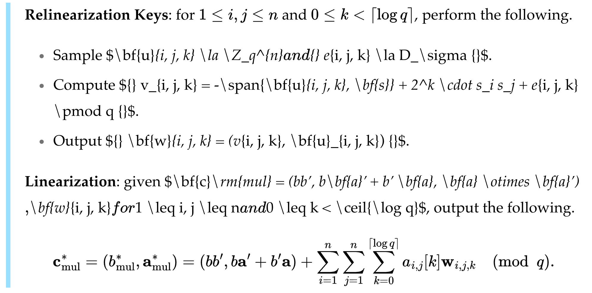

마크다운에서 수식을 사용하는 것은 **생각보다** 어렵다. 애초에 마크다운은 원래 수식을 지원하지 않는다. 그저 Github, Obsidian 등 다양한 플랫폼이 마크다운의 확장 형태로 수식 입력을 지원하고 있는 상황이다.

이 블로그는 jekyll을 사용하기 때문에 모든 글이 마크다운으로 작성되어 있다. 수학을 좋아하는 나의 특성상 블로그 글에 수식을 입력할 일이 많은데, 어느 날 블로그에서 깨져있거나 잘못된 수식을 발견하고 마크다운에서 수식을 사용하는 것이 그리 간단치 않다는 것을 깨닫게 되었다.

이 글에서는 마크다운에서 수식을 사용할 때 생기는 문제점과 이에 대한 해결책을 정리했다.

## 문법의 충돌

 마크다운 엔진에 따라 구체적인 내용이 다를 수도 있지만, Kramdown의 경우 문법이 충돌하는 대표적인 예시는 다음과 같다.

**`$$`는 `$`와 같다.** LaTeX 문법에서 `$$`는 *display mode*로, 한 줄 전체에 수식을 크게 출력하고, `$`는 *inline mode*로 텍스트 중간에 수식을 끼워넣을 때 사용한다. 그런데 Kramdown에서 display math를 사용하기 위해서는 `$$`를 반드시 **새로운 줄**에 입력해야 하고, 그렇지 않으면 `$$`가 inline math로 해석된다.

이는 기존 마크다운에서 `$` 기호가 이미 널리 사용되었을 것을 고려하여 이러한 결정을 내린 것으로 보인다. ([Github Issue](https://github.com/gettalong/kramdown/issues/672)) 그렇다고 `$`가 아예 지원이 되지 않는 것은 아니다.

위 차이가 조금 크게 느껴지고, 이외의 내용은 다음과 같다.

- 절댓값 기호 `| ... |`는 마크다운 테이블로 먼저 해석된다.
- `\{`와 `\}`는 `\\{`, `\\}`로 escape 해줘야 한다.
- 아래 첨자를 위한 `_`, 또는 기호 `*`를 그냥 사용하면 마크다운의 기울임 표시와 충돌할 수 있다.



## 해결 방법

### Display Math

우선 이 문제의 경우, 애초에 문서를 작성할 때 조심하는 것이 권장된다. `$$`를 사용한다면 애초에 새로운 줄에 수식을 입력하려는 것이기 때문에 이 수식을 위해 새로운 줄에 `$$`를 입력하면 된다.

만약 이미 작성된 문서를 고치고 싶다면, 다음 정규식을 사용하면 된다.

```
(^|[^\$])\$\$([^\$]+)\$\$([^\$]|$)
```

문서에 존재하는 `$$ ... $$` 형태를 잡아줄 것이다. Replace 기능을 적절히 이용하면 `$$` 앞 뒤에 newline character `\n` 을 넣을 수 있다.

개인적으로는 Obsidian의 Markdown Linter 플러그인을 이용하여 `$$`를 사용한 수식 앞 뒤에 newline character를 강제로 넣어주도록 하고 있다. 그렇지만 이미 새로운 줄에 입력하는게 습관이 되었다.

### 절댓값, 중괄호 기호

이 기호들은 키보드에 존재하는 `|`, `{}` 키가 아닌 LaTeX 문법을 사용해서

- 절댓값 기호 `| ... |`는 `\lvert ... \rvert`로,
- Norm 기호 `|| ... ||` 는 `\lVert ... \rVert`로,
- 중괄호 `{ ... }`는 `\lbrace \rbrace`로

입력해야 한다. 앞뒤에 `\left`, `\right` 붙이면 크기 조절도 알아서 된다.

그러나 저 기호들을 매번 입력하는 일은 정말 귀찮은 일이다. 따라서 매크로를 사용하는 것이 좋아 보인다. 게다가 매크로를 사용하면 `\{`를 별도로 escaping하지 않아도 사용할 수 있다.

```tex
\newcommand{\abs}[1]{\left\lvert #1 \right\rvert}
\newcommand{\norm}[1]{\left\lVert #1 \right\rVert}
\newcommand{\braces}[1]{\left\{ #1 \right\}}
```

### 기울임체 충돌

개인적으로 이 문제가 가장 골치아팠다. 어떤 경우에는 문제가 되지 않다가, 또 어떤 경우에는 문제가 된다. `_`를 사용해도 멀쩡하게 보이는 수식이 있는가 하면, 완전히 깨져버리는 수식도 있다. 조금 찾아보니 나만 이런 문제를 겪은 것이 아니었다.

문제의 원인은 마크다운으로 쓴 글을 html로 변환할 때 `_` 사이에 있는 텍스트가 기울임체로 먼저 해석되고, 수식은 그 이후에 처리되기 때문이었다. 그러다보니 수식 내부의 `_`가 다른 문자열로 치환되어 버리면서 (기울임을 나타내는 html 태그 `<em>`) 수식이 깨지는 현상이 발생한 것이다.

가장 간단한 해결 방법은 `_`를 escaping 하는 것이다. 그러면 마크다운 변환기가 이를 기울임체 표시로 해석하지 않는다. 다만 `\_`와 같이 하게 되면 Obsidian에서는 수식이 제대로 렌더링 되지 않게 되는데, 아마 다른 툴들도 비슷한 문제가 있을 것으로 예상된다.

진짜 해결 방법은 혼자서 삽질을 하다가 알아내게 되었는데, **`_` 앞 뒤로 공백을 추가하면 기울임체로 표시되지 않는다는 사실을 발견**했다. 이 사실이 신기해서 알려진 바가 있는지 찾아봤는데, 이 내용이 마크다운 문법에 실제로 있었다.

> But if you surround an `*` or `_` with spaces, it’ll be treated as a literal asterisk or underscore.

- 출처: John Grubber's original [Markdown syntax description](https://daringfireball.net/projects/markdown/syntax#em)
- 공식: https://spec.commonmark.org/0.31.2/#emphasis-and-strong-emphasis

그런데 이 문제는 확정적으로 발생하지 않을 수도 있기 때문에, 모든 `_` 앞 뒤로 공백을 추가하면 된다. 어차피 수식은 공백을 무시해 버리기 때문에 수식에는 영향이 없다.[^1]

한편, 이 작업은 매우 귀찮은 일이기 때문에, 자동화된 방법이 필요해 보인다. 수식에서 아래 첨자를 쓸 일은 굉장히 빈번하기 때문에 매번 손수 `_` 앞 뒤에 공백을 추가하기는 힘들다.

이를 위해서는 또 다시 정규식을 사용하면 된다. 내가 직접 만들어 보려고 하다가 결국에는 [StackOverflow에 질문](https://stackoverflow.com/questions/79183172/regex-to-add-spaces-around-all-underscores-in-math-equations?noredirect=1#comment139629564_79183172)하게 되었다.

아무튼 사용할 정규식은 다음과 같다.

```
(?<=\$\S[^$]*)\s?_\s?(?=[^$]*\S\$)
```

자세한 설명은 생략한다... 이 정규식이 잡아낸 `_`를 전부 `\s_\s`로 고쳐주면 끝이다.

개인적으로는 Obsidian에서 블로그 repository로 push할 때 text replacement 기능을 이용해서 자동으로 고쳐지도록 세팅해 두었다.[^2]

## 후기

애초에 마크다운에 수식을 쓰려고 하는 것과, jekyll 블로그에 이를 업로드 하려는 생각 자체가 잘못된 것일 수도 있다. 다른 툴을 썼다면 이런 고생을 하지 않아도 됐을지도 모른다. 실제로 digital garden 같은 툴 중에서 수식을 잘 지원하는 경우도 있다.[^3] 하지만 내가 Obsidian을 포기할 수 없었고, 지금 사용하고 있는 chirpy theme이 너무 마음에 들었기 때문에 이 조합을 포기할 수 없었다.

현대 암호학 개론 수업 내용을 정리한 노트에서 깨진 수식이 대량으로 발생해서, 그동안 방치해두고 있었는데 이번에 칼을 뽑아서 **1년 넘게 묵혀둔 문제를 드디어 해결**했다. 앞으로는 이런 문제가 안 생겼으면 좋겠다.

[^1]: 여기까지 23년 7월 26일에 알아낸 내용이다.
[^2]: 24년 11월 13일에 작업한 내용이다.
[^3]: Obsidian의 경우 Quartz가 대세인 듯 하다.
