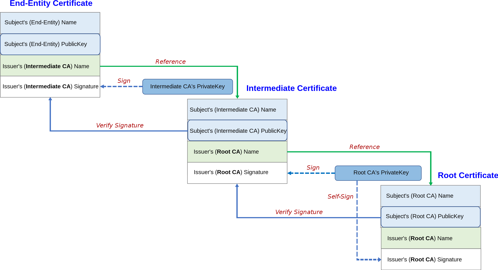

Suppose that we're using RSA, Alice has public key $(N, e)$ and private key $d$. Anyone can send messages to Alice using $(N, e)$. But because anyone can generate $(N, e)$, we are not sure whether the key $(N, e)$ is *really* Alice's key. We might run into a situation where $(N, e)$ was actually some other person's key. *How do we check whose key this is?*

**Public key infrastructure** (PKI) solves this problem by using **certificates**.

## Cryptographic Certificates

We focus on **cryptographic certificates**.

> A **certificate** is an electronic document to bind a *public key* with its *owner's identity*. This binding is assured by a *digital signature* of an issuer, we call the issuer a **certificate authority**. (CA)

- A certificate authority is a *trusted third party* (TTP).
	- If we don't trust the CA, then we cannot trust the signature of the certificate.
- Commercial CAs charge to issue certificates.
- Kinds of certificates
	- Digital certificate
	- Public key certificate
	- SSL (or TLS) certificate
	- X.509 certificates (ITU-T)
	- Web server certificates

## Components of Public Key Infrastructure

- **Registration Authority** (RA)
	- Checks the individual or entity that requests the certificate.
	- It will check if the requester has a matching private key, etc.
	- This result will be sent to the certification authority.
- **Certification Authority** (CA)
	- Issues certificates. Binds a public key to a identity.
	- User identity must be unique within each CA domain.
	- Relying parties (browsers, etc.) need a copy of CA's public key.
- Directory Service
	- A directory of public keys and certificates, so that anyone can access it.
- Revocation Service
	- A mechanism to check if a certificate is revoked or not.
	- Certificate revocation list (CRL), online certificate status protocol (OCSP).

Note that the certification authority can offload some of its work to the registration authority.

## Contents of a Certificate (X.509)

- **Serial Number**: a unique identifier for the certificate within the CA.
- **Subject**: the identified person or entity. Also known as *distinguished name* (DN).
	- Common Name
	- Organization
	- Organizational Unit
	- Locality
	- State or Province
	- Country/Region
- **Signature Algorithm**: the algorithm used to create the signature.
- **Issuer**: the entity that verified the subject and issued the certificate.
- **Valid-From**
- **Valid-To**: certificate expiration date.
- **Key-Usage**: purpose of this public key
	- Encryption, signature, etc.
- **Public Key**: the public key of the subject.
- **Signature**: the digital signature signed by the issuer.
	- For verifying that this signature is from the issuer, and can be trusted.

The hash of the entire certificate is called a **thumbprint**, but this is not included in the certificate.

## Certificate Validation Process

### Hierarchy of CAs

We have a root CA at the top. Then there are issuing CAs below. We usually request certificates to the issuing CA. Note that the issuing CAs also have their own certificate, which is signed by the next higher-level CA.

### Certificate Validation

[^1]

Since we have a hierarchy of CAs, certificate validation must also follow the hierarchy. When we receive a certificate, it is highly likely to be signed by an non-root CA.

Thus we validate certificates by the following process. Suppose we received a certificate $A$.

> 1. In $A$, check the issuer's DN and request the issuer's certificate $B$.
> 2. Verify the signature of $A$ using the public key of the issuer in $B$.
> 3. Recursively validate $B$ following the above steps.

We will request the certificate of a root CA at the end. If everything went well, all the intermediate certificates will have been verified. Now we must verify the certificate of a root CA, but a root CA does not have any higher level CAs.

Root CAs are decided publicly by the [CA/Browser forum](https://cabforum.org/). Thus they are acknowledged by the public community, and we agree that root CAs can be trusted. Therefore, root CAs sign their own certificates.

In many web browsers, root CAs are whitelisted so that they are always trusted.

### Self-Signed Certificates

As in the example of root CAs, there are certificates that is signed by the same identity as the subject. i.e, the issuer and the subject are the same. We call these **self-signed certificates**.

We generally don't trust self-signed certificates, since they can be created easily. Anyone can generate a keypair, create a certificate and sign it by oneself.

But there are some places where self-signed certificates are handy. The first example is the case of root CAs. Also, since issuing a certificate from a CA requires money, using a self-signed certificate for test servers saves money and time.

There are also some problems with self-signed certificates. These certificates are self-created and self-signed, so the certificate can contain arbitrary values.[^2] For example, the certificate can be valid for a thousand years, which is usually not possible for CA-issued certificates. Lastly, self-signed certificates are hard to revoke by nature, since it is not issued by CAs.

## Certificate Revocation

### Key Pair Lifecycle

A key is generated, and a certificate is issued with the key. If the key has expired, we revoke the certificate.

- Keys should be generated by the owner, for non-repudiation.
- Dual key pair model
	- Separate key pairs for encryption/decryption and signature.

### Certificate Revocation

There are some cases where certificates must be revoked.

- Certificate is mis-issued (not the right identity).
- Key can be compromised by attackers.
- One may forget the passphrase for the certificate.
- The private key may get lost.

*PKI is only as secure as the revocation mechanism.* This is because revocation mechanism is hard to handle.

- The CA revokes the certificates.
- The replying party checks the revocation status using **certificate revocation lists** and **online certificate status protocol**.
	- The certificate tells us where to get the revocation information.

### Certificate Revocation Lists (CRL)

The **certificate revocation list** (CRL) contains information about itself and revoked certificates.

- For each revoked certificate, the serial number and the revocation date is recorded.
	- Also contains next update date.
- This list should be publicly available, so that anyone can check if the certificate is revoked.
- The verifier will look at the CRL distribution URL in the certificate and receive the CRLs.

CRL checking is done in the following way.

> 1. A client connects to a website and receives the certificate of the server.
> 2. The client queries the certificate revocation server and downloads CRLs.
> 3. The client checks whether the certificate is revoked or not.

But distributing CRL in real-time is not possible. Furthermore, CRL lifecycles/update periods can vary depending on CAs. Thus there can be attacks between CRL updates. Also, CRL sizes will keep increasing over time, so it gets harder to download and manage the CRLs.

### Online Certificate Status Protocol (OCSP)

The **online certificate status protocol** (OCSP) is another way to handle certificate revocation. Basically, the client queries a OCSP server for revocation information.

There is an **OCSP server** that runs 24/7, responding to queries. This server can be run by the CAs or may be delegated to some other entities. The address of the OCSP server is specified in the certificate.

Using OCSP, revocation check is done in the following way.

> 1. A client connects to a website and receives the certificate of the server.
> 2. Using the OCSP server address in the certificate, the client queries the OCSP server with the serial number of the certificate.
> 3. The server checks the database, and sends a signed response containing revocation information.

This method has a privacy problem. The client queries with the serial number, so the OCSP server can track what kinds of website the client has visited. Also if OCSP server is not available or under too many requests, the response may be unavailable or slow. Browsers soft-fail and assume that the certificate has no problem.[^3]

#### OCSP Stapling

The privacy issue can be solved using **OCSP stapling**. When the client connects to the web server, the *web server queries the OCSP server* and gives the response to the client. It staples the OCSP response with the certificate, hence the name.

Thus the client does not have to query the OCSP server about where it is visiting.

## Problems with PKI

- If a CA is compromised, it can issue a certificate for any name.
	- Or CA may not check every detail but still issue it.
	- Fraudulent certificates look perfectly valid.
	- PKI is only secure as the weakest CA.
- As revoked certificates increase, it is hard to manage them.[^4]
- Certificate verification depends on the implementations of the browser.
- Users often ignore certificate warnings.

### Solving PKI Issues

We use different kinds of certificates. Stronger validations are done by the CA.

- **Domain Validation** (DV) certificate
	- CA issues this certificate to anyone listed in the contact in the public record associated with a domain name.
	- CA exchanges confirmation emails with an address listed in the domain's WHOIS record.
- **Organization Validation** (OV) certificate
	- CA carefully examines the organization or the individual.
- **Extended Validation** (EV) certificate
	- Most rigorous identity check is done on the organization or individual.
	- Online finance companies use this.

But if CA is compromised or the private key of the CA is leaked, certificates may be fake. We need more evidence that some given certificate is valid. Thus, we add other independent sources that can be used to validate the certificate.

The answer to this is **certificate transparency**. When a certificate is issued, it is logged to a public log server, and it is monitored by the server. Issuing certificates is transparent to the public. Read more from [certificate transparency (Wikipedia)](https://en.wikipedia.org/wiki/Certificate_Transparency).

[^1]: Image from [Wikipedia](https://en.wikipedia.org/wiki/File:Chain_Of_Trust.svg).
[^2]: Can someone pretend to be a root CA by creating a fake certificate of a root CA?
[^3]: Is this okay?
[^4]: Is there a reason to keep the list of revoked certificates? The CA can just return *invalid* on non-existing serial numbers...?
