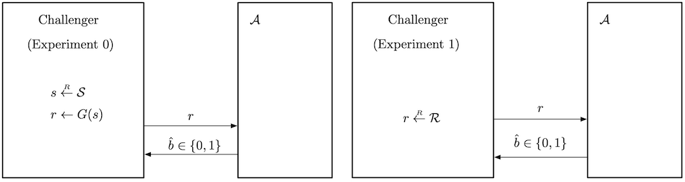
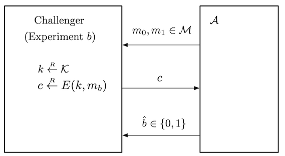

## Assumptions and Notations

An encryption scheme is defined by $3$ algorithms.

- A (probabilistic) key generation algorithm $G$.
- $E: \mathcal{K} \times \mathcal{M} \rightarrow \mathcal{C}$ and $D: \mathcal{K} \times \mathcal{C} \rightarrow \mathcal{M}$ which are encryption, decryption algorithms respectively.

We assume **perfect correctness**.

> **Assumption**. $\forall k \in \mathcal{K}$, $\forall m \in \mathcal{M}$, if $c = E(k, m)$ then $D(k, c) = m$ with probability $1$.

This assumption allows us to assume that the decryption algorithm $D : \mathcal{K} \times \mathcal{C} \rightarrow \mathcal{M}$ is *deterministic*, since it will always give the same output for the same key and ciphertext.

Some random variables:

- $K$ for the distribution over the key space $\mathcal{K}$.
	- The output from $G$. We denote this as $k \leftarrow \mathcal{K}$.
- $M$ for the message being encrypted, and $C$ for the ciphertext.
	- We will write $c \leftarrow E(k, m)$.
- $K$ and $M$ are required to be independent.

## Perfect Secrecy

For a scheme to be perfectly secret, the *ciphertext should not reveal any information about the underlying plaintext*, so that the adversary learns absolutely nothing about the plaintext.

> **Definition**. An encryption scheme is **perfectly secret** if for any distribution of $M$ and any ciphertext $c \in \mathcal{C}$ such that $\Pr[C = c] > 0$,
>
> $$
> \Pr[M = m \mid C = c] = \Pr[M = m]
> $$
>
> for every $m \in \mathcal{M}$.

For example, the shift cipher with $\mathcal{M}$ as the set of all two-letter characters is not perfectly secure. Suppose that $c = \texttt{XX}$ is observed. Then the adversary learns that the plaintext must consist of the same letter, revealing some information.

The above definition is equivalent to the following.

> **Definition**. An encryption scheme is **perfectly secret** if for any $m _ 1, m _ 2 \in \mathcal{M}$ and $c \in \mathcal{C}$, we have
>
> $$
> \Pr[E(k, m _ 1) = c] = \Pr[E(k, m _ 2) = c]
> $$
>
> where the probability is taken over the random choice $k \leftarrow \mathcal{K}$.

> **Proposition**. The above two definitions are equivalent.

*Proof*. Suppose we are given any distribution on $M$, any $m \in \mathcal{M}$ with $\Pr[M = m] > 0$ and any $c \in \mathcal{C}$. Since $K$ and $M$ are independent, we have

$$
\begin{align*}
\Pr[C = c \mid M = m] &= \Pr[E(k, M) = c \mid M = m] \\
&= \Pr[E(k, m) = c \mid M = m] \\
&= \Pr[E(k, m) = c],
\end{align*}
$$

where $E(k, m)$ denotes the distribution of the ciphertext of $m$ over the key $k \leftarrow \mathcal{K}$. Also,

$$
\begin{equation}\tag{1}
\Pr[M = m \mid C = c] \cdot \Pr[C = c] = \Pr[C = c \mid M = m] \cdot \Pr[M = m]
\end{equation}
$$

by the definition of conditional probability.

($\implies$) If $\Pr[M = m \mid C = c] = \Pr[M = m]$, then $\Pr[C = c] = \Pr[C = c \mid M = m]$ by equation $(1)$. Therefore

$$
\begin{align*}
	\Pr[E(k, m) = c] &= \Pr[C = c \mid M = m] \\
	&= \Pr[C = c] \\
	&= \Pr[C = c \mid M = m'] \\
	&= \Pr[E(k, m') = c].
\end{align*}
$$

($\impliedby$) If $\Pr[M = m] = 0$, then we are done. So assume $\Pr[M = m] > 0$. Then

$$
\begin{align*}
	\Pr[C = c] &= \sum _ {m' \in \mathcal{M}} \Pr[C = c \mid M = m'] \cdot \Pr[M = m'] \\
	&= \sum _ {m' \in \mathcal{M}} \Pr[E(k, m') = c] \cdot \Pr[M = m'] \\
	&= \sum _ {m' \in \mathcal{M}} \Pr[E(k, m) = c] \cdot \Pr[M = m'] \\
	&= \Pr[E(k, m) = c] = \Pr[C = c \mid M = m].
\end{align*}
$$

Thus equation $(1)$ implies $\Pr[M = m \mid C = c] = \Pr[M = m]$.

## One-Time Pad (OTP)

This is an encryption scheme patented by Vernam in 1917.

- Set $\mathcal{M} = \mathcal{K} = \mathcal{C} = \lbrace 0, 1 \rbrace^n$.
- $G$ chooses a key from $\mathcal{K}$ according to the uniform distribution.
	- Each key is chosen with probability $2^{-n}$.
- $E(k, m) = k \oplus m$ and $D(k, c) = k \oplus c$.

From the above definition, the correctness of the scheme is easily checked.

Intuitively, $k \oplus m$ has the uniform distribution over $\lbrace 0, 1 \rbrace^n$.

### Perfect Secrecy of OTP

> **Theorem**. The one-time pad encryption scheme is perfectly secret.

*Proof*. For any $c \in \mathcal{C}$ and $m \in \mathcal{M}$ with $\Pr[M = m] > 0$, we have

$$
\begin{align*}
\Pr[C = c \mid M = m] &= \Pr[K \oplus m = c \mid M = m] \\
&= \Pr[K = m \oplus c \mid M = m] \\
&= 2^{-n}
\end{align*}
$$

since $K$ and $M$ are independent. Given any distribution on $\mathcal{M}$, we can see that

$$
\begin{align*}
\Pr[C = c] &= \sum _ {m \in \mathcal{M}} \Pr[C = c \mid M = m] \cdot \Pr[M = m] \\
&= 2^{-n} \cdot \sum _ {m \in \mathcal{M}} \Pr[M = m] = 2^{-n}.
\end{align*}
$$

Therefore $\Pr[M = m \mid C = c] = \Pr[M = m]$ by equation $(1)$.

Here is another proof using the second definition.

*Proof*. For any $m \in \mathcal{M}$ and $c \in \mathcal{C}$,

$$
\Pr[E(k, m) = c] = \Pr[k \oplus m = c] = \Pr[k = c \oplus m] = 2^{-n}.
$$

Thus OTP satisfies the definition of perfect secrecy.

### Drawbacks of OTP

The OTP is perfectly secure, but there are some drawbacks to using the OTP in practice.

First of all, OTP is perfectly secure *only for one message*. Suppose that we reuse the key $k$ for two messages $m _ 1$, $m _ 2$. Then since $c _ 1 = m _ 1 \oplus k$, $c _ 2 = m _ 2 \oplus k$, we have the following relation

$$
c _ 1 \oplus c _ 2 = (m _ 1 \oplus k) \oplus (m _ 2 \oplus k) = m _ 1 \oplus m _ 2.
$$

Since the adversary can see the ciphertext, this kind of relation leaks some information about $m _ 1$ or $m _ 2$. For example, the adversary can learn exactly where the two messages differ. So if the key is reused, the scheme cannot be perfectly secret.

Also, the key is (at least) as long as the message. This is why OTP is rarely used today. When sending a long message, two parties must communicate a very long key that is as long as the message, *every single time*! This makes it hard to manage the key.

## Shannon's Theorem

So is there a way to reduce the key size without losing perfect secrecy? Sadly, no. In fact, the key space must be as least as large as the message space. This is a requirement for perfectly secret schemes.

> **Theorem**. If $(G, E, D)$ is a perfectly secret encryption scheme, then $\lvert \mathcal{K} \rvert \geq \lvert \mathcal{M} \rvert$.

*Proof*. Assume $\lvert \mathcal{K} \rvert < \lvert \mathcal{M} \rvert$, and give $M$ the uniform distribution over $\mathcal{M}$. Let $c \in \mathcal{C}$ be a ciphertext with $\Pr[C = c] > 0$. Define

$$
\mathcal{M}(c) = \lbrace m \mid m = D(k, c) \text{ for some } k \in \mathcal{K}\rbrace,
$$

which is the set of all possible decryptions of $c$. Since we can assume $D$ to be deterministic, $\lvert \mathcal{M}(c) \rvert \leq \lvert \mathcal{K} \rvert$.[^1] Then we can choose $m' \in \mathcal{M} \setminus \mathcal{M}(c)$ since $\lvert \mathcal{M}(c) \rvert < \lvert \mathcal{M} \rvert$. Then

$$
\Pr[M = m' \mid C = c] = 0 \neq \Pr[M = m'],
$$

so the scheme cannot be perfectly secret.

In words, if $\lvert \mathcal{K} \rvert < \lvert \mathcal{M} \rvert$, there is some message $m \in \mathcal{M}$ that is not a decryption of any ciphertext $c$. Then $\Pr[M = m \mid C = c]$ is $0$, but $\Pr[M = m]$ is not. Thus the scheme cannot be perfectly secret.

## Pseudorandom Generators (PRG)

The problem with one-time pad is that we must use very long keys. So the idea of stream ciphers is to replace the *random* key by a *pseudorandom* key. The **pseudorandom generator** (PRG) will compute a pseudorandom key from a seed chosen from a smaller space.

> **Definition.** A **pseudorandom generator** is an efficient deterministic algorithm $G$ such that given an input **seed** from $\lbrace 0, 1 \rbrace^s$, it outputs an element of $\lbrace 0, 1 \rbrace^n$. Typically, $s \ll n$.

## Stream Ciphers

Then the stream cipher is defined as follows. Note that we have reduced the key size.

- $\mathcal{K} = \lbrace 0, 1 \rbrace^s$, $\mathcal{M} = \mathcal{C} = \lbrace 0, 1 \rbrace^n$ with $s \ll n$.
- $G : \lbrace 0, 1 \rbrace^s \rightarrow \lbrace 0, 1 \rbrace^n$.
- $E(k, m) = G(k) \oplus m$ and $D(k, c) = G(k) \oplus c$.

Since $\lvert \mathcal{K} \rvert < \lvert \mathcal{M} \rvert$, stream cipher cannot be perfectly secret.

## Security of PRGs

### Negligible Functions

A negligible function is a function that tends to $0$ as $n \rightarrow \infty$, but faster than the inverse of any polynomial.

> **Definition.** A function $f : \mathbb{N} \rightarrow \mathbb{R}$ is **negligible** if for all $c > 0$, there exists $N \in \mathbb{N}$ such that for all $n \geq N$, we have $\lvert f(n) \rvert < n^{-c}$.

The following is evident from the definition.

> **Lemma.** A function $f : \mathbb{N} \rightarrow \mathbb{R}$ is negligible if and only if for all $c > 0$,
>
> $$
> \lim _ {n \rightarrow \infty} f(n) n^c = 0.
> $$

In practice, about $2^{-30}$ is non-negligible since it is likely to happen over $1$ GB of data. Meanwhile, $2^{-80}$, $2^{-128}$ are negligible since it is very unlikely to happen over the life of a key.

### Unpredictability of PRGs

The adversary will want to distinguish if some bit string is an output of a PRG or truly random. So PRGs must satisfy the notion of **unpredictability**, which says that no *efficient* algorithm can predict the next bit of PRGs.

> **Definition.** A PRG is **predictable** if there exists an efficient adversary $\mathcal{A}$ and $i < n$ such that
>
> $$
> \Pr[\mathcal{A}(G(k)[0..i-1]) = G(k)[i]] > \frac{1}{2} + \epsilon
> $$
>
> for non-negligible $\epsilon > 0$.

The probability here is taken over $k \leftarrow \lbrace 0, 1 \rbrace^s$, and $G(k)[0..i-1]$ denotes the first $i$ bits of $G(k)$. Also, the probability has to be non-negligible compared to $\frac{1}{2}$, implying that the adversary should be better than random guessing.

A PRG is **unpredictable** if it is not predictable, meaning that no efficient adversary $\mathcal{A}$ can predict the next bit at any position.

### Indistinguishability

#### Statistical Test

Since the stream cipher is not perfectly secret, we need a weaker notion of security. That is, **indistinguishability** to the adversary.

Let $G : \lbrace 0, 1 \rbrace^s \rightarrow \lbrace 0, 1 \rbrace^n$ be a PRG. Then our goal is that $G(k)$ from $k \leftarrow  \lbrace 0, 1 \rbrace^s$ and $r \leftarrow \lbrace 0, 1 \rbrace^n$ are indistinguishable, while they differ in their procedures.

To formally define what it means to be *indistinguishable*, we consider a **statistical test**.

> **Definition.** A **statistical test** on $\lbrace 0, 1 \rbrace^n$ is an algorithm $\mathcal{A}$ such that $\mathcal{A}(x)$ outputs $0$ for not random or $1$ for random.

For example, an algorithm $\mathcal{A}$ defined as

> $\mathcal{A}(x) = 1$ if and only if the difference in the number of occurrences of $0$ and $1$ is less than $10 \sqrt{n}$.

would be a statistical test.

#### Advantage

Let $G : \lbrace 0, 1 \rbrace^s \rightarrow \lbrace 0, 1 \rbrace^n$ be a PRG and $\mathcal{A}$ be a statistical test on $\lbrace 0, 1 \rbrace^n$.

> **Definition.** The **PRG advantage** is defined as
>
> $$
> \mathrm{Adv} _ \mathrm{PRG}[\mathcal{A} , G] = \left\lvert \Pr _ {k \leftarrow \left\lbrace 0, 1 \right\rbrace^s}[\mathcal{A}(G(k)) = 1] - \Pr _ {r \leftarrow \left\lbrace 0, 1 \right\rbrace^n}[\mathcal{A}(r) = 1] \right\rvert.
> $$

Intuitively, the **advantage** calculates how well $\mathcal{A}$ distinguishes $G(k)$ from truly random bit strings. Recall that $\mathcal{A}$ will output $1$ if it thinks that the given bit string is random. The first probability term is the case when $\mathcal{A}$ is given a pseudorandom string, but $\mathcal{A}$ decides that the string is random. (incorrect) The second probability term is the case when $\mathcal{A}$ is given a random string and it decides that it is indeed random. (correct) Therefore,

- If the advantage is close to $0$, the probabilities are almost the same, meaning that $\mathcal{A}$ cannot distinguish $G(k)$ from a random bit string.
- If the advantage is close to $1$, one of the probabilities is close to $0$, meaning that $\mathcal{A}$ can distinguish $G(k)$ from a random bit string.[^2]

### Secure PRG

Now we can define the security of PRGs.

> **Definition.** $G : \lbrace 0, 1 \rbrace^s \rightarrow \lbrace 0, 1 \rbrace^n$ is a **secure PRG** if for any efficient statistical test $\mathcal{A}$, $\mathrm{Adv} _ \mathrm{PRG}[\mathcal{A}, G]$ is negligible.

There are no provably secure PRGs, but we have heuristic candidates, meaning that no such efficient $\mathcal{A}$ has been found.

### Predictability and Security of PRGs

We can deduce that if a PRG is predictable, then it is insecure.

> **Theorem.** Let $G$ be a PRG. If $G$ is predictable, then it is insecure.

*Proof*. Let $\mathcal{A}$ be an efficient adversary (next bit predictor) that predicts $G$. Suppose that $i$ is the index chosen by $\mathcal{A}$. With $\mathcal{A}$, we construct a statistical test $\mathcal{B}$ such that $\mathrm{Adv} _ \mathrm{PRG}[\mathcal{B}, G]$ is non-negligible.

1. The challenger PRG will send a bit string $x$ to $\mathcal{B}$.
	- In experiment $0$, PRG gives pseudorandom string $G(k)$.
	- In experiment $1$, PRG gives truly random string $r$.
2. $\mathcal{B}$ gives $x[0..i-1]$ to $\mathcal{A}$, then $\mathcal{A}$ will do some calculation and return $y$.
3. $\mathcal{B}$ compares $x[i]$ with $y$, and returns $1$ if $x[i] = y$, $0$ otherwise.

Let $W _ b$ be the event that $\mathcal{B}$ outputs $1$ in experiment $b$. For $b = 0$, $\mathcal{B}$ outputs $1$ if $\mathcal{A}$ correctly guesses $x[i]$, which happens with probability $\frac{1}{2} + \epsilon$ for non-negligible $\epsilon$. As for $b = 1$, the received string is truly random. Then the values of $x[i]$ and $y$ are independent so $\Pr[W _ 1] = \frac{1}{2}$. Therefore,

$$
\mathrm{Adv} _ \mathrm{PRG}[\mathcal{B}, G] = \lvert \Pr[W _ 0] - \Pr[W _ 1] \rvert = \left\lvert \frac{1}{2} + \epsilon - \frac{1}{2} \right\rvert = \epsilon,
$$

and the advantage is non-negligible.

Surprisingly, the other way around is also true.

> **Theorem.** (Yao'82) If a PRG $G$ is unpredictable, then $G$ is secure.

The theorem implies that if next bit predictors cannot distinguish $G$ from true random, then no statistical test can.

## Security Game Framework

To motivate the definition of semantic security, we consider a **security game framework** (attack game) between a **challenger** (ex. the creator of some cryptographic scheme) and an **adversary** $\mathcal{A}$ (ex. attacker of the scheme).

> **Definition.** Let $\mathcal{E} = (G, E, D)$ be a cipher defined over $(\mathcal{K}, \mathcal{M}, \mathcal{C})$. For a given adversary $\mathcal{A}$, we define two experiments $0$ and $1$. For $b \in \lbrace 0, 1 \rbrace$, define experiment $b$ as follows:
>
> **Experiment** $b$.
> 1. The adversary computes $m _ 0, m _ 1 \in \mathcal{M}$ and sends them to the challenger.
> 2. The challenger computes $k \leftarrow \mathcal{K}$, $c \leftarrow E(k, m _ b)$ and sends $c$ to the adversary.
> 3. The adversary outputs a bit $b' \in \lbrace 0, 1 \rbrace$.
>
> Let $W _ b$ be the event that $\mathcal{A}$ outputs $1$ in experiment $b$. i.e, the event that $\mathcal{A}(\mathrm{EXP}(b)) = 1$. Now define the **semantic security advantage** of $\mathcal{A}$ with respect to $\mathcal{E}$ as
>
> $$
> \mathrm{Adv} _ \mathrm{SS}[\mathcal{A}, \mathcal{E}] = \lvert \Pr [W _ 0] - \Pr[W _ 1] \rvert.
> $$

As we understood the advantage of PRG, semantic security advantage can be understood the same way. If the advantage is closer to $1$, the better the adversary distinguishes the two experiments.

### Distinguishing Distributions

In the same way, we can define a security game for distinguishing two distributions.

> **Definition.** Let $P _ 0$, $P _ 1$ be two distributions over a set $\mathcal{S}$. For any given efficient adversary $\mathcal{A}$, define experiments $0$ and $1$.
>
> **Experiment $b$.**
> 1. The challenger computes $x \leftarrow P _ b$ and sends $x$ to the adversary.
> 2. The adversary computes and outputs a bit $b' \in \lbrace 0, 1 \rbrace$.
>
> Let $W _ b$ the event that $\mathcal{A}$ outputs $1$ in experiment $b$. Then the advantage is defined as
>
>  $$
>  \mathrm{Adv}[\mathcal{A}] = \lvert \Pr[W _ 0] - \Pr[W _ 1] \rvert
>  $$
>
> If the advantage is negligible, we say that $P _ 0$ and $P _ 1$ are **computationally indistinguishable**, and write $P _ 0 \approx _ c P _ 1$.

As an example, a PRG $G$ is secure if the two distributions $G(k)$ over $k \leftarrow \lbrace 0, 1 \rbrace^s$ and $r \leftarrow \lbrace 0, 1 \rbrace^n$ are *computationally indistinguishable*.

### Semantic Security

So now we can define a semantically secure encryption scheme.

> **Definition.** An encryption scheme $\mathcal{E}$ is **semantically secure** if for any efficient adversary $\mathcal{A}$, its advantage $\mathrm{Adv} _ \mathrm{SS}[\mathcal{A}, \mathcal{E}]$ is negligible.

It means that the adversary cannot distinguish whether the received message is an encryption of $m _ 0$ or $m _ 1$, even though it knows what the original messages were in the first place!

Using the notion of computational indistinguishability, $\mathcal{E}$ is semantically secure if for any $m _ 0, m _ 1 \in \mathcal{M}$, the distribution of ciphertexts of $m _ 0$ and $m _ 1$ with respect to $k \leftarrow \mathcal{K}$ is computationally indistinguishable.

$$
E(K, m _ 0) \approx _ c E(K, m _ 1)
$$

## Semantic Security of the Stream Cipher

> **Theorem.** If $G : \lbrace 0, 1 \rbrace^s \rightarrow \lbrace 0, 1 \rbrace^n$ is a secure PRG, then the stream cipher $\mathcal{E}$ constructed from $G$ is semantically secure.

*Proof*. Let $\mathcal{A}$ be an efficient adversary that breaks the semantic security of $\mathcal{E}$. We will use $\mathcal{A}$ to construct a statistical test $\mathcal{B}$ that breaks the security of the PRG.

Since $\mathcal{A}$ can break the semantic security of the stream cipher, for $m _ 0, m _ 1 \in \mathcal{M}$ chosen by $\mathcal{A}$, it can distinguish $m _ 0 \oplus G(k)$ and $m _ 1 \oplus G(k)$. Let $W _ b$ be the event that $\mathcal{A}$ returns $1$ for $m _ b \oplus G(k)$. The advantage $\mathrm{Adv} _ \mathrm{SS}[\mathcal{A}, \mathcal{E}] = \lvert \Pr[W _ 0] - \Pr[W _ 1] \rvert$ is non-negligible.

Define two new experiments as follows:
1. The adversary $\mathcal{A}$ gives two messages $m _ 0, m _ 1 \in \mathcal{M}$.
2. The challenger draws a random string $r \leftarrow \lbrace 0, 1 \rbrace^n$.
3. In experiment $b$, return $m _ b \oplus r$.
4. $\mathcal{A}$ will return $b' \in \lbrace 0, 1 \rbrace$.

Let $W' _ b$ be the event that $\mathcal{A}$ returns $1$ for $m _ b \oplus r$. Then, by triangle inequality,

$$
\tag{2}
\begin{align*}
\mathrm{Adv} _ \mathrm{SS}[\mathcal{A}, \mathcal{E}] &= \lvert \Pr[W _ 0] - \Pr[W _ 1] \rvert \\
&\leq \lvert \Pr[W _ 0] - \Pr[W _ 0'] \rvert + \lvert \Pr[W _ 0'] - \Pr[W _ 1'] \rvert \\
&\qquad + \lvert \Pr[W _ 1'] - \Pr[W _ 1] \rvert \\
&= \lvert \Pr[W _ 0] - \Pr[W _ 0'] \rvert + \lvert \Pr[W _ 1'] - \Pr[W _ 1] \rvert.
\end{align*}
$$

The last equality holds since OTP is perfectly secure and thus $\lvert \Pr[W _ 0'] - \Pr[W _ 1'] \rvert = 0$. Since $\mathrm{Adv} _ \mathrm{SS}[\mathcal{A}, \mathcal{E}]$ is non-negligible, at least one of the terms on the right hand side should also be non-negligible.

Without loss of generality, assume that $\lvert \Pr[W _ 0] - \Pr[W _ 0'] \rvert$ is non-negligible. This implies that $\mathcal{A}$ can distinguish $m _ 0 \oplus G(k)$ from $m _ 0 \oplus r$. Using this fact, we can construct a statistical test $\mathcal{B}$ for the PRG as follows.

1. Challenger PRG gives a bit string $x$.
	- In experiment $0$, challenger gives pseudorandom string $G(k)$.
	- In experiment $1$, challenger gives truly random string $r$.
2. Invoke $\mathcal{A}$, then $\mathcal{A}$ will send two messages $m _ 0, m _ 1 \in \mathcal{M}$.
3. Compute $c = m _ 0 \oplus x$ and return $c$ to $\mathcal{A}$.
4. $\mathcal{A}$ will return $b'$, and return $b'$ directly to challenger PRG.

Let $Y _ b$ the event that $\mathcal{B}$ returns $1$ on experiment $b$. Then, we directly see that

$$
\Pr[Y _ 0] = \Pr[W _ 0], \qquad \Pr[Y _ 1] = \Pr[W _ 0'].
$$

Therefore, the PRG advantage of $\mathcal{B}$ is

$$
\mathrm{Adv} _ \mathrm{PRG}[\mathcal{B}, G] = \lvert \Pr[Y _ 0] - \Pr[Y _ 1] \rvert = \lvert \Pr[W _ 0] - \Pr[W _ 0'] \rvert,
$$

which is non-negligible, so it breaks the security of the PRG.

> **Corollary.** For any adversary $\mathcal{A}$ for the stream cipher $\mathcal{E}$, there exists an adversary $\mathcal{B}$ for a PRG $G$ such that
>
> $$
> \mathrm{Adv} _ \mathrm{SS}[\mathcal{A}, \mathcal{E}] \leq 2 \cdot \mathrm{Adv} _ \mathrm{PRG}[\mathcal{B}, G].
> $$

*Proof*. Use equation $(2)$ in the above proof.

This theorem tells use that the (semantic) security of the stream cipher relies on the security of the PRGs.[^3] Thus we conclude that it is important to construct a secure PRG.

[^1]: Some pair of keys may give the same decryption of $c$.
[^2]: If $\Pr[\mathcal{A}(r) = 1] \approx 0$, then $\mathcal{A}$ *can* distinguish pseudorandom from true random, although it is almost always incorrect.
[^3]: Note that the meaning of *security* is different for stream ciphers and PRGs.
