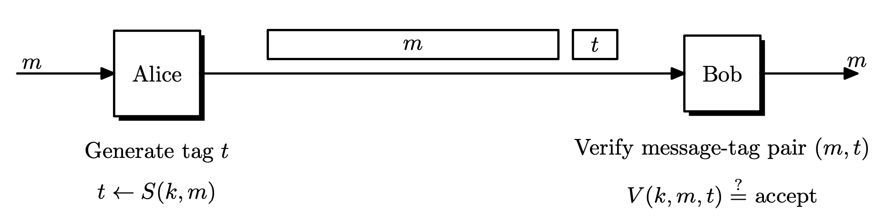
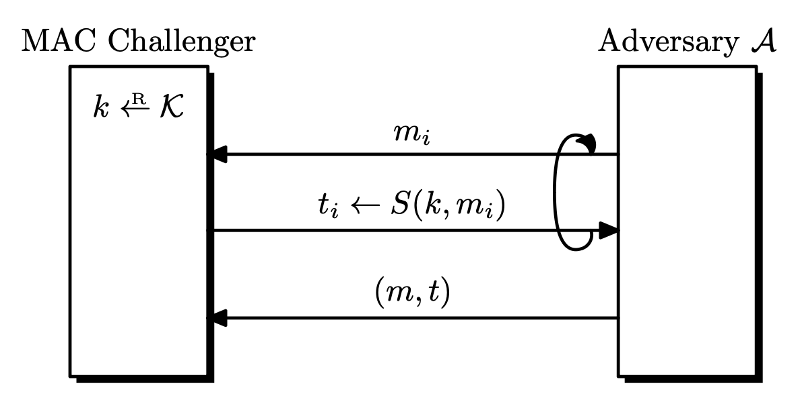
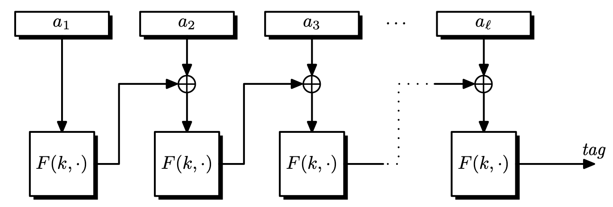
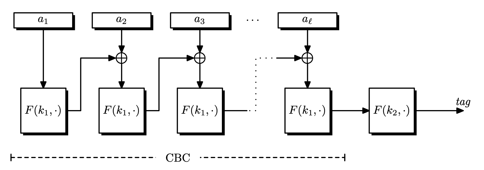

Message authentication codes (MAC) were designed to provide message integrity. Bob receives a message from Alice and wants to know if this message was not modified during transmission. For MACs, the message itself does not have to be secret. For example, when we download a file the file itself does not have to be protected, but we need a way to verify that the file was not modified.

Note that MAC is different from error correcting codes (ECC). ECC fixes accidental errors. For example, the Ethernet protocol uses CRC32, which is *keyless*. Keyless integrity mechanisms are designed to detect and fix random transmission errors, and the adversary can easily modify the data since there is no key and the algorithm is publicly known.

On the other hand, MAC fixes data that is tampered in purpose. We will also require a key so that the adversary cannot easily modify the message. We assume that the secret key is shared between two parties, in advance.

## Message Authentication Code

> **Definition.** A **MAC** system $\Pi = (S, V)$ defined over $(\mathcal{K}, \mathcal{M}, \mathcal{T})$ is a pair of efficient algorithms $S$ and $V$ where $S$ is a **signing algorithm** and $V$ is a **verification algorithm**.
> 
> - $S : \mathcal{K} \times \mathcal{M} \rightarrow \mathcal{T}$ is a probabilistic algorithm that outputs $t \leftarrow S(k, m)$ for some key $k \in \mathcal{K}$ and message $m \in \mathcal{M}$. The output $t$ is called a **tag**, and $\mathcal{T}$ is the tag space.
> - $V: \mathcal{K} \times \mathcal{M} \times \mathcal{T} \rightarrow \left\lbrace 0, 1 \right\rbrace$ is a deterministic algorithm that computes $V(k, m, t)$ and outputs $1$ ($\texttt{accept}$) or $0$ ($\texttt{reject}$) .
> - It is required that $V(k, m, S(k, m)) = 1$.

When $V$ accepts $(m, t)$, then $t$ is called a **valid tag**. Since $(m, t)$ is the transmitted data, we want $t$ to be short as possible.

### Canonical Verification

$V$ can be replaced with an invocation of $S$ if *$S$ is deterministic*. The receiver can recompute the tag and check equality.

$$
V(k, m, t) = 1 \iff t = S(k, m)
$$

This is called **canonical verification**. All real-world MACs use canonical verification.

## Secure MAC: Unforgeability

In the security definition of MACs, we allow the attacker to request tags for arbitrary messages of its choice, called **chosen-message attacks**. This assumption will allow the attacker to collect a bunch of valid $(m, t)$ pairs. In this setting, we require the attacker to forge a **new** valid message-tag pair, which is different from what the attacker has. Also, it is not required that the forged message $m$ have any meaning. This is called **existential forgery**. A MAC system is secure if an existential forgery is almost impossible. Note that we are giving the adversary much power in the definition, to be conservative.

- Attacker is given $t_i \leftarrow S(k, m_i)$ for $m_1, \dots, m_q$ of his choice.
	- Attacker has a *signing oracle*.
- Attacker's goal is **existential forgery**.
	- **MAC**: generate a *new* valid message-tag pair $(m, t)$ such that $V(k, m, t) = 1$ and $m \notin \left\lbrace m_1, \dots, m_q \right\rbrace$.
	- **Strong MAC**: generate a *new* valid message-tag pair $(m, t)$ $V(k, m, t) = 1$ and $(m, t) \notin \left\lbrace (m_1, t_1), \dots, (m_q, t_q) \right\rbrace$.

For strong MACs, the attacker only has to change the tag for the attack to succeed.

> **Definition.** Let $\Pi = (S, V)$ be a MAC system defined over $(\mathcal{K}, \mathcal{M}, \mathcal{T})$. Given an adversary $\mathcal{A}$, the security game goes as follows.
> 
> 1. The challenger picks a random $k \leftarrow \mathcal{K}$.
> 2. $\mathcal{A}$ queries the challenger $q$ times.
> 	- The $i$-th signing query is a message $m_i$, and receives $t_i \leftarrow S(k, m_i)$.
> 3. $\mathcal{A}$ outputs a new forged pair $(m, t)$ that is not among the queried pairs.
> 	- $m \notin \left\lbrace m_1, \dots,m_q \right\rbrace$
> 	- $(m, t) \notin \left\lbrace (m_1, t_1), \dots, (m_q, t_q) \right\rbrace$ (for strong MAC)
> 
> $\mathcal{A}$ wins if $(m, t)$ is a valid pair under $k$. Let this event be $W$. The **MAC advantage** with respect to $\Pi$ is defined as
> 
> $$
> \mathrm{Adv}_{\mathrm{MAC}}[\mathcal{A}, \Pi] = \Pr[W]
> $$
> 
> and a MAC $\Pi$ is secure if the advantage is negligible for any efficient $\mathcal{A}$. In this case, we say that $\Pi$ is **existentially unforgeable under a chosen message attack**.

If a MAC is secure, the attacker learns almost nothing from the $q$ queries. i.e, the tags for the previous $q$ messages gives no useful information for producing a tag for some other message $m$, even in cases where messages are almost identical.

### MAC Security with Verification Queries

The above definition can be modified to include **verification queries**, where the adversary $\mathcal{A}$ queries $(m_j, t_j) \in \mathcal{M} \times \mathcal{T}$ and the challenger responds with $V(k, m_j, t_j)$. $\mathcal{A}$ wins if any verification query is returned with $1$ ($\texttt{accept}$).

It can be shown that for **strong MACs**, these two definitions are equivalent. See Theorem 6.1.[^1] For (just) MACs, these are not equivalent. See Exercise 6.7.[^1]

Since these two definition are equivalent, security proofs are easier when we use the definition without verification queries.

## Notes on the Security Definition

### Replay Attacks

The definition requires that the adversary generate a **new** message-tag pair. In the real world, there are **replay attacks** that send the same message multiple times. For example, intercepting a bank transaction message and sending it several times can be critical. Replay attacks should be handled differently, by using sequence numbers in messages or by appending a timestamp.

### Secure MAC with Canonical Verification

**A secure MAC with canonical verification is strongly secure**, since $S$ is deterministic, so for every message $m \in \mathcal{M}$, there is a *unique* tag $t \in \mathcal{T}$. Thus it is impossible to only modify the tag.

## MAC Constructions from PRFs

Block ciphers were actually PRPs, but we have a large message space, so by the **PRF switching lemma**, we can use block ciphers as PRFs and construct other systems!

> Let $F : \mathcal{K} \times X \rightarrow Y$ be a PRF. Define a MAC scheme $\Pi = (S, V)$ over $(\mathcal{K}, X, Y)$ as
> - $S(k, m) = F(k, m)$
> - $V(k, m, t) = 1$ if $t = F(k, m)$ and $0$ otherwise.

This MAC is **derived from $F$**, and is deterministic. This scheme is secure as long as $\left\lvert Y \right\lvert$ is sufficiently large. This is necessary since if $\left\lvert Y \right\lvert$ is small, then an adversary can randomly guess the tag with non-negligible probability.

> **Theorem.** Let $F : \mathcal{K} \times X \rightarrow Y$ be a secure PRF. If $\left\lvert Y \right\lvert$ is sufficiently large, then $\Pi$ is a secure MAC.
> 
> For every efficient MAC adversary $\mathcal{A}$ against $\Pi$, there exists an efficient PRF adversary $\mathcal{B}$ such that
> 
> $$
> \mathrm{Adv}_{\mathrm{MAC}}[\mathcal{A}, \Pi] \leq \mathrm{Adv}_{\mathrm{PRF}}[\mathcal{B}, F] + \frac{1}{\left\lvert Y \right\lvert}.
> $$

*Proof*. See Theorem 6.2.[^1]

The above construction uses a PRF, so it is restricted to messages of fixed size. We also need a MAC for longer messages.

## MAC Constructions for Fixed Length Messages

### CBC-MAC

> **Definition.** For any message $m = (m_0, m_1, \dots, m_{l-1}) \in \left\lbrace 0, 1 \right\rbrace^{nl}$, let $F_k := F(k, \cdot)$.
> 
> $$
> S_\mathrm{CBC}(m) = F_k(F_k(\cdots F_k(F_k(m_0) \oplus m_1) \oplus \cdots) \oplus m_{l-1}).
> $$

$S_\mathrm{CBC}$ is similar to CBC mode encryption, but there is no intermediate output, and the IV is fixed as $0^n$.

> **Theorem.** If $F : \mathcal{K} \times \left\lbrace 0, 1 \right\rbrace^n \rightarrow \left\lbrace 0, 1 \right\rbrace^n$ is a secure PRF, then **for a fixed $l$**, CBC-MAC is secure for messages $\mathcal{M} = \left\lbrace 0, 1 \right\rbrace^{nl}$.

The following modifications show some of the ways that CBC-MAC could become insecure.

#### Using Shorter Messages is Insecure (Extension Attack)

For any messages *shorter than* $nl$, CBC-MAC is not secure. So the length of the messages should be fixed in advance by the sender and the receiver.

To see this, consider the following **extension attack**.

1. Pick an arbitrary $m_0 \in \left\lbrace 0, 1 \right\rbrace^n$.
2. Request the tag $t = F(k, m_0)$.
3. Set $m_1 = t \oplus m_0$ and output $(m_0, m_1) \in \left\lbrace 0, 1 \right\rbrace^{2n}$ and $t$ as the tag.

Then the verification works since

$$
S_\mathrm{CBC}(k, (m_0, t\oplus m_0)) = F(k, F(k, m_0) \oplus (t \oplus m_0)) = F(k, m_0) = t.
$$

#### Random IV is Insecure

If we use random IV instead of $0^n$, CBC-MAC is insecure. Suppose a random IV was chosen from $\left\lbrace 0, 1 \right\rbrace^n$ and the final output was $(\mathrm{IV}, t)$. Then the following attack is possible.

1. Pick an arbitrary $m \in \left\lbrace 0, 1 \right\rbrace^n$.
2. Request the tag $(\mathrm{IV}, t)$. ($t = F(k, m)$)
3. Send $m' = \mathrm{IV} \oplus m$ and tag $(\mathrm{IV}, t)$.

Then the verification works since

$$
S_\mathrm{CBC}(k, \mathrm{IV} \oplus m) = F(k, (\mathrm{IV} \oplus m) \oplus \mathrm{IV}) = F(k, m) = t.
$$

#### Disclosing Intermediate Values is Insecure

If CBC-MAC outputs all intermediate values of $F(k, \cdot)$, then CBC-MAC is insecure. Consider the following attack.

1. Pick an arbitrary $(m_0, m_1) \in \left\lbrace 0, 1 \right\rbrace^{2n}$.
2. Request the computed values $(t_0, t)$, where $t_0 = F(k, m_0)$ and $t = F(k, m_1 \oplus t_0)$.
3. Send $(m_0, m_0 \oplus t_0) \in \left\lbrace 0, 1 \right\rbrace^{2n}$ and tag $t_0$.

Then the verification works since

$$
S_\mathrm{CBC}(k, (m_0, m_0 \oplus t_0)) = F(k, F(k, m_0) \oplus (m_0 \oplus t_0)) = F(k, m_0) = t_0.
$$

The lesson is that *cryptographic constructions should be implemented exactly as it was specified, without any unproven variations*.

## CBC-MAC for Messages of Arbitrary Length

We can extend CBC-MAC for arbitrary length messages. First, assume that all messages have lengths divisible by $n$.

### Length Prepending

We can prepend the length of message $\left\lvert m \right\lvert$, encoded as an $n$-bit string. The computation of CBC-MAC is the same. It can be shown that this MAC scheme is secure.

However, this cannot be used if the length of the message is not known in advance. Also, only *prepending* works since *appending* the length is not secure. See Exercise 6.8.[^1]

> **Proposition.** Appending the length of the message in CBC-MAC is insecure.

*Proof*. Let $n$ be the length of a block. Query $m_1, m_2, m_1 \parallel n \parallel m_3$ and receive $3$ tags, $t_1 = E_k(E_k(m_1) \oplus n)$, $t_2 = E_k(E_k(m_2) \oplus n)$, $t_3 = E_k(E_k(t_1 \oplus m_3) \oplus 3n)$.

Now forge a message-tag pair $(m_2 \parallel n \parallel (m_3 \oplus t_1 \oplus t_2), t_3)$. Then the tag is

$$
E_k(E_k(\overbrace{E_k(E_k(m_2) \oplus n)}^{t_2} \oplus m_3 \oplus t_1 \oplus t_2) \oplus 3n) = E_k(E_k(t_1 \oplus m_3) \oplus 3n)
$$

which equals $t_3$. Note that the same logic works if the length is *anywhere* in the message, except for the beginning.

### Encrypt Last Block (ECBC-MAC)

Since CBC-MAC is vulnerable to extension attacks, we encrypt the last block again. Choose a second key $k' \in \mathcal{K}$ to encrypt the tag, so $t' = F(k', t)$. This method is called **encrypt-last-block CBC-MAC** (ECBC-MAC).

ECBC-MAC doesn't require us to know the message length in advance, but it is relatively expensive in practice, since a block cipher has to be initialized with a new key.

> **Theorem.** Let $F : \mathcal{K} \times X \rightarrow X$ be a secure PRF. Then for any $l \geq 0$, $F_\mathrm{ECBC} : \mathcal{K}^2 \times X^{\leq l} \rightarrow X$ is a secure PRF.
> 
> For any efficient $q$-query PRF adversary $\mathcal{A}$ against $F_\mathrm{ECBC}$, there exists an efficient PRF adversary $\mathcal{B}$ such that
> 
> $$
> \mathrm{Adv}_{\mathrm{PRF}}[\mathcal{A}, F_\mathrm{ECBC}] \leq \mathrm{Adv}_{\mathrm{PRF}}[\mathcal{B}, F] + \frac{2q^2l^2}{\left\lvert X \right\lvert}.
> $$
> 
> [^2]

Thus ECBC-MAC is secure as long as $ql \ll \sqrt{\left\lvert X \right\lvert}$.

#### Extendable PRF

> **Definition.** Let $PF$ be a PRF defined over $(\mathcal{K}, X^{\leq l}, Y)$. $PF$ is **extendable** if for all $k \in \mathcal{K}$, $x, y \in X^{\leq l}$ and $a \in X$,
> 
> $$
> PF(k, x) = PF(k, y) \implies PF(k, x \parallel a) = PF(k, y \parallel a).
> $$

It is easy to see that (E)CBC is an extendable PRF.

#### Attacking ECBC with $\sqrt{\left\lvert X \right\lvert}$ Messages

1. Make $q = \sqrt{\left\lvert X \right\lvert}$ queries using random messages $m_i \in X$ and obtain $t_i = F_\mathrm{ECBC}(k, m_i)$.
2. With a high probability, there is a collision $t_i = t_j$ for $i \neq j$.
3. Query for $m_i \parallel m$ and receive the tag $t$.
4. Return a forged pair $(m_j \parallel m, t)$.

This works because ECBC is an extendable PRF. $t$ also works as a valid tag for $m_j \parallel m$.

So ECBC becomes insecure after signing $\sqrt{\left\lvert X \right\lvert}$ messages.

### Bit-wise PRF Using Block-wise PRF

Now we construct a bitwise PRF, that enables us to sign messages of arbitrary length. We pad the messages so that they can be signed block-wise.

Specifically, pad with $1000\dots0$. If the message length is already a multiple of $n$, then add a dummy block and pad with $1000\dots0$. It is easy to see that this padding is injective, so using this padding gives us a secure PRF for bit-wise operations.

### Other Constructions

- CMAC (OMAC)
	- Simplified version of ECBC-MAC
	- Uses only one key
	- NIST standard
- **Parallelizable MAC** (PMAC)
	- Uses two keys.
	- Better than ECBC, since it is parallelizable.
	- Each message block is XORed with a easy-to-compute function, then it is encrypted.
	- All encrypted blocks are XORed, and finally encrypted again.
	- PMAC is incremental: the tag can be easily updated when a message block changes.
- Hash-MAC (HMAC)

[^1]: A Graduate Course in Applied Cryptography
[^2]: Need to check if this is correct. Check Theorem 6.6.[^1]
