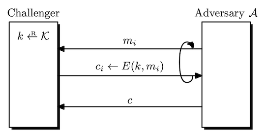
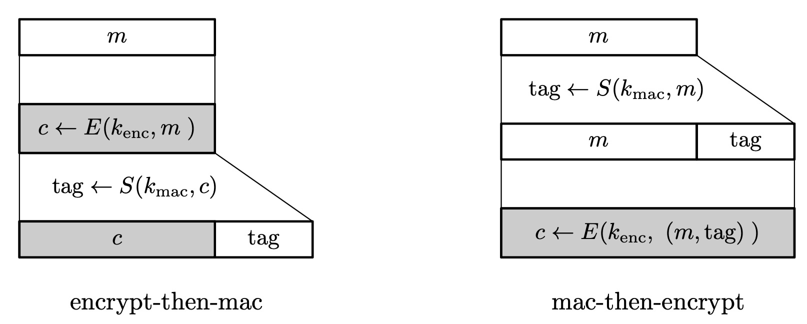

Previously, we focused on semantic security against **passive adversaries**, that only eavesdrop on the ciphertext. But in the real world, there are **active adversaries** that interfere with the communication, or even modify them.

We need to develop security notions for these cases. For example, suppose a sender encrypts a message $m$ and sends $c$. The attacker can read $c$ and generate another ciphertext $c'$, which will be decrypted by the receiver. If the decrypted message does not match $m$, this is a violation of message integrity.

Also, there are cases where some information about $m$ is leaked when the attacker learns about $m'$, from the behavior of the receiver. Such an attack exists in the real world called *padding oracle attacks*, where the attacker can completely recover the original message of any ciphertext just from the behavior of the server.

## CCA Security

Now we define a stronger notion of security against **chosen ciphertext attacks**, where the adversary can also obtain the decryption of any ciphertext it wants. As always, the notion is formalized as a security game.

> **Definition.** Let $\mathcal{E} = (E, D)$ be a cipher over $(\mathcal{K}, \mathcal{M}, \mathcal{C})$. Given an adversary $\mathcal{A}$, define experiments $0$ and $1$.
> 
> **Experiment $b$.**
> 1. The challenger fixes a key $k \leftarrow \mathcal{K}$.
> 2. $\mathcal{A}$ makes a series of queries to the challenger, which is one of the following two types.
> 	- *Encryption*: Send $m_i$ and receive $c'_i = E(k, m_i)$.
> 	- *Decryption*: Send $c_i$ and receive $m'_i = D(k, c_i)$.
> 	- Note that $\mathcal{A}$ is not allowed to make a decryption query for any $c_i'$.
> 3. $\mathcal{A}$ outputs a pair of messages $(m_0^ * , m_1^*)$.
> 4. The challenger generates $c^* \leftarrow E(k, m_b^*)$ and gives it to $\mathcal{A}$.
> 5. $\mathcal{A}$ is allowed to keep making queries, but not allowed to make a decryption query for $c^*$.
> 6. The adversary computes and outputs a bit $b' \in \left\lbrace 0, 1 \right\rbrace$.
> 
> Let $W_b$ be the event that $\mathcal{A}$ outputs $1$ in experiment $b$. Then the **CCA advantage with respect to $\mathcal{E}$** is defined as
> 
> $$
> \mathrm{Adv}_{\mathrm{CCA}}[\mathcal{A}, \mathcal{E}] = \left\lvert \Pr[W_0] - \Pr[W_1] \right\lvert.
> $$
> 
> If the CCA advantage is negligible for all efficient adversaries $\mathcal{A}$, then $\mathcal{E}$ is **semantically secure against a chosen ciphertext attack**, or simply **CCA secure**.

### CCA is a Strong Notion

None of the encryption schemes already seen thus far is CCA secure.

Recall a [CPA secure construction from PRF](../2023-09-19-symmetric-key-encryption/#secure-construction-from-prf). This scheme is not CCA secure. Suppose that the adversary is given $c^* = (r, F(k, r) \oplus m_b)$. Then it can request a decryption for $c' = (r, s')$ for some $s'$ and receive $m' = s' \oplus F(k, r)$. Then $F(k, r) = m' \oplus s'$, so the adversary can successfully recover $m_b$.

In general, any encryption scheme that allows ciphertexts to be *manipulated* in a controlled way cannot be CCA secure.

We need a way to prevent manipulation of ciphertexts and provide ciphertext integrity.

### Example: Modifying Data Encrypted in CBC Mode

Suppose that there is a proxy server in the middle, that forwards the message to some destination included in the message. The messages begin with $\texttt{dest = N}$ where $\texttt{N}$ is the destination port.

An adversary at destination 25 wants to receive the message sent to destination $80$. This can be done by modifying the destination to $\texttt{25}$.

Suppose we used CBC mode encryption. Then the first block of the ciphertext would contain the IV, the next block would contain $E(k, \mathrm{IV} \oplus m_0)$.

The adversary can generate a new ciphertext $c'$ without knowing the actual key. Set the new IV as $\mathrm{IV}' =\mathrm{IV} \oplus m^ *$ where $m^ *$ contains a payload that can change $\texttt{80}$ to $\texttt{25}$. (This can be calculated)

Then the decryption works as normal,

$$
D(k, c_0) \oplus \mathrm{IV}' = (m_0 \oplus \mathrm{IV}) \oplus \mathrm{IV}' = m_0 \oplus m^*.
$$

The destination of the original message has been changed, even though the adversary had no information of the key.

## Ciphertext Integrity (CI)

The attacker shouldn't be able to create a new ciphertext that decrypts properly.

In this case, we fix the decryption algorithm so that $D : \mathcal{K} \times \mathcal{C} \rightarrow \mathcal{M} \cup \left\lbrace \bot \right\rbrace$, where $\bot$ means that the ciphertext was rejected.

> **Definition.** Let $\mathcal{E} = (E, D)$ be a cipher defined over $(\mathcal{K}, \mathcal{M}, \mathcal{C})$. Given an adversary $\mathcal{A}$, the security game goes as follows.
> 
> 1. The challenger picks a random $k \leftarrow \mathcal{K}$.
> 2. $\mathcal{A}$ queries the challenger $q$ times.
> 	- The $i$-th query is a message $m_i$, and receives $c_i \leftarrow E(k, m_i)$.
> 3. $\mathcal{A}$ outputs a candidate ciphertext $c \in \mathcal{C}$ that is not among the ciphertexts it was given by querying.
> 
> $\mathcal{A}$ wins if $c$ is a valid ciphertext under $k$. i.e, $D(k, c) \neq \bot$.
> 
> The **CI advantage** with respect to $\mathcal{E}$ $\mathrm{Adv}_{\mathrm{CI}}[\mathcal{A}, \mathcal{E}]$ is defined as the probability that $\mathcal{A}$ wins the game. If the advantage is negligible for any efficient $\mathcal{A}$, we say that $\mathcal{E}$ provides **ciphertext integrity**. (CI)

If a scheme provides ciphertext integrity, then it will almost surely receive $\bot$ for some randomly generated ciphertext, and also for a valid ciphertext that was changed a little bit.

Previously seen schemes also do not provide ciphertext integrity.

As a bad example, randomized CBC mode does not provide ciphertext integrity, since decryption never outputs $\bot$.

## Authenticated Encryption (AE)

The goal of this definition is to provide *privacy* and *integrity* from a single primitive.

> **Definition.** A cipher $\mathcal{E} = (E, D)$ provides **authenticated encryption**, or is **AE-secure** if it is CPA secure and provides ciphertext integrity.

Thus, if we use a cipher that is AE secure, the adversary cannot distinguish encryption of real messages from encryption of random messages. Also, ciphertexts cannot be forged, so ciphertexts not encrypted by he sender will not be accepted.

However, AE secure schemes are vulnerable to replay attacks. These attacks should be handled in a different way.

### AE Implies CCA Security

This theorem enables us to use AE secure schemes as a CCA secure scheme.

> **Theorem.** Let $\mathcal{E} = (E, D)$ be a cipher. If $\mathcal{E}$ is AE-secure, then it is CCA-secure.
> 
> For any efficient $q$-query CCA adversary $\mathcal{A}$, there exists efficient adversaries $\mathcal{B} _ \mathrm{CPA}$ and $\mathcal{B} _ \mathrm{CI}$ such that
> 
> $$
> \mathrm{Adv}_{\mathrm{CCA}}[\mathcal{A}, \mathcal{E}] \leq \mathrm{Adv}_{\mathrm{CPA}}[\mathcal{B}_\mathrm{CPA}, \mathcal{E}] + 2q \cdot \mathrm{Adv}_{\mathrm{CI}}[\mathcal{B}_\mathrm{CI}, \mathcal{E}].
> $$

*Proof*. Check Theorem 9.1.[^1]

Intuitively, $\mathcal{A}$ is a CCA adversary, so it will make both encryption and decryption queries. Since $\mathcal{E}$ is AE secure, all of its decryption queries will return $\bot$, and by definition of CI, the adversary will learn nothing from the decryption queries. So if we remove the decryption queries, the CCA game becomes a CPA game. But $\mathcal{E}$ is also CPA secure, so $\mathcal{A}$ cannot win with non-negligible probability.

Note that the converse is not true. There are constructions that are CCA secure but not AE secure. Check Exercise 9.12.[^1]

Also, if a cipher is CCA secure and provides *plaintext* integrity, it is AE secure. Check Exercise 9.15.[^1]

Most natural constructions of CCA secure schemes satisfy AE, so we don't need to worry to much.

## AE Constructions by Generic Composition

We want to combine CPA secure scheme and strongly secure MAC to get AE. Rather than focusing on the internal structure of the scheme, we want a general method to compose these two secure schemes so that we can get a AE secure scheme. We will see 3 examples.

### Encrypt-and-MAC (E&M)

In **Encrypt-and-MAC**, encryption and authentication is done in parallel.

> Given a message $m$, the sender outputs $(c, t)$ where
> 
> $$
> c \leftarrow E(k_1, m), \quad t \leftarrow  S(k_2, m).
> $$

This approach does not provide AE. In general, the tag may leak some information about the original message. This is because MACs do not care about the privacy of messages.

As a counterexample, consider a strongly secure MAC where the first bit of the tag is always equal to the first bit of the message.[^2]

### MAC-then-Encrypt (MtE)

In **MAC-then-Encrypt**, the tag is computed and the message-tag pair is encrypted.

> Given a message $m$, the sender outputs $c$ where
> 
> $$
> t \leftarrow S(k_2, m), \quad c \leftarrow E(k_1, m\parallel t).
> $$
> 
> Decryption is done by $(m, t) \leftarrow D(k_1, c)$ and then verifying the tag with $V(k_2, m, t)$.

This is not secure either. It is known that the attacker can decrypt all traffic using a chosen ciphertext attack. (padding oracle attacks) Check Section 9.4.2.[^1]

### Encrypt-then-MAC (EtM)

In **Encrypt-then-MAC**, the encrypted message is signed, and is known to be secure in general.

> Given a message $m$, the sender outputs $(c, t)$ where
> 
> $$
> c \leftarrow E(k_1, m), \quad t \leftarrow S(k_2, c).
> $$
> 
> Decryption is done by returning $D(k_1, c)$ only if verification $V(k_2, c, t)$ succeeds.

> **Theorem.** Let $\mathcal{E} = (E, D)$ be a cipher and let $\Pi = (S, V)$ be a MAC system. If $\mathcal{E}$ is CPA secure cipher and $\Pi$ is a strongly secure MAC, then $\mathcal{E}_\mathrm{EtM}$ is AE secure.
> 
> For every efficient CI adversary $\mathcal{A} _ \mathrm{CI}$ attacking $\mathcal{E} _ \mathrm{EtM}$, there exists an efficient MAC adversary $\mathcal{B} _ \mathrm{MAC}$ attacking $\Pi$ such that
> 
> $$
> \mathrm{Adv}_{\mathrm{CI}}[\mathcal{A}_\mathrm{CI}, \mathcal{E}_\mathrm{EtM}] = \mathrm{Adv}_{\mathrm{MAC}}[\mathcal{B}_\mathrm{MAC}, \Pi].
> $$
> 
> For every efficient CPA adversary $\mathcal{A} _ \mathrm{CPA}$ attacking $\mathcal{E} _ \mathrm{EtM}$, there exists an efficient CPA adversary $\mathcal{B} _ \mathrm{MAC}$ attacking $\mathcal{E}$ such that
> 
> $$
> \mathrm{Adv}_{\mathrm{CPA}}[\mathcal{A}_\mathrm{CPA}, \mathcal{E}_\mathrm{EtM}] = \mathrm{Adv}_{\mathrm{CPA}}[\mathcal{B}_\mathrm{CPA}, \mathcal{E}].
> $$

*Proof*. See Theorem 9.2.[^1]

**Remark.** In the definition of strongly secure MACs, forging a new tag with the same ciphertext is admitted as a successful attack. Considering EtM construction, the attacker could construct a new valid tag and win the CI game if it was not for the *strongly* secure MAC definition.

#### Common Mistakes in EtM Implementation

- Do not use the same key for $\mathcal{E}$ and $\Pi$. The security proof above relies on the fact that the two keys $k_1, k_2 \in \mathcal{K}$ were chosen independently. See Exercise 9.8.[^1]
- MAC must be applied to the full ciphertext. For example, if IV is not protected by the MAC, the attacker can create a new valid ciphertext by changing the IV.

[^1]: A Graduate Course in Applied Cryptography
[^2]: Since we are looking for a general construction, it suffices to show a counterexample.
