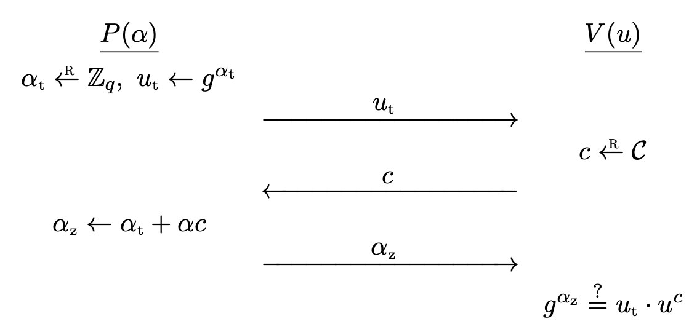

## Digital Signatures

> **Definition.** A **signature scheme** $\mc{S} = (G, S, V)$ is a triple of efficient algorithms, where $G$ is a **key generation** algorithm, $S$ is a **signing** algorithm, and $V$ is a **verification** algorithm.
> 
> - A probabilistic algorithm $G$ outputs a pair $(pk, sk)$, where $sk$ is called a secret **signing key**, and $pk$ is a public **verification key**.
> - Given $sk$ and a message $m$, a probabilistic algorithm $S$ outputs a **signature** $\sigma \la S(sk, m)$.
> - $V$ is a deterministic algorithm that outputs either $\texttt{{accept}}$ or $\texttt{reject}$ for $V(pk, m, \sigma)$.

The correctness property requires that all signatures generated by $S$ is always accepted by $V$. For all $(pk, sk) \la G$ and $m \in \mc{M}$,

$$
\Pr[V(pk, m, S(sk, m)) = \texttt{{accept}}] = 1.
$$

### Properties of Digital Signatures

- Digital signatures can be verified by anyone, whereas MACs can be verified by the parties sharing the same key.
	- No need to share a key for digital signatures.
- **Non-repudiation**: cannot deny having created the signature.
	- Signatures can only be created by people having the secret key.
	- In cases where the secret key is leaked, then we don't have non-repudiation.
	- In MACs, the secret key is shared by two parties, so we don't have non-repudiation.
- Must trust the identity of the public key.
	- How do you trust that this public key is Alice's?
	- We need **public key infrastructure** (PKI).

### Applications

- Electronic document signing
- HTTPS/TLS certificates
- Software installation
- Authenticated email (DKIM)
- Bitcoins

## Secure Digital Signatures

The definition is similar to the [secure MAC](../2023-09-21-macs/#secure-mac-unforgeability). The adversary can perform a **chosen message attack**, but cannot create an **existential forgery**.

> **Definition.** Let $\mc{S} = (G, S, V)$ be a signature scheme defined over $(\mc{M}, \Sigma)$. Given an adversary $\mc{A}$, the game goes as follows.
> 
> 1. The challenger generates $(pk, sk) \la G()$ and sends $pk$ to $\mc{A}$.
> 2. $\mc{A}$ makes a series of *signing queries* to the challenger.
> 	- Each query is a message $m_i \in \mc{M}$, the challenger responds with $\sigma_i \la S(sk, m_i)$.
> 3. $\mc{A}$ computes and outputs a candidate forgery pair $(m, \sigma) \in \mc{M} \times \Sigma$.
> 	- $m \notin \left\lbrace m_1, \dots, m_q \right\rbrace$.
> 	- $(m, \sigma) \notin \left\lbrace (m_1, \sigma_1), \dots, (m_q, \sigma_q) \right\rbrace$. (strong)
> 
> $\mc{A}$ wins if $V(pk, m, \sigma) = \texttt{accept}$, let this event be $W$. The advantage of $\mc{A}$ with respect to $\mc{S}$ is defined as
> 
> $$
> \rm{Adv}_{\rm{SIG}}[\mc{A}, \mc{S}] = \Pr[W].
> $$
> 
> If the advantage is negligible for all efficient adversaries $\mc{A}$, the signature scheme $S$ is (strongly) **secure**. $\mc{S}$ is **existentially unforgeable under a chosen message attack**.

- We do not make verification queries, since the adversary can always check any signature.
- The normal definition of security is sufficient. Secure signature schemes can be converted into strongly secure signature schemes. See Exercise 14.10.[^1]

### Message Confusion

Two different messages $m, m'$ can produce the same signature $\sigma$. In this case, the scheme is vulnerable to **message confusion**. See Exercise 13.3.[^1]

In common implementations, we consider $m$, $m'$ both to be valid. But there may be situations that this is undesirable. For those cases, a signature is would be a *binding commitment* to the message, and there will be no confusion.

### Signer Confusion

Suppose that $(m, \sigma)$ is a valid pair with $pk$, i.e, $V(pk, m, \sigma) = \texttt{accept}$. But an attacker can generate $pk'$ different from $pk$ such that $V(pk', m, \sigma) = \tt{accept}$. In this cases, we have **signer confusion** since both can claim to have signed $m$. See Exercise 13.4.[^1]

### Strongly Binding Signatures

**Strongly binding signatures** prevent both message confusion and signer confusion.

Any signature scheme can be made strongly binding by appending a collision resistant hash of $(pk, m)$ to the signature. See Exercise 13.5.[^1]

## Extending the Message Space

We can extend the message space of a secure digital signature scheme, [as we did for MACs](../2023-09-28-hash-functions/#mac-domain-extension). Let $\mc{S} = (G, S, V)$ be a signature scheme defined over $(\mc{M}, \Sigma)$ and let $H : \mc{M}' \ra \mc{M}$ be a hash function with $\left\lvert \mc{M}' \right\lvert \geq \left\lvert \mc{M} \right\lvert$.

Define a new signature scheme $\mc{S}' = (G, S', V')$ over $(\mc{M}', \Sigma)$ as

$$
S'(sk, m) = S(sk, H(m)), \qquad V'(pk, m, \sigma) = V(pk, H(m), \sigma).
$$

This is often called the **hash-and-sign paradigm**, and the new signature scheme is also secure.

> **Theorem.** Suppose that $\mc{S}$ is a secure signature scheme and $H$ is a collision resistant hash function. Then $\mc{S}'$ is a secure signature.
> 
> If $\mc{A}$ is an adversary attacking $\mc{S}'$, then there exist an adversary $\mc{B}_\mc{S}$ attacking $\mc{S}$ and an adversary $\mc{B}_H$ attacking $H$ such that
> 
> $$
> \rm{Adv}_{\rm{SIG}}[A, \mc{S}'] \leq \rm{Adv}_{\rm{SIG}}[\mc{B}_\mc{S}, \mc{S}] + \rm{Adv}_{\rm{CR}}[\mc{B}_H, H].
> $$

*Proof*. The proof is identical to the theorem for MACs.

## Digital Signature Constructions

We can build secure signature schemes from hash functions, trapdoor permutations, or from discrete logarithms.

### Textbook RSA Signatures

This is the signature scheme based on the textbook RSA. It is also insecure.

- Key generation: $pk = (N, e)$ and $sk = (N, d)$ are chosen to satisfy $d = e^{-1} \bmod \phi(N)$ for $N = pq$.
- Sign: $S(sk, m) = m^d \bmod N$.
- Verify: $V(pk, m, \sigma)$ returns $\texttt{accept}$ if and only if $\sigma^e = m \bmod N$.

Here are some possible attacks.

- No message attack
	- Just return $(\sigma^e, \sigma)$ for some $\sigma$. Then it passes verification.
- Attack using the homomorphic property.
	- Suppose we want to forge a message $m$.
	- Pick $m_1 \in \Z_N^{\ast}$ and set $m_2 = m\cdot m_1^{-1} \bmod N$.
	- Query signatures for both messages and multiply the responses.
		- $\sigma = \sigma_1 \cdot \sigma_2 = m_1^e \cdot m^e \cdot m_1^{-e} = m^e \bmod N$.
	- Then $(m, \sigma)$ is a valid pair.

Because of the second attack, the textbook RSA signature is **universally forgeable**. This property is used to create **blind signatures**, where the signer creates a signature without any knowledge about the message. See Exercise 13.15.[^1]

### RSA Full Domain Hash Signature Scheme

Given a hash function $H : \mc{M} \ra \mc{Y}$, the **RSA full domain hash** signature scheme $\mc{S}_\rm{RSA-FDH}$ is defined as follows.

- Key generation: $pk = (N, e)$ and $sk = (N, d)$ are chosen to satisfy $d = e^{-1} \bmod \phi(N)$ for $N = pq$.
- Sign: $S(sk, m) = H(m)^d \bmod N$.
- Verify: $V(pk, m, \sigma)$ returns $\texttt{accept}$ if and only if $\sigma^d = H(m) \bmod N$.

This scheme is now secure.

> **Theorem.** If the hash function $H$ is modeled as a random oracle, and the RSA assumptions holds, then $\mc{S}_\rm{RSA-FDH}$ is a secure signature scheme.
> 
> For any $q$-query adversary $\mc{A}$ against hashed RSA, there exists an adversary $\mc{B}$ solving the RSA problem such that
> 
> $$
> \rm{Adv}_{\rm{SIG}}[\mc{A}, \mc{S}_\rm{RSA-FDH}] \leq q \cdot \rm{Adv}_{\rm{RSA}}[\mc{B}].
> $$

### Full Domain Hash Signature Scheme

The following is a description of a **full domain hash** scheme $\mc{S}_\rm{FDH}$, constructed from trapdoor permutation scheme $\mc{T} = (G, F, I)$.

- Key generation: $(pk, sk) \la G()$.
- Sign: $S(sk, m)$ returns $\sigma \la I(sk, H(m))$.
- Verify: $V(pk, m, \sigma)$ returns $\texttt{accept}$ if and only if $F(pk, \sigma) = H(m)$.

This scheme $\mc{S}_\rm{FDH} = (G, S, V)$ is secure if $\mc{T}$ is a **one-way trapdoor permutation** and $H$ is a random oracle.

> **Theorem.** Let $\mc{T} = (G,F,I)$ be a one-way trapdoor permutation defined over $\mc{X}$. Let $H : \mc{M} \ra \mc{X}$ be a hash function, modeled as a random oracle. Then the derived FDH signature scheme $\mc{S}_\rm{FDH}$ is a secure signature scheme.

*Proof*. See Theorem 13.3.[^1]

## Schnorr Digital Signature Scheme

This one uses discrete logarithms.

### The Schnorr Identification Protocol

This scheme is originally from the **Schnorr identification protocol**.

Let $G = \left\langle g \right\rangle$ be a cyclic group of prime order $q$. We consider an interaction between two parties, prover $P$ and a verifier $V$. The prover has a secret $\alpha \in \Z_q$ and the verification key is $u = g^\alpha$. **$P$ wants to convince $V$ that he knows $\alpha$, but does not want to reveal $\alpha$**.

The protocol $\mc{I}_\rm{sch} = (G, P, V)$ works as follows.

> 1. A **secret key** $\alpha \la \Z_q$ and **verification key** $u \la g^\alpha$ is generated. The prover $P$ has $\alpha$ and the verifier $V$ has $u$.
> 2. $P$ computes a random $\alpha_t \la \Z_q$, and sends $u_t \la g^{\alpha_t}$ to $V$.
> 3. $V$ chooses a random $c \la \Z_q$ and sends it to $P$.
> 4. $P$ computes $\alpha_z \la \alpha_t + \alpha c \in \Z_q$ and sends it to $V$.
> 5. $V$ checks if $g^{\alpha_z} = u_t \cdot u^c$. Accept if and only if it is equal.

- $u_t$ is the **commitment** sent to the verifier.
- $c$ is the **challenge** sent to the prover.
	- If $P$ can predict the challenge, $P$ can choose $\alpha_t$ and $\alpha_z$ so that verifier accepts it.
- $\alpha_z$ is the **response** sent to the verifier.

We must check a few things.

- **Correctness**: If $P$ has the correct $\alpha$, then $g^{\alpha_z} = g^{\alpha_t} \cdot (g^\alpha)^c = u_t \cdot u^c$.
- **Soundness**: If $P$ does not have the correct $\alpha$, it is reject with probability $1 - \frac{1}{q}$.
	- We can repeat this many times then the probability of reject is $1 - \frac{1}{q^n} \ra 1$.
	- Thus $q$ (the size of the challenge space) must be large.
- **Zero-knowledge**: $V$ learns no information about $x$ from the conversation.
	- This will be revisited later. See [here](../2023-11-07-sigma-protocols/#the-schnorr-identification-protocol-revisited).

> **Theorem.** The Schnorr identification protocol is secure if the DL problem is hard, and the challenge space $\mc{C}$ is large.

### Schnorr Digital Signature Scheme

We *transform* the above protocol to a signature scheme.[^2] We need a hash function $H : \mc{M} \times G \ra \mc{C}$, modeled as a random oracle. The protocol originally involves interaction between two parties, but a signature is computed by a single party. Intuitively, $H$ will play the role of the verifier.

The **Schnorr signature scheme** $\mc{S}_\rm{sch} = (G, S, V)$ is defined as follows.

- Key generation: a **secret key** $sk = \alpha \la \Z_q$ and **public key** $pk = u \la g^\alpha$ is generated.
- Sign: $S(sk, m)$ outputs $\sigma = (u_t, \alpha_z)$ where
	- Choose random $\alpha_t \la \Z_q$ and set $u_t \la g^{\alpha_t}$.
	- **Compute $c \la H(m, u_t)$** and set $\alpha_z \la \alpha_t + \alpha c$.
- Verify: $V(pk, m, \sigma)$ outputs $\texttt{accept}$ if and only if $g^{\alpha_z} = u_t \cdot u^c$.
	- $c \la H(m, u_t)$ can be computed and $u$ is known.

Since $H$ is being modeled as a random oracle, the signer cannot predict the value of the challenge $c$. Also, $c$ must take both $m$ and $u_t$ as input, since without $m$, the signature is not related to $m$ (the signature has no $m$ term inside it). On the other hand, without $u_t$, then the scheme is insecure since the Schnorr identification protocol is HVZK. See Exercise 19.12.[^1]

> **Theorem.** If $H$ is modeled as a random oracle and Schnorr's identification protocol is secure, then Schnorr's signature scheme is also secure.

*Proof*. See Theorem 19.7.[^1]

Note that $\alpha \la \Z_q$ must be chosen randomly every time.

## Digital Signature Algorithm

Schnorr's scheme was protected by a patent, so NIST opted for a ad-hoc signature scheme based on a prime order subgroup of $\Z_p^{\ast}$. This algorithm eventually became the **Digital Signature Algorithm** (DSA). The standard was updated to support elliptic curve groups over a finite field, resulting in **ECDSA**.

## Public Key Infrastructure

How would you trust public keys? We introduce **digital certificates** for this.

Read in [public key infrastructure (Internet Security)](../../internet-security/2023-10-16-pki).

[^1]: A Graduate Course in Applied Cryptography
[^2]: By using the [Fiat-Shamir transform](../2023-11-07-sigma-protocols/#the-fiat-shamir-transform).
