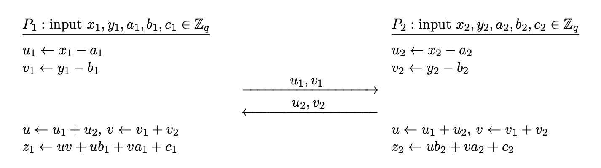

There are two types of MPC protocols, **generic** and **specific**. Generic protocols can compute arbitrary functions. [Garbled circuits](../2023-11-14-garbled-circuits/#garbled-circuits) were generic protocols, since it can be used to compute any boolean circuits. In contrast, the [summation protocol](../2023-11-09-secure-mpc/#example-secure-summation) is a specific protocol that can only be used to compute a specific function. Note that generic protocols are not necessarily better, since specific protocols are much more efficient.

## GMW Protocol

The **Goldreich-Micali-Wigderson** (GMW) **protocol** is a designed for evaluating boolean circuits. In particular, it can be used for XOR and AND gates, which corresponds to addition and multiplication in $\Z _ 2$. Thus, the protocol can be generalized for evaluating arbitrary arithmetic circuits.

We assume semi-honest adversaries and static corruption. The GMW protocol is known to be secure against any number of corrupted parties. We also assume that any two parties have private channels for communication.

The idea is **secret sharing**, where each party shares its input with other parties. The actual input is not revealed, and after the computation, each party holds a *share* of the final result.

The protocol can be broken down into $3$ phases.
- **Input phase**: each party shares its input with the other parties.
- **Evaluation phase**: each party computes gate by gate, using the shared values.
- **Output phase**: each party publishes their output.

### Input Phase

Suppose that we have $n$ parties $P _ 1, \dots, P _ n$ with inputs $x _ 1, \dots, x _ n \in \braces{0, 1}$. The inputs are bits but they can be generalized to inputs over $\Z _ q$ where $q$ is prime.

> Each party $P _ i$ shares its input with other parties as follows.
>
> 1. Choose random $r _ {i, j} \la \braces{0, 1}$ for all $j \neq i$ and send $r _ {i, j}$ to $P _ j$.
> 2. Set $r _ {i, i} = x _ i + \sum _ {i \neq j} r _ {i, j}$.

Then we see that $x _ i = \sum _ {j = 1}^n r _ {i, j}$. Each party has a **share** of $x _ i$, which is $r _ {i, j}$. We have a notation for this,

$$
[x _ i] = (r _ {i, 1}, \dots, r _ {i, n}).
$$

It means that $r _ {i, 1}, \dots, r _ {i, n}$ are shares of $x _ i$.

After this phase, each party $P _ j$ has $n$ shares $r _ {1, j}, \dots, r _ {n,j}$, where each is a share of $x _ i$.

### Evaluation Phase

Now, each party computes each gate using the shares received from other parties. We describe how the XOR and AND gate are computed.

#### Evaluating XOR Gates

Suppose we want to compute a share of $c = a + b$. Then, since

$$
[c] = [a] + [b],
$$

each party can simply add all the input shares.

If $y = x _ 1 + \cdots + x _ n$, then party $P _ j$ will compute $y _ j = \sum _ {i=1}^n r _ {i, j}$, which is a share of $y$, $[y] = (y _ 1, \dots, y _ n)$. It can be checked that

$$
y = \sum _ {j=1}^n y _ j = \sum _ {j=1}^n \sum _ {i=1}^n r _ {i, j}.
$$

#### Evaluating AND Gates

AND gates are not as simple as XOR gates. If $c = ab$,

$$
c = \paren{\sum _ {i=1}^n a _ i} \paren{\sum _ {j=1}^n b _ j} = \sum _ {i=1}^n a _ ib _ i + \sum _ {1 \leq i < j \leq n} (a _ ib _ j + a _ j b _ i).
$$

The first term can be computed internally by each party. The problem is the second term. $P _ i$ doesn't know the values of $a _ j$ and $b _ j$. Therefore, we need some kind of interaction between $P _ i$ and $P _ j$, but no information should be revealed. We can use an OT for this.

> For every pair of parties $(P _ i, P _ j)$, perform the following.
>
> 1. $P _ i$ chooses a random bit $s _ {i, j}$ and computes all possible values of $a _ ib _ j + a _ jb _ i + s _ {i, j}$. These values are used in the OT.
> 2. $P _ i$ and $P _ j$ run a $1$-out-of-$4$ OT.
> 3. $P _ i$ keeps $s _ {i, j}$ and $P _ j$ receives $a _ ib _ j + a _ jb _ i + s _ {i, j}$.

- If $a _ ib _ j + a _ jb _ i$ is exposed to any party, it reveals information about other party's share.
- These are bits, so $P _ i$ and $P _ j$ get to keep a share of $a _ ib _ j + a _ jb _ i$. If these aren't bits, then $s _ {i, j} - a _ ib _ j - a _ jb _ i$ must be computed for inputs to the OT.
- Since $a _ j, b _ j \in \braces{0, 1}$, it is possible to compute all possible values, and use them in the OT. $(a _ j, b _ j)$ will be used as the choice of $P _ j$.

### Output Phase

After evaluation, each party has a share of the final output, so the share is sent to the parties that will learn the output. These shares can be summed to obtain the final output value.

### Performance

Addition is easy, but multiplication gates require $n \choose 2$ OTs. Thus the protocol requires a communication round among the parties for every multiplication gate. Also, the multiplication gates on the same level can be processed in parallel.

Overall, the round complexity is $\mc{O}(d)$, where $d$ is the depth of the circuit, including only the multiplication gates.

A shallow circuit is better for GMW protocols. However, shallow circuits may end up using more gates depending on the function.

## Security Proof

We show the case when there are $n-1$ corrupted parties.[^1] Let $P _ i$ be the honest party and assume that all others are corrupted. We will construct a simulator.

Let $(x _ 1, \dots, x _ n)$ be inputs to the function, and let $[y] = (y _ 1, \dots, y _ n)$ be output shares. The adversary's view contains $y$, and all $x _ j$, $y _ j$ values except for $x _ i$ and $y _ i$.

To simulate the input phase, choose random shares to be communicated, both for $P _ i \ra P _ j$ and $P _ j \ra P _ i$. The shares were chosen randomly, so they are indistinguishable to the real protocol execution.

For the evaluation phase, XOR gates can be computed internally, so we only consider AND gates.
- When $P _ j$ is the receiver, choose a random bit as the value learned from the OT. Since the OT contains possible values of $a _ ib _ j + a _ jb _ i + s _ {i, j}$ and they are random, the random bit is equivalent.
- When $P _ j$ is the sender, choose $s _ {i, j}$ randomly and compute all $4$ possible values following the protocol.

Lastly, for the output phase, the simulator has to simulate the message $y _ i$ from $P _ i$. Since the final output $y$ is known and $y _ j$ ($j \neq i$) is known, $y _ i$ can be computed from the simulator.

We see that the distribution of the values inside the simulator is identical to the view in the real protocol execution.

## Beaver Triples

**Beaver triple sharing** is an offline optimization method for multiplication (AND) gates in the GMW protocol. Before actual computation, Beaver triples can be shared to speed up multiplication gates, reducing the running time in the online phase. Note that the overall complexity is the same.

> **Definition.** A **Beaver triple** is a triple $(x, y, z)$ such that $z = xy$.

### Beaver Triple Sharing

When Beaver triples are shared, $[x] = (x _ 1, x _ 2)$ and $[y] = (y _ 1, y _ 2)$ are chosen so that

$$

\tag{$\ast$}
z = z _ 1 + z _ 2 = (x _ 1 + x _ 2)(y _ 1 + y _ 2) = x _ 1y _ 1 + x _ 1y _ 2 + x _ 2y _ 1 + x _ 2y _ 2.
$$

> 1. Each party $P _ i$ chooses random bits $x _ i, y _ i$. Now they must generate $z _ 1, z _ 2$ so that the values satisfy equation $(\ast)$ above.
> 2. $P _ 1$ chooses a random bit $s$ and computes all $4$ possible values of $s + x _ 1y _ 2 + x _ 2y _ 1$.
> 3. $P _ 1$ and $P _ 2$ run a $1$-out-of-$4$ OT.
> 4. $P _ 1$ keeps $z _ 1 = s + x _ 1y _ 1$, $P _ 2$ keeps $z _ 2 = (s + x _ 1y _ 2 + x _ 2y _ 1) + x _ 2y _ 2$.

Indeed, $z _ 1, z _ 2$ are shares of $z$.[^2] See also Exercise 23.5.[^3]

### Evaluating AND Gates with Beaver Triples

Now, in the actual computation of AND gates, proceed as follows.

> Each $P _ i$ has a share of inputs $a _ i, b _ i$ and a Beaver triple $(x _ i, y _ i, z _ i)$.
> 1. Each $P _ i$ computes $u _ i = a _ i + x _ i$, $v _ i = b _ i + y _ i$.
> 2. $P _ i$ shares $u _ i, v _ i$ to $P _ {3-i}$ and receives $u _ {3-i}, v _ {3-i}$ from $P _ {3-i}$.
> 3. Each party now can compute $u = u _ 1 + u _ 2$, $v = v _ 1 + v _ 2$.
> 4. $P _ 1$ computes $c _ 1 = uv + uy _ 1 + vx _ 1 + z _ 1$, $P _ 2$ computes $c _ 2 = uy _ 2 + vx _ 2 + z _ 2$.

Note that

$$
\begin{aligned}
c = c _ 1 + c _ 2 &= uv + u(y _ 1 + y _ 2) + v(x _ 1 + x _ 2) + (z _ 1 + z _ 2) \\
&= uv + uy + vx + xy \qquad (\because z = xy)  \\
&= u(v + y) + x(v + y) \\
&= (u + x)(v + y) = ab
\end{aligned}
$$

The last equality comes from the fact that $u = a + x$ and $v = b+y$ from step $1$. The equation was derived from the following observation.

$$
c = ab = (a + x)(b + y) - x(b + y) - y(a + x) + xy.
$$

Substitute $u = a +x$ and $v = b + y$, since $z = xy$, we have

$$
c = uv - xv - yu + z.
$$

Thus

$$
[c] = uv - [x]v - [y]u + [z],
$$

and $uv$ is public, so any party can include it in its share.

Also note that $u _ i, v _ i$ does not reveal any information about $x _ i, y _ i$. Essentially, they are *one-time pad* encryptions of $x _ i$ and $y _ i$ since $a _ i, b _ i$ were chosen randomly. No need for OTs during actual computation.

### Reusing Beaver Triples?

**Beaver triples are to be used only once!** If $u _ 1 = a _ 1 + x _ 1$ and $u _ 1' = a _ 1' + x _ 1$, then $u _ 1 + u _ 1' = a _ 1 + a _ 1'$, revealing information about $a _ 1 + a _ 1'$.

Thus, before the online phase, a huge amount of Beaver triples are shared to speed up the computation. This can be done efficiently using [OT extension](../2023-11-16-gmw-protocol/#ot-extension) described below.

## Comparison of Yao and GMW

|Protocol|Yao|GMW|
|:-:|:-:|:-:|
|Metaphor|Apple: bite-by-bite|Orange: peel and eat|
|Pros|Constant round complexity|Circuit evaluation is simple|
|Cons|Requires symmetric cipher in the online phase|High overhead in AND gates|
|Good In|High latency networks|Low latency networks|
|Round Complexity|$\mc{O}(1)$|Depends on circuit depth. $n$ OTs per AND gates per party.|

Yao's protocol computes gates bite-by-bite, whereas GMW protocol is peel-and-eat. Most of the effort is required in the preprocessing phase, by sharing many Beaver triples, but the evaluation phase is easy.

## OT Extension

Both Yao's and GMW protocol use OTs. Depending on the computation, one may end up performing thousands of OTs, which can be inefficient.

There is a technique called **OT extension**, that allows us to obtain many OT instances from a small number of OT instances. OT extension only uses small number of base OTs, and uses symmetric cipher to extend it to many OTs.

### Protocol Description

This protocol will extend $n$ OTs to $m$ OTs, where $m \gg n$.

- Sender has inputs $\paren{x _ i^0, x _ i^1}$ for $i = 1, \dots, m$.
- Receiver has choice vector $\sigma = (\sigma _ 1, \dots, \sigma _ m) \in \braces{0, 1}^m$.
	- After the protocol, the receiver will get $x _ i^{\sigma _ i}$ for $i = 1, \dots, m$.

> **First phase.**
>
> 1. The receiver samples $n$ random strings $T _ 1, \dots, T _ n \la \braces{0, 1}^m$ of length $m$.
> 2. The receiver prepares pairs $\paren{T _ i, T _ i \oplus \sigma}$ for $i = 1, \dots, n$ and plays *sender in base OT*.
> 3. The sender chooses random $s = (s _ 1, \dots, s _ n) \in \braces{0, 1}^n$.
> 4. The sender plays *receiver in base OT* with input $s _ i$ for $i = 1, \dots, n$.

In the first phase, the roles are temporarily switched.

- The receiver chose $n$ random $m$-bit vectors, now has a $m\times n$ bit matrix $T$.
- For the $i$-th base OT, the receiver inputs $T _ i$ or $T _ i \oplus \sigma$. Therefore, if $s _ i = 0$, the sender gets $T _ i$. If $s _ i = 1$, then sender gets $T _ i \oplus \sigma$.
- Suppose that the sender gets $Q _ i \in \braces{0, 1}^m$ in the $i$-th base OT. The sender will also have a $m \times n$ bit matrix $Q$.

$$
Q _ i = \begin{cases} T _ i  & (s _ i = 0)  \\
	T _ i \oplus \sigma  & (s _ i = 1).
\end{cases}
$$

**Now consider each row separately!** Let $A[k]$ be the $k$-th row of matrix $A$.

If $\sigma _ j = 0$, the XOR operation in $T _ i \oplus \sigma$ has no effect on the $j$-th element (row), so the $j$-th element of $T _ i \oplus \sigma$ and $T _ i$ are the same. Thus, we have $Q[j] = T[j]$.

On the other hand, suppose that $\sigma _ j = 1$ and consider each element of $Q[j]$. The $i$-th element is the $j$-th element of $Q _ i$. If $s _ i = 0$, then $Q _ i = T _ i$, so the $j$-th element (row) is the same as the $j$-th element of $T _ i$. If $s _ i = 1$, then $Q _ i = T _ i \oplus \sigma$, so the $j$-th element is flipped. Thus, $Q[j] = T[j] \oplus s$.

$$
Q[j] = \begin{cases} T[j] & (\sigma _ j = 0)  \\
T[j] \oplus s & (\sigma _ j = 1).
\end{cases}
$$

> **Second phase.** To perform the $j$-th transfer $(j = 1, \dots, m)$,
>
> 1. The sender sends $y _ j^0 = H(j, Q[j]) \oplus x _ j^0$ and $y _ j^1 = H(j, Q[j] \oplus s) \oplus x _ j^1$.
> 2. The receiver computes $H(j, T[j]) \oplus y _ j^{\sigma _ j}$.

If $\sigma _ j = 0$, then the sender gets

$$
H(j, T[j]) \oplus y _ j^0 = H(j, T[j]) \oplus H(j, Q[j]) \oplus x _ j^0 = x _ j^0.
$$

If $\sigma _ j = 1$,

$$
H(j, T[j]) \oplus y _ j^1 = H(j, T[j]) \oplus H(j, Q[j] \oplus s) \oplus x _ j^1 = x _ j^1.
$$

We have just shown correctness.

### Security Proof of OT Extension

Intuitively, the sender receives either $T _ i$ or $T _ i \oplus \sigma$. But $T _ i$ are chosen randomly, so it hides $\sigma$, revealing no information.

As for the receiver, the values $(x _ j^0, x _ j^1)$ are masked by a hash function, namely $H(j, Q[j])$ and $H(j, Q[j] \oplus s)$. The receiver can compute $H(j, T[j])$, which equals *only one of them* but since receiver has no information about $s$, prohibiting the receiver from computing the other mask.

### Performance of OT Extension

The extension technique allows us to run $n$ base OT instances to obtain $m$ OT instances. For each of the $m$ OT transfers, only a few hash operations are required, resulting in very efficient OT.

One may concern that we have to send a lot of information for each of the $n$ OT instances, since we have to send $m$ bit data for each OT. But this of not much concern. For example, if we used [OT based on ElGamal](../2023-11-09-secure-mpc/#1-out-of-2-ot-construction-from-elgamal-encryption), we can choose primes large enough $> 2^m$ to handle $m$-bit data.

Hence, with OT extensions, we can perform millions of OTs efficiently, which can be used especially for computing many Beaver triples during preprocessing.

[^1]: Intuitively, it may seem that proving security for $n-1$ corrupted parties would be the hardest. However, security for $n-1$ corrupted parties does not imply security for $n-2$ corrupted parties, in general.
[^2]: There is a variant of sharing Beaver triples, where a dealer generates all $x _ i, y _ i, z _ i$ and gives them to each party.
[^3]: A Graduate Course in Applied Cryptography.
