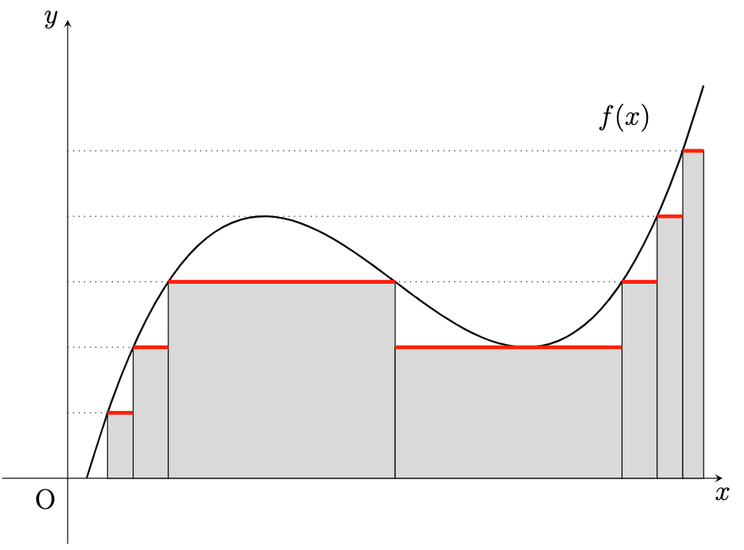

## Lebesgue Integration

르벡 적분을 단계적으로 정의하려고 합니다. $X = (X, \mathscr{F}, \mu)$ 라고 계속 가정합니다. $\mathscr{F}$는 $\sigma$-algebra on $X$, $\mu$는 $\mathscr{F}$의 measure 입니다.

$E \in \mathscr{F}$ 일 때, 적분을 정의하기 위해

$$\mathscr{F} _ E = \lbrace A \cap E : A \in \mathscr{F}\rbrace, \quad \mu _ E = \mu| _ {\mathscr{F} _ E}$$

로 설정하고 $\int = \int _ E$ 로 두어 ($X, \mathscr{F} _ E, \mu _ E$) 위에서 적분을 정의할 수 있습니다. 그러나 굳이 이렇게 하지 않아도 됩니다. $\int = \int _ X$ 로 두고

$$\int _ E f \,d{\mu} = \int f \chi _ E \,d{\mu}$$

로 정의하면 충분하기 때문입니다.

르벡 적분을 다루기 위해 simple function부터 적분해보겠습니다.

### Step 1. For Characteristic Functions

우선 가장 간단한 characteristic function부터 단계를 밟아나가야 합니다.

**(Step 1)** $A \in \mathscr{F}$ 에 대하여

$$\int \chi _ A \,d{\mu} = \mu(A)$$

로 정의한다.

함수 $\chi _ A$는 $x \in A$ 일 때만 함숫값 $1$을 갖고 이외의 경우에는 $0$이기 때문에 이 함수를 $X$ 위에서 적분하면 ‘$A$의 길이’에 대응되는 $\mu(A)$가 결과인 것이 자연스럽습니다.

### Step 2. For Positive Measurable Simple Functions

다음으로 양의 값을 갖는 measurable simple function에 대해 정의합니다. $f = f^+ - f^-$ 에서 $f^+, f^-$ 모두 양의 값을 갖기 때문에 양의 값에 대해 먼저 정의합니다.

**(Step 2)** $f: X \rightarrow[0, \infty)$ 가 measurable simple function이라 하자. 그러면 $A _ k \subseteq\mathscr{F}$ 이면서 쌍마다 서로소인 집합열 $\left( A _ k \right) _ {k=1}^n$과 $a _ k \in [0, \infty)$ 인 수열 $\left( a _ k \right) _ {k=1}^n$을 잡아

$$f(x) = \sum _ {k=1}^n a _ k \chi _ {A _ k}$$

와 같이 표현할 수 있다. 이제

$$\int f\,d{\mu} = \sum _ {k=1}^n a _ k \mu(A _ k) \in [0, \infty]$$

로 정의한다.

Measurable simple function은 measurable characteristic function의 linear combination으로 표현할 수 있기 때문에, 이와 같은 정의를 생각할 수 있습니다. 하지만 이런 정의를 보면 well-definedness를 제일 먼저 생각해야 합니다. 위와 같은 linear combination 표현이 유일하지 않기 때문입니다.

Well-definedness를 증명하기 위해 임의의 linear combination을 잡아도 적분값이 항상 같음을 보이면 됩니다.

**명제.** 위 정의는 모든 measurable simple function에 대해 well-defined이다.

**증명.** $f$가 다음과 같이 두 가지 방법으로 표현된다고 하자.

$$f(x) = \sum _ {k=1}^n a _ k \chi _ {A _ k} = \sum _ {i=1}^m b _ i \chi _ {B _ i}.$$

여기서 $k = 1, \dots, n$, $i = 1, \dots, m$ 에 대하여 $0\leq a _ k, b _ i < \infty$ 이고 $A _ k, B _ i \in \mathscr{F}$ 이다. 여기서 $A _ k, B _ i$는 각각 쌍마다 서로소로, $X$의 분할이 된다. $C _ {k, i} = A _ k \cap B _ i$ 로 두면

$$\sum _ {k=1}^n a _ k \mu(A _ k) = \sum _ {k=1}^n a _ k \mu\left( A _ k \cap \bigcup _ {i=1}^m B _ i \right) = \sum _ {k=1}^n \sum _ {i=1}^m a _ k \mu(C _ {k, i}),$$

$$\sum _ {i=1}^m b _ i \mu(B _ i) = \sum _ {i=1}^{m} b _ i \mu\left( B _ i \cap \bigcup _ {k=1}^n A _ k \right)= \sum _ {i=1}^m \sum _ {k=1}^n b _ i \mu(C _ {k, i})$$

이다. 이 때 $C _ {k, i} \neq \varnothing$ 이면 $x \in C _ {k, i}$ 에 대해 $f(x) = a _ k = b _ i$ 가 된다. 한편 $C _ {k, i} = \varnothing$ 이면 $\mu(C _ {k, i}) = 0$ 이다. 이로부터 모든 $k, i$에 대하여 $b _ i \mu(C _ {k, i}) = a _ k \mu(C _ {k, i})$ 임을 알 수 있다.[^1] 따라서

$$\int f \,d{\mu }= \sum _ {k=1}^n a _ k \mu(A _ k) = \sum _ {i=1}^m b _ i \mu(B _ i)$$

가 되어 적분값은 유일하고 위 정의가 well-defined임을 알 수 있다.

이제 measurable simple function은 얼마든지 적분할 수 있습니다. 이제 다음은 measurable function으로 확장할 단계입니다. 확장을 편하게 하기 위해 약간의 준비 작업을 거치겠습니다.

적분은 선형이고, monotonicity를 항상 유지하기를 기대합니다. 아직은 함수가 $0$보다 클 것을 가정했기 때문에 이를 계속 활용합니다.

**참고.** $a, b \in [0, \infty)$ 와 measurable simple function $f, g \geq 0$ 에 대하여

$$\int \left( af + bg \right) \,d{\mu} = a \int f \,d{\mu} + b \int g \,d{\mu}$$

이다.

**증명.** 위 Step 2와 동일하게

$$f = \sum _ {j=1}^m y _ j \chi _ {A _ j}, \quad g = \sum _ {k=1}^n z _ k \chi _ {B _ k}$$

로 둘 수 있다. 여기서 $A _ j, B _ k$는 $X$의 분할이고 $y _ j, z _ k \geq 0$ 이다. 마찬가지로 $C _ {j, k} = A _ j \cap B _ k$ 로 정의하면

$$\begin{aligned}        a \int f \,d{\mu} + b \int g \,d{\mu} & = \sum _ {j} ay _ j \mu(A _ j) + \sum _ k b z _ k \mu(B _ k) \\                                            & = \sum _ {j} ay _ j \sum _ k \mu(A _ j \cap B _ k) + \sum _ k b z _ k \sum _ j \mu(B _ k \cap A _ j) \\                                            & = \sum _ {j} \sum _ k ay _ j \mu(C _ {j, k}) + \sum _ k \sum _ j b z _ k \mu(C _ {j, k}) \\                                            & = \sum _ {j, k} (ay _ j + bz _ k) \mu(C _ {j, k}) = \int \left( af + bg \right) \,d{\mu}    \end{aligned}$$

이다.

**참고.** $f \geq g \geq 0$ 이 measurable simple function일 때,

$$\int f \,d{\mu} \geq \int g \,d{\mu}$$

이다.

**증명.** $f - g \geq 0$ 이 simple이고 measurable임을 활용한다.

$$\int f \,d{\mu} = \int \left[g + (f - g)\right] \,d{\mu} = \int g\,d{\mu} + \int (f - g) \,d{\mu} \geq \int g \,d{\mu} \geq 0.$$

위와 같이 $g + (f-g)$ 로 변형해야 하는 이유는 $g$의 적분값이 무한대인 경우 이를 이항할 수 없기 때문입니다. 하지만 $f-g$ 의 적분값이 $0$ 이상인 것은 확실하게 알 수 있습니다.

### Step 3. For Positive Measurable Functions

이제 양의 값을 가지는 임의의 measurable function을 고려해 보겠습니다.

**(Step 3)** $f: X \rightarrow[0, \infty]$ 가 measurable일 때,

$$\int f \,d{\mu} = \sup\left\lbrace \int h \,d{\mu}: 0\leq h \leq f, h \text{ measurable and simple}\right\rbrace.$$

로 정의한다.

$f$보다 작은 measurable simple function의 적분값 중 상한을 택하겠다는 의미입니다. $f$보다 작은 measurable simple function으로 $f$를 근사한다고도 이해할 수 있습니다. 또한 $f$가 simple function이면 Step 2의 정의와 일치하는 것을 알 수 있습니다.

$f \geq 0$ 가 measurable이면 증가하는 measurable simple 함수열 $s _ n$이 존재함을 지난 번에 보였습니다. 이 $s _ n$에 대하여 적분값을 계산해보면

$$\int _ E s _ n \,d{\mu} = \sum _ {i=1}^{n2^n} \frac{i - 1}{2^n}\mu\left( \left\lbrace x \in E : \frac{i-1}{2^n} \leq f(x) \leq \frac{i}{2^n}\right\rbrace \right) + n\mu(\lbrace x \in E : f(x)\geq n\rbrace)$$

임을 알 수 있습니다. 이제 $n \rightarrow\infty$ 일 때 우변이 곧 $\displaystyle\int f \,d{\mu}$ 이기를 기대합니다.

위 내용에 대한 증명은 추후 다루도록 하고 식의 의미를 이해해 보겠습니다. **르벡 적분은 치역을 잘게 잘라** 자른 치역 부분의 preimage에 대해 measure를 사용하여 길이를 잽니다. 그리고 함숫값과 preimage의 measure를 곱한 뒤 더해 넓이를 계산한다고 이해할 수 있습니다. **리만 적분은 정의역을 잘게 잘라** 상합/하합을 고려하여 정의한 것과는 다른 접근 방법입니다.

### Step 4. For Measurable Functions

이제 마지막 단계입니다. 임의의 measurable function에 대해 정의합니다.

**(Step 4)** $f$가 measurable이면 $f^+, f^- \geq 0$ 도 measurable이다. 그러므로 $E \in \mathscr{F}$ 에 대하여

$$\int _ E f \,d{\mu} = \int _ E f^+ \,d{\mu} - \int _ E f^- \,d{\mu}$$

와 같이 정의한다. 단, 우변에서 $\infty - \infty$ 가 등장하는 경우는 제외한다.

우변에서 $\infty - \infty$ 인 경우는 제외되었기 때문에 $f^+$, $f^-$의 적분값 둘 중 하나는 유한해야 합니다.

## Lebesuge Integrable

위 내용을 종합하여 다음 정의를 얻습니다.

**정의.** (르벡 적분 가능) $f$가 measurable이고,

$$\int _ E \lvert f \rvert \,d{\mu} = \int _ E f^+ \,d{\mu} + \int _ E f^- \,d{\mu} < \infty$$

이면 $f$가 $E$에서 $\mu$에 대해 **르벡 적분 가능**하다고 한다.

**표기법.** $f$가 $E$에서 $\mu$에 대해 르벡 적분 가능하면

$$f \in \mathcal{L}^1(E, \mu)$$

로 표기한다. 특별히 $\mu = m$ 이면 $f \in \mathcal{L}^1(E)$ 로 적는다.

즉 다음이 성립합니다.

$$f \in \mathcal{L}^{1}(E, \mu) \iff f^+, f^- \in \mathcal{L}^{1}(E, \mu)\iff \lvert f \rvert \in \mathcal{L}^{1}(E, \mu).$$

[^1]: 계수가 같거나, measure가 0이 되어 같거나.
