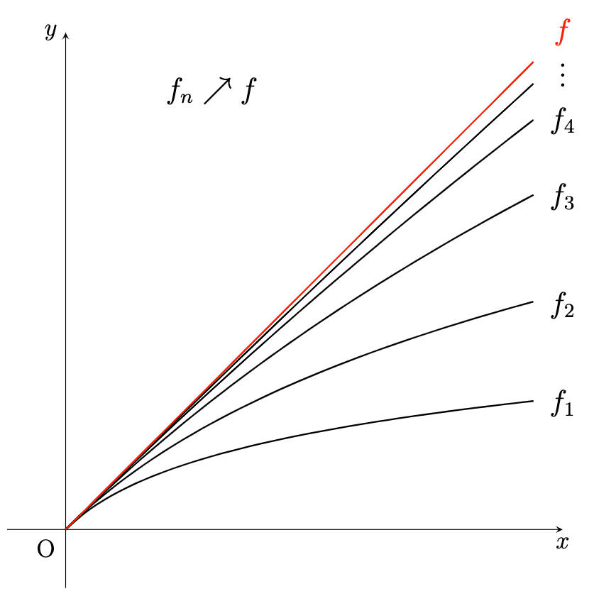

르벡 적분 이론에서 굉장히 자주 사용되는 수렴 정리에 대해 다루겠습니다. 이 정리들을 사용하면 굉장히 유용한 결과를 쉽게 얻을 수 있습니다.

## Monotone Convergence Theorem

먼저 단조 수렴 정리(monotone convergence theorem, MCT)입니다. 이 정리에서는 $f _ n \geq 0$ 인 것이 매우 중요합니다.

**정리.** (단조 수렴 정리) $f _ n: X \rightarrow[0, \infty]$ 가 measurable이고 모든 $x \in X$ 에 대하여 $f _ n(x) \leq f _ {n+1}(x)$ 라 하자.

$$\lim _ {n\rightarrow\infty} f _ n(x) = \sup _ {n} f _ n(x) = f(x)$$

로 두면,

$$\int f \,d{\mu} = \lim _ {n\rightarrow\infty} \int f _ n \,d{\mu} = \sup _ {n \in \mathbb{N}} \int f _ n \,d{\mu}$$

이다.

**증명.**

($\geq$) $f _ n(x) \leq f(x)$ 이므로 단조성을 이용하면 모든 $n \in \mathbb{N}$ 에 대하여 $\displaystyle\int f _ n \,d{\mu} \leq \displaystyle\int f \,d{\mu}$ 이다. 따라서 다음이 성립한다.

$$\sup _ n \int f _ n \,d{\mu} \leq \int f \,d{\mu}.$$

($\leq$) 실수 $c \in (0, 1)$ 를 잡자. 마지막에 $c \nearrow 1$ 로 둘 것이다. 이제 measurable simple function $s$가 $0 \leq s \leq f$ 라 하자. 그러면 모든 $x \in X$ 에 대하여 $c \cdot s(x) < f(x)$ 일 것이다.

이제

$$E _ n = \lbrace x \in X : f _ n(x) \geq cs(x)\rbrace$$

으로 두면, $f _ n(x) - cs(x)$ 가 measurable function이므로 $E _ n$ 또한 measurable이다. 여기서 $f _ n$이 증가하므로 $E _ n\subseteq E _ {n+1} \subseteq\cdots$ 임을 알 수 있고 $f _ n \rightarrow f$ 이므로 $\bigcup _ {n=1}^\infty E _ n = X$ 이다.

충분히 큰 $N \in \mathbb{N}$ 에 대하여 $n \geq N$ 일 때, 모든 $x$에 대하여 $f(x) \geq f _ n(x) > cs(x)$ 가 되게 할 수 있다. 그리고 $f _ n \geq f _ n \chi _ {E _ n} \geq cs \chi _ {E _ n}$ 이므로

$$\tag{\(\star\)}    \int f _ n \,d{\mu} \geq \int f _ n \chi _ {E _ n} \,d{\mu} \geq c\int s \chi _ {E _ n} \,d{\mu},$$

이고 여기서 $s, \chi _ {E _ n}$는 simple function이다. 그러므로 $s = \sum _ {k=0}^m y _ k \chi _ {A _ k}$ 라고 적으면

$$s\chi _ {E _ n} = \sum _ {k=0}^m y _ k \chi _ {A _ k\cap E _ n} \implies \int s \chi _ {E _ n} \,d{\mu} = \sum _ {k=0}^m y _ k \mu(A _ k\cap E _ n)$$

이다. $n\rightarrow\infty$ 일 때 $A _ k\cap E _ n \nearrow A _ k$ 이므로, continuity of measure를 사용해 $\mu(A _ k \cap E _ n) \nearrow \mu(A _ k)$ 를 얻고

$$\lim _ {n\rightarrow\infty} \int s \chi _ {E _ n}\,d{\mu} = \int s \,d{\mu}$$

임도 알 수 있다. 이제 ($\star$)를 이용하면

$$\lim _ {n\rightarrow\infty} \int f _ n \,d{\mu} \geq c\int s \,d{\mu}$$

이므로, $c \nearrow 1$ 로 두고 $0\leq s\leq f$ 에 대하여 $\sup$을 취하면

$$\lim _ {n\rightarrow\infty} \int f _ n \,d{\mu} \geq \sup _ {0\leq s\leq f} \int s \,d{\mu} = \int f \,d{\mu}$$

가 되어 원하는 결과를 얻는다.

**참고.** 만약 부등식 $0 \leq f _ n \leq f _ {n+1}$ 이 정의역 전체가 아닌 정의역의 부분집합 $E$에서만 성립한다고 하면, 다음과 같이 생각할 수 있다.

$$0 \leq f _ n \chi _ E \leq f _ {n+1} \chi _ E \nearrow f \chi _ E.$$

그러므로 단조 수렴 정리가 $E$에서도 성립함을 알 수 있다.

> $E$에서 $0\leq f _ n \leq f _ {n+1} \nearrow f$ 이면 $\displaystyle\lim _ {n\rightarrow\infty} \int _ E f _ n \,d{\mu} = \int _ E f \,d{\mu}$.

**참고.** 함수열 $f _ n$이 증가하는 경우에만 정리가 성립합니다. 감소하는 경우에는 반례로 함수 $f _ n = \chi _ {[n, \infty)}$ 를 생각할 수 있습니다. 그러면 $n \rightarrow\infty$ 일 때 $\chi _ {[n, \infty)} \searrow 0$ 입니다.

그러면 Lebesgue measure $m$에 대하여

$$\infty = \int \chi _ {[n, \infty)} \,d{m} \neq \int 0 \,d{m} = 0$$

이 되어 단조 수렴 정리가 성립하지 않음을 확인할 수 있습니다.

---

지난 번에 $f \geq 0$ 가 measurable이면 증가하는 measurable simple 함수열 $s _ n$이 존재함을 보였고, 이 $s _ n$에 대하여 적분값을 계산하여

$$\int _ E s _ n \,d{\mu} = \sum _ {i=1}^{n2^n} \frac{i - 1}{2^n}\mu\left( \left\lbrace x \in E : \frac{i-1}{2^n} \leq f(x) \leq \frac{i}{2^n}\right\rbrace \right) + n\mu(\lbrace x \in E : f(x)\geq n\rbrace)$$

라는 결과까지 얻었습니다. 그런데 여기서

$$f(x) = \displaystyle\lim _ {n\rightarrow\infty} s _ n(x)$$

이기 때문에, 단조 수렴 정리에 의해

$$\int _ E f \,d{\mu} = \lim _ {n\rightarrow\infty} \int _ E s _ n \,d{\mu}$$

가 성립하여 기대했던 결과를 얻었습니다. 지난 번 설명한 것처럼, 이는 곧 르벡 적분은 치역을 잘게 잘라 넓이를 계산한 것으로 이해할 수 있다는 의미가 됩니다.

---

다음은 단조 수렴 정리를 활용하여 유용한 결과를 쉽게 얻을 수 있는 예제입니다.

**참고.** Measurable function $f, g \geq 0$ 과 $\alpha, \beta \in [0, \infty)$ 에 대하여 다음이 성립한다.

$$\int _ E \left( \alpha f + \beta g \right) \,d{\mu} = \alpha \int _ E f \,d{\mu} + \beta \int _ E g\,d{\mu}.$$

**증명.** Measurable function은 measurable simple function으로 근사할 수 있고, $f, g \geq 0$ 이므로 단조증가하도록 잡을 수 있다. 그러므로 measurable simple function $f _ n$, $g _ n$에 대하여 $0 \leq f _ n \leq f _ {n+1} \nearrow f$, $0 \leq g _ n \leq g _ {n+1} \nearrow g$ 으로 잡는다.

그러면 $\alpha f _ n + \beta g _ n \nearrow \alpha f + \beta g$ 이고 $\alpha f _ n + \beta g _ n$ 은 단조증가하는 measurable simple 함수열이다. 따라서 단조 수렴 정리에 의해

$$\int _ E \left( \alpha f _ n + \beta g _ n \right) \,d{\mu} = \alpha \int _ E f _ n \,d{\mu} + \beta \int _ E g _ n \,d{\mu} \rightarrow\alpha \int _ E f \,d{\mu} + \beta \int _ E g\,d{\mu}$$

이다.

이와 비슷한 방법을 급수에도 적용할 수 있습니다.

**정리.** Measurable function $f _ n: X \rightarrow[0, \infty]$ 에 대하여 $\sum _ {n=1}^\infty f _ n$는 measurable이고, 단조 수렴 정리에 의해 다음이 성립한다.

$$\int _ E \sum _ {n=1}^\infty f _ n \,d{\mu} = \sum _ {n=1}^\infty \int _ E f _ n \,d{\mu}.$$

**증명.** $\sum _ {n=1}^\infty f _ n$는 measurable function의 극한이므로 measurable이다. 무한급수를 부분합의 극한으로 생각하면 $f _ n \geq 0$ 이므로 부분합이 증가함을 알 수 있다. 따라서 단조 수렴 정리를 적용하여 결론을 얻는다.

## Fatou's Lemma

단조 수렴 정리와 동치인 수렴 정리를 하나 더 소개합니다. Fatou's lemma로 알려져 있습니다.

**정리.** (Fatou) $f _ n \geq 0$ 가 measurable이고 $E$가 measurable이라 하자. 다음이 성립한다.

$$\int _ E \liminf _ {n\rightarrow\infty} f _ n \,d{\mu} \leq \liminf _ {n\rightarrow\infty} \int _ E f _ n \,d{\mu}.$$

**증명.** $g _ n = \displaystyle\inf _ {k \geq n} f _ k$ 으로 두면 $\displaystyle\lim _ {n \rightarrow\infty} g _ n = \liminf _ {n\rightarrow\infty} f _ n$ 이다. $g _ n$이 증가함은 쉽게 확인할 수 있으며 $g _ n \geq 0$ 이다. $g _ n$의 정의로부터 모든 $k \geq n$ 에 대하여 $g _ n \leq f _ k$ 이므로,

$$\int _ E g _ n \,d{\mu} \leq \inf _ {k\geq n} \int _ E f _ k \,d{\mu}$$

이다. 여기서 $n \rightarrow\infty$ 로 두면

$$\int _ E \liminf _ {n\rightarrow\infty} f _ n \,d{\mu} = \lim _ {n \rightarrow\infty} \int _ E g _ n \,d{\mu} \leq \lim _ {n \rightarrow\infty} \inf _ {k \geq n}\int _ E f _ k \,d{\mu} = \liminf _ {n \rightarrow\infty} \int _ E f _ n \,d{\mu}$$

이 된다. 여기서 첫 번째 등호는 단조 수렴 정리에 의해 성립한다.

**참고.** 위 증명에서는 단조 수렴 정리를 활용했습니다. 반대로 이 정리를 가정하면 단조 수렴 정리를 증명할 수 있기도 합니다. 따라서 이 둘은 동치입니다. 증명은 생략합니다.

**참고.** 왠지 위와 비슷한 결론이 $\limsup$에 대해서도 성립해야 할 것 같습니다. 구체적으로,

$$\int _ E \limsup _ {n \rightarrow\infty} f _ n \,d{\mu} \geq \limsup _ {n \rightarrow\infty} \int _ E f _ n \,d{\mu}$$

일 것 같습니다. 안타깝게도 이는 성립하지 않습니다. 반례로 앞서 소개한 $\chi _ {[n, \infty)}$를 한 번 더 가져올 수 있습니다. 좌변을 계산해 보면 0이지만, 우변을 계산해 보면 $\infty$입니다. 나중에 소개하겠지만, $\lvert f _ n \rvert \leq g$ 를 만족하는 함수 $g \in \mathcal{L}^{1}$ 가 존재해야 위 부등식이 성립합니다.

## Properties of the Lebesgue Integral

르벡 적분의 몇 가지 성질을 소개하고 마칩니다.

1. $f$가 measurable이고 $E$에서 bounded이며 $\mu(E) < \infty$ 일 때, 적당한 실수 $M > 0$ 에 대하여 $\lvert f \rvert \leq M$ 이므로

	$$\int _ E \lvert f \rvert \,d{\mu} \leq \int _ E M \,d{\mu} = M\mu(E) < \infty$$

	임을 알 수 있습니다. 그러므로 $f \in \mathcal{L}^{1}(E, \mu)$ 입니다. $E$의 measure가 finite라는 가정 하에, bounded function은 모두 르벡 적분 가능합니다.

2. $f, g \in \mathcal{L}^{1}(E, \mu)$ 이고 $E$에서 $f \leq g$ 일 때, 단조성이 성립함을 보이려고 합니다. 앞에서는 $0 \leq f \leq g$ 인 경우에만 단조성을 증명했었는데, 이를 확장하여 함수가 음의 값을 가지는 경우에도 증명하고 싶습니다. 그러므로 양수인 부분과 음수인 부분을 나누어 고려하여 다음과 같이 적을 수 있습니다.

	$$\chi _ E (x) f^+(x) \leq \chi _ E(x) g^+(x), \qquad \chi _ E(x) g^-(x) \leq \chi _ E (x) f^-(x)$$

	이로부터

	$$\int _ E f^+ \,d{\mu} \leq \int _ E g^+ \,d{\mu} < \infty, \qquad \int _ E g^- \,d{\mu} \leq \int _ E f^- \,d{\mu} < \infty$$

	를 얻습니다. 따라서

	$$\int _ E f\,d{\mu} \leq \int _ E g \,d{\mu}$$

	가 성립하고, 함수가 음의 값을 가지는 경우에도 단조성이 성립함을 알 수 있습니다.

3. $f \in \mathcal{L}^{1}(E, \mu)$, $c \in \mathbb{R}$ 라 하면 $cf \in \mathcal{L}^{1}(E, \mu)$ 입니다. 왜냐하면

	$$\int _ E \lvert c \rvert\lvert f \rvert \,d{\mu} = \lvert c \rvert \int _ E \lvert f \rvert\,d{\mu} < \infty$$

	이기 때문입니다. 적분이 가능하니 실제 적분값을 계산할 때 선형성이 성립했으면 좋겠습니다. 앞에서는 음이 아닌 실수에 대해서만 증명했었는데, 이도 마찬가지로 확장하려 합니다. $c < 0$ 인 경우만 보이면 됩니다. 이 때, $(cf)^+ = -cf^-$, $(cf)^- = -cf^+$ 이므로, 다음이 성립합니다.

	$$\int _ E cf \,d{\mu} = \int _ E (cf)^+ - \int _ E (cf)^- \,d{\mu} = -c \int _ E f^- \,d{\mu} - (-c) \int _ E f^+ \,d{\mu} = c\int _ E f\,d{\mu}.$$

4. Measurable function $f$에 대하여 $E$에서 $a \leq f(x) \leq b$ 이고 $\mu(E) < \infty$ 일 때 다음이 성립합니다.

	$$\int _ E a \chi _ E \,d{\mu} \leq \int _ E f\chi _ E \,d{\mu} \leq \int _ E b \chi _ E \,d{\mu} \implies a \mu(E) \leq \int _ E f \,d{\mu} \leq b \mu(E).$$

	$f$가 르벡 적분 가능하다는 사실은 $f$가 bounded라는 사실을 이용합니다.

5. $f \in \mathcal{L}^{1}(E, \mu)$ 와 measurable set $A \subseteq E$ 가 주어지는 경우, $f$는 $E$의 부분집합인 $A$ 위에서도 르벡 적분 가능합니다. 이는 다음 부등식에서 확인할 수 있습니다.

	$$\int _ A \lvert f \rvert \,d{\mu} \leq \int _ E \lvert f \rvert\,d{\mu} < \infty.$$

6. 만약 measure가 0인 집합에서 적분을 하면 어떻게 될까요? $\mu(E) = 0$ 라 하고, measurable function $f$를 적분해 보겠습니다. 여기서 $\min\lbrace \lvert f \rvert, n\rbrace\chi _ E$ 도 measurable이며 $n \rightarrow\infty$ 일 때 $\min\lbrace \lvert f \rvert, n\rbrace\chi _ E \nearrow \lvert f \rvert\chi _ E$ 임을 이용합니다. 마지막으로 단조 수렴 정리를 적용하면

	$$\begin{aligned}                    \int _ E \lvert f \rvert \,d{\mu} &= \lim _ {n \rightarrow\infty} \int _ E \min\lbrace \lvert f \rvert, n\rbrace \,d{\mu} \\                    &\leq \lim _ {n \rightarrow\infty} \int _ E n \,d{\mu} = \lim _ {n \rightarrow\infty} n\mu(E) = 0                  \end{aligned}$$

	임을 얻습니다. 따라서 $f \in \mathcal{L}^{1}(E, \mu)$ 이고, $\displaystyle\int _ E f \,d{\mu} = 0$ 가 되어 적분값이 0임을 알 수 있습니다. 즉, measure가 0인 집합 위에서 적분하면 그 결과는 0이 됩니다.[^1]

[^1]: 편의상 $0\cdot\infty = 0$ 으로 정의했기 때문에 $f \equiv \infty$ 인 경우에도 성립합니다.
