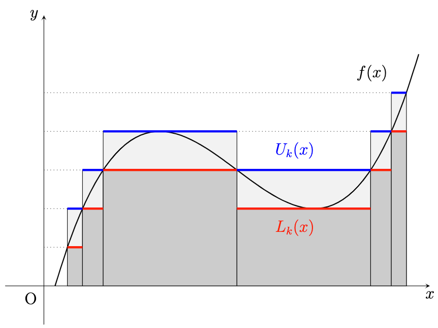

## Comparison with the Riemann Integral

먼저 혼동을 막기 위해 Lebesgue measure $m$에 대하여 르벡 적분을

$$\int _ {[a, b]} f \,d{m} = \int _ {[a, b]} f \,d{x} = \int _ a^b f \,d{x}$$

와 같이 표기하고, 리만 적분은

$$\mathcal{R}\int _ a^b f\,d{x}$$

로 표기하겠습니다.

**정리.** $a, b \in \mathbb{R}$ 에 대하여 $a < b$ 이고 함수 $f$가 유계라고 하자.

1. $f \in \mathcal{R}[a, b]$ 이면 $f \in \mathcal{L}^{1}[a, b]$ 이고 $\displaystyle\int _ a^b f\,d{x} = \mathcal{R}\int _ a^b f \,d{x}$ 이다.

2. $f \in \mathcal{R}[a, b]$ $\iff$ $f$가 연속 $m$-a.e. on $[a, b]$.

쉽게 풀어서 적어보면, (1)은 $f$가 $[a, b]$에서 리만 적분 가능하면 르벡 적분 또한 가능하며, 적분 값이 같다는 의미입니다. 즉 르벡 적분이 리만 적분보다 더 강력하다는 것을 알 수 있습니다.

또한 (2)는 리만 적분 가능성에 대한 동치 조건을 알려줍니다. Almost everywhere라는 조건이 붙었기 때문에, $\mathcal{L}^1$의 equivalence class를 고려하면 사실상 연속함수에 대해서만 리만 적분이 가능하다는 뜻이 됩니다.

**증명.** $k \in \mathbb{N}$ 에 대하여 구간 $[a, b]$의 분할 $P _ k = \lbrace a = x _ 0^k < x _ 1^k < \cdots < x _ {n _ k}^k = b\rbrace$ 를 잡는다. 단 $P _ k \subseteq P _ {k+1}$ (refinement) 이고 $\lvert x _ {i}^k - x _ {i-1}^k \rvert < \frac{1}{k}$ 이 되도록 한다.

그러면 리만 적분의 정의로부터

$$\lim _ {k \rightarrow\infty} L(P _ k, f) = \mathcal{R}\underline{\int _ {a}^{b}} f\,d{x}, \quad \lim _ {k \rightarrow\infty} U(P _ k, f) = \mathcal{R} \overline{\int _ {a}^{b}} f \,d{x}$$

임을 알 수 있다.

이제 measurable simple function $U _ k, L _ k$를 다음과 같이 잡는다.

$$U _ k = \sum _ {i=1}^{n _ k} \sup _ {x _ {i-1}^k \leq y \leq x _ {i}^k} f(y) \chi _ {(x _ {i-1}^k, x _ i^k]}, \quad L _ k = \sum _ {i=1}^{n _ k} \inf _ {x _ {i-1}^k \leq y \leq x _ {i}^k} f(y) \chi _ {(x _ {i-1}^k, x _ i^k]}.$$

그러면 구간 $[a, b]$ 위에서 $L _ k \leq f \leq U _ k$인 것은 당연하고, 르벡 적분이 가능하므로

$$\int _ a^b L _ k \,d{x} = L(P _ k, f), \quad \int _ a^b U _ k \,d{x} = U(P _ k, f)$$

이 됨을 알 수 있다. 여기서 $P _ k \subseteq P _ {k + 1}$ 이 되도록 잡았기 때문에, $L _ k$는 증가하는 수열, $U _ k$는 감소하는 수열이다.

그러므로

$$L(x) = \lim _ {k \rightarrow\infty} L _ k(x), \quad U(x) = \lim _ {k \rightarrow\infty} U _ k(x)$$

로 정의했을 때, 극한이 존재함을 알 수 있다. 여기서 $f, L _ k, U _ k$가 모두 유계인 함수이므로 지배 수렴 정리에 의해

$$\int _ a^b L \,d{x} = \lim _ {k \rightarrow\infty} \int _ a^b L _ k \,d{x} = \lim _ {k \rightarrow\infty} L(P _ k, f) = \mathcal{R}\underline{\int _ {a}^{b}} f\,d{x} < \infty,$$

$$\int _ a^b U\,d{x} = \lim _ {k \rightarrow\infty} \int _ a^b U _ k \,d{x} = \lim _ {k \rightarrow\infty} U(P _ k, f) = \mathcal{R} \overline{\int _ {a}^{b}} f \,d{x} < \infty$$

이므로 $L, U \in \mathcal{L}^{1}[a, b]$ 이다.

위 사실을 종합하면 $f \in \mathcal{R}[a, b]$ 일 때,

$$\mathcal{R}\underline{\int _ {a}^{b}} f\,d{x} = \mathcal{R}\overline{\int _ {a}^{b}} f\,d{x}$$

이므로

$$\int _ a^b (U - L)\,d{x} = 0$$

가 되어 $U = L$ $m$-a.e. on $[a, b]$라는 사실을 알 수 있다. 역으로 이를 거꾸로 읽어보면 $U = L$ $m$-a.e. on $[a, b]$일 때 $f \in \mathcal{R}[a, b]$ 가 되는 것 또한 알 수 있다.

(1) 위 논의에 의해 $f \in \mathcal{R}[a, b]$ 이면 $f = U = L$ a.e. on $[a, b]$ 이다. 따라서 $f$는 measurable.

$$\int _ a^b f \,d{x} = \mathcal{R}\int _ a^b f\,d{x} < \infty \implies f \in \mathcal{L}^{1}[a, b].$$

(2) 만약 $x \notin \bigcup _ {k=1}^{\infty} P _ k$ 라고 가정하면, 임의의 $\epsilon > 0$ 에 대해 충분히 큰 $n \in \mathbb{N}$ 을 잡았을 때 적당한 $j _ 0 \in \mathbb{N}$ 이 존재하여 $x \in (t _ {j _ 0-1}^n, t _ {j _ 0}^n)$ 이면서

$$\lvert L _ n(x) - L(x) \rvert + \lvert U _ n(x) - U(x) \rvert < \epsilon$$

이 되도록 할 수 있다. 그러면 $y \in (t _ {j _ 0-1}^n, t _ {j _ 0}^n)$ 일 때

$$\begin{aligned}        \lvert f(x) - f(y) \rvert & \leq M _ {j _ 0}^n - m _ {j _ 0}^n = M _ {j _ 0}^n - U(x) + U(x) - L(x) + L(x) - m _ {j _ 0}^n \\                          & \leq U(x) - L(x) + \epsilon    \end{aligned}$$

가 됨을 알 수 있다.

위 부등식에 의해 $y \in \lbrace x : U(x) = L(x)\rbrace \setminus\bigcup _ {k=1}^{\infty} P _ k$ 이면 $f$가 $y$에서 연속임을 알 수 있게 된다.

따라서, $f$가 연속인 점들의 집합을 $C _ f$라 하면

$$\lbrace x : U(x) = L(x)\rbrace \setminus\bigcup _ {k=1}^{\infty} P _ k \subseteq C _ f \subseteq\lbrace x : U(x) = L(x)\rbrace$$

이 된다. 한편 $\bigcup _ {k=1}^{\infty} P _ k$는 measure가 0 이므로, $U = L$ $m$-a.e. 인 것과 $f$가 연속 $m$-a.e. 인 것은 동치이다. 위 논의의 결과를 이용하면 $f \in \mathcal{R}[a, b]$ 인 것과 $f$가 연속 $m$-a.e. 인 것은 동치이다.

아래는 증명의 부산물입니다.

**참고.**

1. $x \notin \bigcup _ {k=1}^\infty P _ k$ 이면 $f$가 $x$에서 연속 $\iff f(x) = U(x) = L(x)$ 이다.

2. $L(x) \leq f(x) \leq U(x)$ 이고 measurable function의 극한인 $L(x), U(x)$ 또한 measurable이다.

3. $f$가 유계라는 조건이 있기 때문에 $f \geq 0$ 인 경우만 생각해도 충분하다. $\lvert f \rvert \leq M$ 라고 하면 $f$ 대신 $f + M$ 을 생각하면 되기 때문이다.

이제 리만 적분의 유용한 성질들을 가지고 와서 사용할 수 있습니다.

1. $f \geq 0$ 이고 measurable일 때, $f _ n = f\chi _ {[0, n]}$으로 정의한다. 단조 수렴 정리에 의해

	$$\int _ 0^\infty f \,d{x} = \lim _ {n \rightarrow\infty} \int _ 0^\infty f _ n \,d{x} = \lim _ {n \rightarrow\infty} \int _ 0^n f \,d{x}$$

	이다. 마지막 적분을 리만 적분으로 계산할 수 있다.

2. 닫힌 유계 구간 $I \subseteq(0, \infty)$ 에 대하여 $f \in \mathcal{R}(I)$ 라 하면 $f \in \mathcal{L}^{1}(I)$ 이다. $f _ n = f\chi _ {[0, n]}$ 으로 잡으면 $\lvert f _ n \rvert \leq f$ 이므로 지배 수렴 정리를 적용하여

	$$\int _ 0^\infty f \,d{x} = \lim _ {n \rightarrow\infty} \int _ 0^\infty f _ n \,d{x} = \lim _ {n \rightarrow\infty} \int _ 0^n f \,d{x} = \lim _ {n \rightarrow\infty} \mathcal{R} \int _ 0^n f \,d{x}$$

	임을 알 수 있다.

마찬가지로 $f _ n = f\chi _ {(1/n, 1)}$ 으로 잡은 경우에도 지배 수렴 정리에 의해

$$\int _ 0^1 f\,d{x} = \lim _ {n \rightarrow\infty} \int _ {0}^1 f _ n \,d{x} = \lim _ {n \rightarrow\infty}\int _ {1/n}^1 f \,d{x} = \lim _ {n \rightarrow\infty} \mathcal{R}\int _ {1/n}^1 f \,d{x}$$

이 된다.
